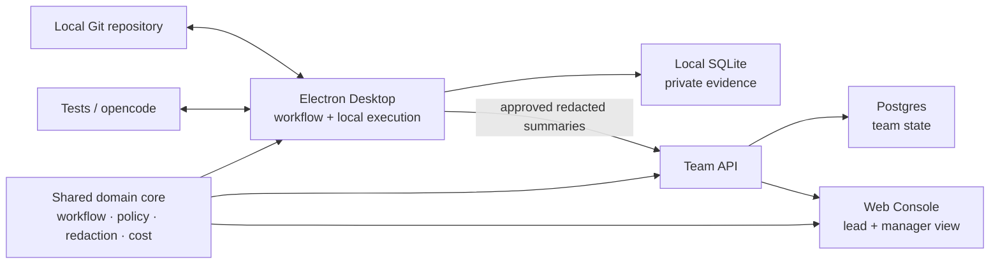

# AI DevFlow Studio

**A self-hosted AI development workflow workbench for small engineering teams.**

DevFlow turns an AI-assisted code change into a governed delivery flow with local execution, reviewable evidence, cost visibility, and explicit human approval.


_A real Electron workbench showing the six-stage workflow, local repository controls, Gate Enforcement, knowledge evidence, and agent actions._

> **v1.3 status contract:** This source tree declares `1.3.0` and contains the v1.3-scoped
> functional closeout.
>
> Formal release state is not hard-coded in this README. Read the records under
> `docs/releases/v1.3.0/` and run `corepack pnpm release:status -- --mode=tagged`; the release is
> valid only when that check confirms the evidence commit and `v1.3.0` tag.
>
> The [2026-07-25 walkthrough result](docs/guides/devflow-studio-v1.3-walkthrough-result-2026-07-25.md)
> remains the failed baseline that motivated the repaired workflow, sync, binding, redaction, and
> deterministic-provider paths.

## Why It Exists

An AI prompt can produce code, but a team still needs to know what changed, which standards were used, whether tests passed, who approved the risk, and what the runtime cost.

DevFlow keeps repository execution on the developer's machine. It turns requests, designs, diffs, tests, reviews, policy decisions, and costs into evidence that a team can inspect before delivery.

### Target Users

| User | Primary job |
| --- | --- |
| Developer | Run AI-assisted work locally, review permissions and diffs, execute tests, and preserve evidence. |
| Tech lead or reviewer | Inspect policy, knowledge, tests, and Agent Review output before approving a Gate. |
| Team manager or owner | See redacted delivery health, runtime cost, budget state, and project progress in the Web console. |

### Product Value

- **Governed execution:** human Gates and deterministic policy checks stay in the delivery path.
- **Evidence over activity:** artifacts, traces, Test Evidence, reviews, and decisions make work auditable.
- **Local-first safety:** code, raw output, local paths, and provider secrets stay behind the Electron boundary.
- **Team visibility:** approved redacted summaries reach a self-hosted API, Postgres store, and Web console.

## Implemented Capabilities

- A six-stage Run model covers request intake, Clarify, Design, Build, Test, PR handoff, and Acceptance.
- Shared trusted commands enforce current-node order and required evidence across all six stages.
- Electron selects a local Git repository, validates test commands, runs tests through controlled IPC, and persists local state in SQLite.
- Coding Agent runs use managed worktrees, explicit permission relay, diff capture, Test Evidence, runtime trace, and cleanup state.
- Knowledge Governance links Git-managed Markdown standards to Runs, Artifacts, Gates, and review evidence.
- Knowledge Review produces structured findings, trace, advisory, and cost data without replacing human approval.
- Gate Enforcement supports team policy, project overrides, remediation candidates, and human-approved retry paths.
- Runtime budgets model projected provider cost and lead approval; fail-closed paid-runtime hardening remains open.
- Desktop pairing explicitly binds a Local Project to its Team Project; local-first merge preserves richer local workflow state during sync.
- Bearer-token sync, API/Postgres persistence, and the Web console provide a self-hosted team-pilot path.

### Verification Evidence

| Evidence path | What it checks |
| --- | --- |
| `corepack pnpm verify` | TypeScript checks, the unit/component suite, and the cross-platform static audit. |
| `corepack pnpm verify:demo` | The default gate plus browser E2E and a real Electron main/preload/SQLite smoke path. |
| `corepack pnpm test:postgres-smoke` | Migration, persistence, policy, approval, sync, and redacted team reads against Postgres. |
| `corepack pnpm test:docker-smoke` | The containerized API/Web/Postgres stack, Desktop pairing, bearer auth, and safe overview data. |
| Release-only opencode smoke | A paid, explicit signoff for the real local coding runtime; it is never part of default CI. |

Deterministic results become release evidence only when `required-gates.json` binds them to the clean
candidate commit `C`; the README does not substitute for those records or `release:status`.

See the [testing strategy](docs/engineering/testing-strategy.md), [demo and smoke guide](docs/engineering/demo-and-smoke.md), and [release-only runtime policy](docs/plans/release-only-real-opencode-smoke.md) for exact evidence boundaries.

## Architecture and Data Boundary



The Desktop owns local repository access, shell execution, raw runtime detail, and local evidence. Only approved redacted contracts cross into the team layer.

The monorepo separates `apps/desktop`, `apps/web`, `apps/api`, `apps/worker`, and `packages/shared`. The worker remains a narrow asynchronous rollup placeholder.

## Five-Minute Demo

### 1. Start the real Electron app with deterministic demo runtimes

```bash
corepack pnpm install --frozen-lockfile

DEVFLOW_ENABLE_DEMO_DATA=true \
DEV_AUTH_ENABLED=true \
DEVFLOW_ENABLE_FAKE_RUNTIME=true \
DEVFLOW_CODING_ENGINE=fake \
corepack pnpm dev:electron
```

These flags are explicit and local. `DEV_AUTH_ENABLED=true` enables header-based demo sessions only
for non-browser local clients; keep it disabled on a network-exposed API. This path does not call a
paid model provider.

Together, these flags expose the built-in deterministic Workflow/Review provider and fake Coding
Engine without credentials.

Confirm the fake provider state in Agents before the walkthrough. Production providers still
require explicit configuration.

### 2. Walk the governed delivery path

1. Select a small committed Git repository and save its detected test command.
2. Create a Run from a short request, generate Clarification and Design artifacts, and inspect the six-stage canvas.
3. Run Knowledge Review on a Gate, inspect policy and evidence, then approve the Gate as a human decision.
4. Start the Coding Agent from the Build task, approve its permission request, and inspect the managed-worktree diff and Test Evidence.
5. Open Agents and Tests to review the trace, command result, redaction state, and cost source.

Continue through PR Draft and Acceptance Bundle with the [full feature walkthrough](docs/guides/devflow-studio-full-feature-walkthrough.md).

Use `corepack pnpm dev:electron` for local execution. The browser-only `dev:desktop` path is a visual preview: it cannot select folders, run local tests, or execute Agent, Gate, PR, and Acceptance workflow writes. Those actions fail closed unless the trusted Electron main-process runtime is available.

Remote Run, Test Evidence, and Coding summaries are not renderer upload APIs. Electron main builds
them from canonical local state (including the current workflow Node), while the API and repositories
re-apply redaction before team-visible persistence. Unsigned identity headers are disabled by default;
networked Team writes use a signed session Cookie or paired Desktop Bearer Token.

Test, Review, and Coding summaries use a bounded child-first sync contract: only an explicit missing
canonical Run causes one latest-Run upload and one child retry. Durable outbox/backoff and visible
retry operations are intentionally part of v1.4, while v1.3 keeps the committed local state authoritative.

### Minimum Quality Gate

```bash
corepack pnpm verify
```

For the API/Web/Postgres team path, use the [self-hosted pilot guide](docs/guides/devflow-studio-self-hosted-pilot.md).

## Current Boundaries

- The default system is intentionally empty. Demo data and fake runtimes require explicit flags, while real runtimes require explicit provider configuration.
- The PR stage creates a reviewable handoff artifact. It does not silently push, open, merge, or publish a real GitHub pull request.
- Real opencode and live Knowledge Review are opt-in paths that can spend provider quota. They stay outside the default quality gate.
- Skills and MCP are management surfaces today. Real MCP process execution, permission auditing, and MCP policy enforcement are not implemented.
- Knowledge retrieval is lexical and graph-backed. Full RAG or vector-provider integration is not implemented.
- Full real-window validation is macOS-local. Windows has CI compatibility checks and a source-validation guide, but no signed installer or full Electron release signoff.
- The current product is a self-hosted team pilot, not a managed public SaaS offering.

The [roadmap](docs/roadmap.md) is the source of truth for milestone status, planned GitHub delivery integration, runtime hardening, and deferred platform work.

## Documentation Map

| Need | Start here |
| --- | --- |
| Product positioning and user workflow | [Product Definition](docs/product/product-definition.md) |
| Current status and future priorities | [Roadmap](docs/roadmap.md) |
| Complete hands-on product tour | [Full feature walkthrough](docs/guides/devflow-studio-full-feature-walkthrough.md) |
| Current delivery-flow walkthrough | [v1.3 Walkthrough](docs/guides/devflow-studio-v1.3-walkthrough.md) |
| Self-hosted API/Web/Postgres pilot | [Self-Hosted Pilot](docs/guides/devflow-studio-self-hosted-pilot.md) |
| Windows source and ZIP validation | [Windows ZIP Smoke Guide](docs/guides/windows-zip-smoke.md) |
| Test layers and quality gates | [Testing Strategy](docs/engineering/testing-strategy.md) |
| Demo and smoke reproduction | [Demo and Smoke Guide](docs/engineering/demo-and-smoke.md) |
| Stable domain language | [Context Glossary](CONTEXT.md) |
| Architecture decisions | [ADRs](docs/adr/) |
| Historical HoneyAI comparison | [Research Snapshot](docs/research/2026-06-15-honeyai-vs-devflow.md) |
