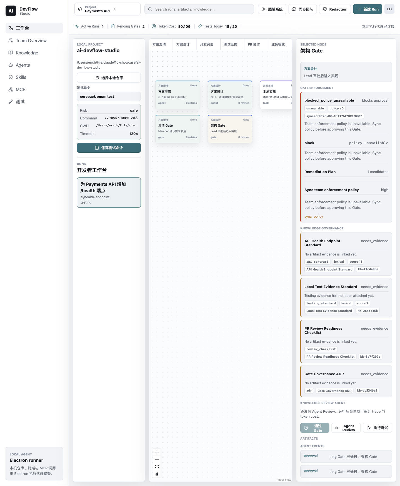
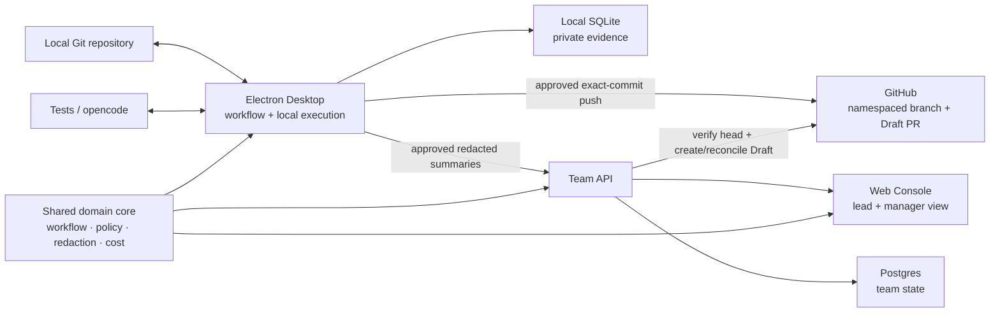

# AI DevFlow Studio

**A self-hosted AI development workflow workbench for small engineering teams.**

DevFlow turns an AI-assisted code change into a governed delivery flow with local execution, reviewable evidence, cost visibility, and explicit human approval.



_A real Electron workbench showing the six-stage workflow, local repository controls, Gate Enforcement, knowledge evidence, and agent actions._

> **Current release and roadmap status:** `v1.5.0` is released and the finite 1.x line is complete.
> V2.0 Native Agent Runtime is complete, with candidate-bound evaluator and gate evidence under
> `docs/releases/v2.0.0/`. V2.1 Evaluated Retrieval and Memory is now the active priority. The
> [Roadmap](docs/roadmap.md) is the single source of truth; package labels and this README do not
> substitute for immutable proof under `docs/releases/`.

## Why It Exists

An AI prompt can produce code, but a team still needs to know what changed, which standards were used, whether tests passed, who approved the risk, and what the runtime cost.

DevFlow keeps repository execution on the developer's machine. It turns requests, designs, diffs, tests, reviews, policy decisions, and costs into evidence that a team can inspect before delivery.

### Target Users

| User | Primary job |
| --- | --- |
| Developer | Run AI-assisted work locally, review permissions and diffs, execute tests, and preserve evidence. |
| Tech lead or reviewer | Inspect policy, knowledge, tests, and Agent Review output before approving a Gate. |
| Team manager or owner | See redacted delivery health, runtime cost, budget state, and project progress in the Web console. |

### Product Value

- **Governed execution:** human Gates and deterministic policy checks stay in the delivery path.
- **Evidence over activity:** artifacts, traces, Test Evidence, reviews, and decisions make work auditable.
- **Local-first safety:** code, raw output, local paths, and provider secrets stay behind the Electron boundary.
- **Team visibility:** approved redacted summaries reach a self-hosted API, Postgres store, and Web console.

## Implemented Capabilities

- A six-stage Run model covers request intake, Clarify, Design, Build, Test, PR handoff, and Acceptance.
- Shared trusted commands enforce current-node order and required evidence across all six stages.
- Electron selects a local Git repository, validates test commands, runs tests through controlled IPC, and persists local state in SQLite.
- Coding Agent runs use managed worktrees, explicit permission relay, diff capture, Test Evidence, runtime trace, and cleanup state.
- Knowledge Governance links Git-managed Markdown standards to Runs, Artifacts, Gates, and review evidence.
- Knowledge Review produces structured findings, trace, advisory, and cost data without replacing human approval.
- Gate Enforcement supports team policy, project overrides, remediation candidates, and human-approved retry paths.
- Runtime budgets model projected provider cost and lead approval. Paid Coding and Knowledge Review runtimes fail closed before provider invocation when authoritative budget context is missing, invalid, unavailable, unauthenticated, or out of scope.
- Desktop pairing explicitly binds a Local Project to its Team Project; Web Work Requests and Gate Commands preserve Desktop authority over the canonical local Run.
- Durable redacted sync uses a persisted outbox with bounded backoff, restart recovery, immutable project scope, and operator-visible retry state.
- GitHub Delivery binds one Delivery Intent to the managed-worktree commit, Test Evidence, Run
  version, repository binding, and PR Delivery Package; a separate signed Web approval is required
  before any remote write.
- A least-privilege GitHub App gives Electron main one short-lived repository credential for the
  exact branch push; the API independently verifies the head and creates or reconciles one Draft
  pull request. DevFlow never merges, force-pushes, deletes a branch, or publishes a tag.
- A later approved delivery attempt can use verified publication adoption after an earlier attempt
  pushed the exact same commit but failed before Draft creation; it does not mint another credential
  or push the branch again.
- The V2.0 foundation provides a strict bounded Agent Runtime kernel, while current Desktop schema
  v22 retains its schema v21 trajectory/checkpoint persistence, durable metadata-only Tool audit,
  and main-owned trusted local stdio MCP authority and adds empty-by-default V2.1 retrieval index
  snapshot/chunk/vector/Citation tables without fabricating retained data.
  installation authority. Electron main owns strict Tool registration, opaque scoped
  grants, executable/digest verification, negotiated discovery, cancellation fencing, and bounded
  repository read, managed-workspace edit, saved-test, deterministic-evaluation, and MCP Tool
  execution. The governed Coding Executor now places OpenCode and deterministic fixtures behind one
  capability-negotiated, path-free request/permission/terminal contract. The narrow native executor
  now performs bounded plan/read/observation-bound-edit/test/evaluate/one-repair work through accepted main-owned Tools,
  recovers approved checkpoints without repeated side effects, and keeps publication/Gate authority outside.
  Team schema v16 receives only monotonic redacted status/version/counter/digest summaries and
  versioned audit; the Web view is read-only and cannot resume or advance a Runtime or Workflow.
- Bearer-token sync, API/Postgres persistence, reproducible unsigned pilot artifacts, and the Web console provide a self-hosted team-pilot path.

### Verification Evidence

| Evidence path | What it checks |
| --- | --- |
| `corepack pnpm verify` | TypeScript checks, the unit/component suite, and the cross-platform static audit. |
| `corepack pnpm verify:demo` | The default gate plus browser E2E and a real Electron main/preload/SQLite smoke path. |
| `corepack pnpm test:postgres-smoke` | Migration, persistence, policy, approval, sync, and redacted team reads against Postgres. |
| `corepack pnpm test:docker-smoke` | The containerized API/Web/Postgres stack, Desktop pairing, bearer auth, and safe overview data. |
| `corepack pnpm test:docker-lifecycle-smoke` | Fresh Team schema v16, retained V1.4 schema v10 upgrade, transactional populated v11-to-v12 retry, fail-closed v12-to-v13 provider-authoritative expiry migration, durable v13-to-v14 provider backoff, v14-to-v15 verified publication adoption, v15-to-v16 metadata-only Agent Runtime projection, and bounded V1.4 backup/restore rollback. |
| `corepack pnpm test:v15-github-delivery` | The full offline Delivery Intent → separate approval → exact branch → Draft PR → Acceptance story, including restart and revocation. |
| `corepack pnpm build:desktop-pilot` + `corepack pnpm test:desktop-pilot-smoke` | The reproducible unsigned current-host Desktop archive and packaged launch isolation; the Local MCP accepted action count remains exactly one after cold restart, while one approved native Coding repair also survives with exact audit/permission counts and zero repeated effects. |
| `corepack pnpm test:v15-github-delivery-packaged-smoke` | The built Desktop at Desktop schema v24 completing the offline fake-GitHub/local-bare-remote delivery path and cold-start reconciliation. |
| `corepack pnpm test:v20-agent-runtime-evaluator` | The clean-candidate V2.0 scenario collector and strict completion evaluator; provider credentials are removed and only a path/secret-free structured record is retained. |
| Release-only opencode smoke | A paid, explicit signoff for the real local coding runtime; it is never part of default CI. |

Deterministic results become release evidence only when `required-gates.json` binds them to the clean
candidate commit `C`; the README does not substitute for those records or `release:status`.

See the [testing strategy](docs/engineering/testing-strategy.md), [demo and smoke guide](docs/engineering/demo-and-smoke.md), and [release-only runtime policy](docs/plans/release-only-real-opencode-smoke.md) for exact evidence boundaries.

## Architecture and Data Boundary



The Desktop owns local repository access, shell execution, raw runtime detail, and local evidence. Only approved redacted contracts cross into the team layer.

The monorepo separates `apps/desktop`, `apps/web`, `apps/api`, `apps/worker`, and `packages/shared`. The worker remains a narrow asynchronous rollup placeholder.

## Five-Minute Demo

### 1. Start the real Electron app with deterministic demo runtimes

```bash
corepack pnpm install --frozen-lockfile

DEVFLOW_ENABLE_DEMO_DATA=true \
DEV_AUTH_ENABLED=true \
DEVFLOW_ENABLE_FAKE_RUNTIME=true \
DEVFLOW_CODING_ENGINE=fake \
corepack pnpm dev:electron
```

These flags are explicit and local. `DEV_AUTH_ENABLED=true` enables header-based demo sessions only
for non-browser local clients; keep it disabled on a network-exposed API. This path does not call a
paid model provider.

Together, these flags expose the built-in deterministic Workflow/Review provider and fake Coding
Engine without credentials.

Confirm the fake provider state in Agents before the walkthrough. Production providers still
require explicit configuration.

### 2. Walk the governed delivery path

1. Select a small committed Git repository and save its detected test command.
2. Create a Run from a short request, generate Clarification and Design artifacts, and inspect the six-stage canvas.
3. Run Knowledge Review on a Gate, inspect policy and evidence, then approve the Gate as a human decision.
4. Start the Coding Agent from the Build task, approve its permission request, and inspect the managed-worktree diff and Test Evidence.
5. Open Agents and Tests to review the trace, command result, redaction state, and cost source.

The [full feature walkthrough](docs/guides/devflow-studio-full-feature-walkthrough.md) is the
historical v1.3 feature tour. Use the [V1.5 operator walkthrough](docs/guides/devflow-studio-v1.5-walkthrough.md)
for the current governed GitHub Delivery path.

Use `corepack pnpm dev:electron` for local execution. The browser-only `dev:desktop` path is a visual preview: it cannot select folders, run local tests, or execute Agent, Gate, PR, and Acceptance workflow writes. Those actions fail closed unless the trusted Electron main-process runtime is available.

Remote Run, Test Evidence, and Coding summaries are not renderer upload APIs. Electron main builds
them from canonical local state (including the current workflow Node), while the API and repositories
re-apply redaction before team-visible persistence. Unsigned identity headers are disabled by default;
networked Team writes use a signed session Cookie or paired Desktop Bearer Token.

Only the canonical Run Summary advances remote status/current Node. Dependent IDs remain bound to
their original organization/project/Run/Node, and an independent Lead override evaluates the
creator-owned Run without republishing it under the reviewer's identity.

Test, Review, and Coding summaries use a bounded child-first sync contract: only an explicit missing
canonical Run causes one latest-Run upload and one child retry. The V1.4 durable outbox rebuilds
redacted summaries from canonical local state, resumes after restart, and surfaces terminal recovery
without changing the V1.3 local-authority invariant.

### Minimum Quality Gate

```bash
corepack pnpm verify
```

For the API/Web/Postgres team path, use the [self-hosted pilot guide](docs/guides/devflow-studio-self-hosted-pilot.md).

## Current Boundaries

- The default system is intentionally empty. Demo data and fake runtimes require explicit flags, while real runtimes require explicit provider configuration.
- The PR Delivery Package is metadata, not source or publication authority. After an exact signed
  Web approval, GitHub Delivery may publish only the approved commit and create or reconcile one
  Draft pull request; it never merges or silently broadens scope.
- Real opencode and live Knowledge Review are opt-in paths that can spend provider quota. They stay outside the default quality gate.
- Team Skills/MCP remain management metadata, while one explicitly installed local stdio MCP server
  can execute only through Electron main's verified installation, scoped grant, deadline,
  cancellation, validation, and metadata-only audit boundary. Remote MCP transports remain deferred.
- Knowledge retrieval is lexical and graph-backed. Full RAG or vector-provider integration is not implemented.
- Full real-window validation is macOS-local. Windows has CI compatibility checks and a source-validation guide, but no signed installer or full Electron release signoff.
- The current product is a self-hosted team pilot, not a managed public SaaS offering.

The [roadmap](docs/roadmap.md) is the source of truth for the completed 1.x line, completed V2.0
Agent Runtime foundation, active V2.1 retrieval/Memory milestone, V2.2 sequence, and deferred
platform work.

## Documentation Map

| Need | Start here |
| --- | --- |
| Product positioning and user workflow | [Product Definition](docs/product/product-definition.md) |
| Current status and future priorities | [Roadmap](docs/roadmap.md) |
| Historical v1.3 feature tour | [Full feature walkthrough](docs/guides/devflow-studio-full-feature-walkthrough.md) |
| V1.4 operator walkthrough | [v1.4 Walkthrough](docs/guides/devflow-studio-v1.4-walkthrough.md) |
| V1.5 governed GitHub Delivery | [v1.5 Walkthrough](docs/guides/devflow-studio-v1.5-walkthrough.md) |
| V2.0 Native Agent Runtime contract | [V2.0 PRD](docs/product/prd/v2.0-native-agent-runtime-prd.md) and [implementation plan](docs/plans/v2.0-native-agent-runtime.md) |
| Self-hosted API/Web/Postgres pilot | [Self-Hosted Pilot](docs/guides/devflow-studio-self-hosted-pilot.md) |
| Windows source and ZIP validation | [Windows ZIP Smoke Guide](docs/guides/windows-zip-smoke.md) |
| Test layers and quality gates | [Testing Strategy](docs/engineering/testing-strategy.md) |
| Demo and smoke reproduction | [Demo and Smoke Guide](docs/engineering/demo-and-smoke.md) |
| Stable domain language | [Context Glossary](CONTEXT.md) |
| Architecture decisions | [ADRs](docs/adr/) |
| Historical HoneyAI comparison | [Research Snapshot](docs/research/2026-06-15-honeyai-vs-devflow.md) |
