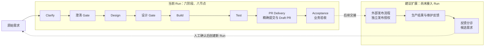

# Anthropic AI-Native SDLC 与 DevFlow Studio 的架构对齐

**结论：适合部分采纳，优先完善阶段产物交接和 Agent 配置评估，再扩展运维反馈入口。** 当前的确定性 Workflow、人工 Gate、有界执行和证据记录已经提供了这些改进需要的基础。生产部署和维护应作为后续生命周期扩展单独设计。

本文是代码对照分析与增量设计建议。标为“建议”的内容尚未实现，也不改变现有 ADR、Roadmap 或版本发布状态。

- 原文：[The AI-Native SDLC playbook](https://claude.com/blog/the-ai-native-sdlc-playbook)，Anthropic，Louis Claxton，2026-08-21；核对日期：2026-09-10。
- 代码基线：`b7903c3ebaa1db99c953bc0f2d05ff94997a099b`。分析时工作区已有文档修改和分析产物；代码判断以该提交及实际读取的工作区源码为准。
- 分析方法：使用 `build-graph` 增量更新 Code Review Graph，再按 `explore-codebase` 查询结构和调用关系，回读领域契约、可信入口、测试与 ADR。图索引覆盖 552 个可解析文件，更新后与 HEAD 一致。静态图用于导航；Electron IPC、动态回调及运行时权限仍需源码核对。

## 1. 原文思想与采用边界

文章将生命周期划分为 **Plan、Design、Build、Test、Deploy、Maintain** 六个非线性阶段。核心是通过可追溯产物交接工作，以 Skills 提供指导，以可执行规则和人工授权约束动作，通过评估与维护反馈持续改进。[原文](https://claude.com/blog/the-ai-native-sdlc-playbook)

下面的模块映射、优先级和方案是结合本仓库得出的判断，不是 Anthropic 对 DevFlow Studio 的评价或官方集成要求。

DevFlow 的六个阶段为 `clarify / design / build / test / pr / accept`。标准 Run 包含八个节点：Clarify 和 Design 各有一个 Agent 节点与一个 Gate，其余四个阶段各一个节点。Request Intake 是创建 Run 的入口。对应代码是 [NodeStage 与 ArtifactKind](../../packages/shared/src/domain.ts) 和 [createWorkflowRunFromRequest](../../packages/shared/src/workflow.ts)。

## 2. 六阶段对照

| 原文阶段 | 当前项目中的对应职责 | 代码已支持的行为 | 差距与采纳判断 |
| --- | --- | --- | --- |
| Plan | Intake → Clarify → Clarification Gate | 保存原始需求；生成目标、非目标、验收条件、假设与问题；新澄清路径记录修订与引用；人工可要求修改后重审 | 对齐程度较高。适合补充稳定的验收条件编号和下游引用。只读本地 Stage Agent 当前仅授权用于澄清，不应写成所有阶段均有此能力。 |
| Design | Design Agent → Design Gate | 生成设计产物，包含实现思路和测试策略；Gate 要求匹配前置节点的设计产物 | 设计正文可以承载实施计划，但当前没有独立的 `plan` 产物类型，也没有与澄清完全相同的设计修订契约。优先增强现有 Design 交接格式。 |
| Build | Coding Agent Run / Coding Executor | 在受控本地工作区执行，形成 Coding Diff、权限与执行记录；运行时成功后仍由 Workflow 检查推进条件 | 保留有界执行。可增加“批准设计中的计划项 → 实际改动”的对应关系；执行偏离设计时的重审规则需要单独补齐。 |
| Test | Run 的 Test 节点；项目自身的 CI/evaluator | 保存测试命令、结果和来源；交付与验收引用精确提交的测试；Verify 配置执行 V2.0、V2.1、V2.2 评估器 | 两种测试对象必须区分：Run 验证用户项目改动，CI 验证 DevFlow 自身。现有确定性评估不能直接证明任意新模型或 Skill 的真实任务效果。 |
| Deploy | PR Delivery + Acceptance 承担交付前的部分职责 | 独立授权精确提交的分支发布及 Draft PR；核实远端结果；最后记录业务验收 | 部分对应。Run 中没有生产发布、环境审批和回滚节点；Acceptance 不代表已经部署。 |
| Maintain | 暂无用户项目维护闭环 | 已有运行轨迹、审计与失败证据，可作为后续反馈的数据来源 | 暂缺产品级闭环。先设计“反馈记录 → 人工分诊 → 新 Run”，再考虑监控触发。Worker 当前只做成本汇总，不是生产运维 Agent。 |

证据入口：[Workflow 命令及测试](../../packages/shared/src/workflow-transition.ts)、[澄清修订契约](../../packages/shared/src/clarification.ts)、[Stage Agent 能力限制](../../packages/shared/src/workflow-agent.ts)、[GitHub Delivery](../../packages/shared/src/github-delivery.ts)、[Verify 配置](../../.github/workflows/verify.yml)、[Worker](../../apps/worker/src/index.ts)。

需要另外区分：仓库的 [release.yml](../../.github/workflows/release.yml) 是 **DevFlow Studio 软件本身**的发布流程，其存在不等于每个用户 Run 都具备部署目标应用的能力。

## 3. 对齐后的流程与架构解释

图中当前流程的状态变化由确定性 Workflow 命令控制；产物生成、知识命中或 Agent 自报成功都不能代替对应的证据检查与授权。虚线表示拟议的产品扩展连接，不表示已有自动触发器。

项目架构可以按以下职责解释。这些是代码职责层次，不是把六个 SDLC 阶段拆成六个服务。

| 职责层次 | 主要代码位置 | 在流程中的作用 |
| --- | --- | --- |
| 展示与协作 | `apps/desktop/src`、`apps/web` | 展示阶段、产物与审批上下文，让开发者和负责人采取明确动作。 |
| 流程与证据规则 | `packages/shared/src/workflow*.ts`、`clarification.ts`、`github-delivery.ts` | 定义节点、产物和推进条件，检查当前版本、证据与权限。 |
| 本地 Agent 与工具执行 | `apps/desktop/electron`，包括 `native-coding-executor-v2.ts`、`native-tool-registry.ts` | 把模型动作交给受约束的执行器，管理工作区、工具能力、预算和执行结果。 |
| 知识与上下文 | `packages/shared/src/workflow-context-projection.ts`、`retrieval-memory.ts` 与 Desktop 对应模块 | 提供适用于当前节点的知识、引用和受作用域约束的记忆。检索结果用于解释与审查。 |
| 本地可靠性与审计 | `apps/desktop/electron/local-store.ts` 及其存储模块 | 保存完整本地证据、版本和恢复状态，维护事务与重放边界。 |
| 团队治理与交付协作 | `apps/api`、Postgres、Web 与 GitHub Delivery | 管理团队身份、规则、签名审批和脱敏投影；协作层不获得任意本地执行权。 |

本地 Run、工作区和完整执行证据继续由 Desktop/SQLite 管理；团队身份、策略、审批等由 API/Postgres 管理；团队知识以 Git/Markdown 来源及其版本为依据。具体字段遵循[后端数据源矩阵](backend-data-source-matrix.md)与[上下文投影](workflow-context-projection.md)。导出 Wiki 或 Markdown 时应注明其来源和派生性质，不另建一份可修改执行状态的权威副本。

## 4. 采纳顺序与最小增量

### 优先级一：完善 Design 的交接契约

**现状：** 澄清已有 `ClarificationRevisionMetadata`，包含修订摘要、原始需求引用、反馈和执行来源；`SkillDefinition` 已有 `version`；Stage Agent 已记录模型、执行器版本和 `contextDigest`。但这些局部能力尚不等于每个阶段都有统一的、批准后不可混用的产物版本链。尤其 Design 的通用 Artifact 不能被描述为已经具备澄清的完整修订能力。

**建议：** 先在现有 Design 产物中约定以下可读内容，随后按需要增加结构化字段和版本约束：

| 交接内容 | 建议记录的项目数据 | 作用 |
| --- | --- | --- |
| 上游依据 | 当前澄清产物 ID、revision/digest、验收条件编号 | 明确这份设计回答哪一版需求。 |
| 代码依据 | 源提交、分析范围、相关文件或符号、存在的工作区差异 | 让设计结论能够回到具体代码核对。 |
| 实施计划 | 改动范围、计划项、关键接口与依赖、风险和替代方案 | 让开发者在 Build 前检查实施路径。 |
| 验证计划 | 每个验收条件对应的测试或人工检查、成功判据 | 使后续 Test 和 Acceptance 能检查同一目标。 |
| 生成配置 | 实际使用的模型、执行器、提示词摘要，以及 Skill 的 ID、版本和内容摘要 | 支持复现与配置比较；不把 Skill 目录展示记录当作执行证明。 |
| 修订处理 | 批准对象、修订原因、受影响的下游证据引用 | 对实质性设计变化建立失效与重审规则。 |

以上是建议字段，不是当前 TypeScript schema。第一步可用固定 Markdown 小节试用，无需添加一个新的 Plan 节点。实现阶段的最小验收应覆盖：设计基于过期澄清时不能进入 Build；批准后更换设计内容不能复用旧批准；变更验收条件后旧的对应关系被标记为需重新核对。

这项工作应复用 [clarification.ts](../../packages/shared/src/clarification.ts)、[Workflow 命令](../../packages/shared/src/workflow-transition.ts) 与 [Workflow Runtime](../../apps/desktop/electron/workflow-runtime.ts) 的职责边界，避免让 UI 或 Skill 直接更新 Run 状态。

### 优先级二：为模型、提示词与 Skill 变更建立专项评估

**现状：** [Verify](../../.github/workflows/verify.yml) 已运行绑定候选提交的三套 evaluator；对应 runner 会去除 Provider/凭证环境权限。它们提供确定性运行时、检索/记忆和协同契约的回归依据。不能据此推导“某个新模型一定理解需求更准确”或“某个 Skill 提升了交付质量”。

**建议：** 在现有评估体系上增加配置比较用例，而非另建一条与发布证据脱离的评分流水线：

1. 选取少量有标准答案或可验证结果的任务，覆盖澄清、设计、引用正确性与越权动作拒绝。
2. 固定代码/知识样本与案例版本，同时记录模型、提示词、Skill 内容摘要和评估器版本。一个比较只改变明确的配置因素。
3. 分别保留确定性契约结果和真实模型任务结果；后者按明确预算进行独立验证，默认 CI 继续保持无付费 Provider。
4. 为质量、引用有效性和成本/耗时设定明确判据。越权、伪造证据和跨项目引用设为必须阻断的失败；不能仅凭综合平均分放行。
5. 经确认的实际失败加入回归案例。配置变更通过对应检查后才成为可用候选配置，业务 Gate 仍照常执行。

起点是 [V2.0 runner](../../scripts/v20-agent-runtime-evaluation-runner.mjs)、[V2.1 runner](../../scripts/v21-retrieval-memory-evaluation-runner.ts)、[V2.2 runner](../../scripts/v22-multi-agent-evaluation-runner.ts)，以及已有的[测试策略](testing-strategy.md)。本轮没有执行新的模型比较或生成发布评估记录。

### 优先级三：先接收维护反馈，再讨论自动部署与监控

**现状：** 当前 Run 以业务验收结束。失败日志、执行轨迹和团队知识可作为后续分析材料，但没有证据表明产品已经实现生产指标检测、告警分诊和自动回流需求。

**建议的第一步：** 人工录入或选择一条问题反馈，生成候选需求，记录来源、关联 Run、代码/发布版本、现象、已核实证据、假设和建议回归案例。负责人分诊确认后创建新的 Run，保留关联关系，不修改旧 Run 的完成证据。

最小验收包括：同一反馈不重复创建 Run；未经确认的诊断不会成为已证实事实；新 Run 可回溯旧交付；关闭反馈需要可核实的处理结果。

若未来增加部署集成，再单独定义环境权限、发布版本、独立批准、部署结果与回滚证据。先对接可信外部发布系统的有限接口。当前 Draft PR 授权和 Acceptance 不可复用成生产发布授权，也不应直接赋予 Worker 或 Coding Agent 任意生产命令权限。

## 5. 代码分析 Skills 如何参与

本次实际使用的是 `build-graph` 与 `explore-codebase`，并回读源码确认结论。已安装的分析工具可以按以下工作分工复用；本表不表示它们已经集成进 DevFlow 产品运行时。

| 工具/Skill | 适合贡献的材料 | 进入项目文档时的处理 |
| --- | --- | --- |
| Code Review Graph：`build-graph` / `explore-codebase` | 文件关系、符号调用、相关测试和变更影响线索 | 更新到分析提交；再沿源码和真实入口核对关键路径。静态调用边不能证明某条路径在运行时已经执行。 |
| Understand Anything：`understand` / `understand-domain` | 模块解释、业务概念与交互式理解图 | 对照领域契约及 ADR 修正归类，区分代码事实与分析推断。适合后续项目学习与面试讲解。 |
| Graphify | 代码、ADR、流程文档之间的关系及 Wiki 导航素材 | 每条关键结论保留来源；文档过期或代码变化后更新派生图。适合后续建设知识入口。 |

可复用的分析步骤：

1. 记录源提交、工作区差异、工具版本、分析范围和未覆盖范围。
2. 从目标 Workflow 节点追踪到共享契约、Electron/API 入口、执行器、持久化和对应测试。
3. 将发现整理为“已实现行为、相关证据、差距、拟议改动、验收判据”，再更新架构或流程文档。
4. 知识图谱、Wiki 与分析报告先作为上下文。若用于 Gate Review，由完成的 Review/finding 留下审查记录，不能以图谱连通性、检索分数或模型总结直接满足 Gate。

这一边界沿用 [ADR 0007](../adr/0007-knowledge-retrieval-is-not-governance-evidence.md) 和 [ADR 0016](../adr/0016-tool-mcp-execution-authority.md)：本机 Codex 安装了 Skill/MCP，不会自动创建 DevFlow 的 `LocalMcpInstallation`、工具授权或批准记录。

## 6. 如何判断采纳是否有收益

以下是建议指标，尚无本轮实测基线或改善数值：

| 指标 | 建议口径 | 需要的数据 |
| --- | --- | --- |
| 需求到交付耗时 | 同一 Run 创建到 Acceptance 的耗时，报告样本数与 P50/P90；未完成 Run 单列 | Run、节点与验收事件；同时分开人工等待和实际执行时间。 |
| 需求/设计返工 | 进入 Build 后因需求或设计变更而需重审的 Run 数 / 进入 Build 的 Run 数 | 带原因的修订和重审事件；设计事件契约需先补齐。 |
| 配置变更质量 | 同一案例集下候选配置与基线配置的有效完成率、无效引用率、成本和耗时 | 配置摘要、案例版本、独立评估记录；区分确定性与真实模型结果。 |

这些口径用于改进流程。真实使用数据积累前，简历中不填写“效率提升百分比”“生产故障下降”等结果。

## 7. 项目介绍的准确表述

> AI DevFlow Studio 面向小型研发团队，将 AI 辅助开发组织成需求澄清、方案设计、实现、测试、PR 交付和业务验收六阶段流程。共享领域层检查阶段推进条件，Electron 在本地执行并保存完整证据，Web/API 承担团队治理和协作。项目把模型动作、有界工具执行、证据版本与人工批准连接起来；当前交付边界到经过核实的 Draft PR 和业务验收，生产部署与维护闭环属于后续扩展方向。

这段是项目能力介绍。个人贡献、技术取舍由谁完成及效果数据，需要再结合提交、实际运行记录和贡献访谈确定，不能从工具生成的架构图直接推导。

## 8. 关键证据与本轮验证

| 核对事项 | 证据 |
| --- | --- |
| 六阶段与八节点结构 | [domain.ts](../../packages/shared/src/domain.ts) 的 `NodeStage`；[workflow.ts](../../packages/shared/src/workflow.ts) 的 `createWorkflowRunFromRequest`。 |
| 证据、顺序与权限控制推进 | [workflow-transition.ts](../../packages/shared/src/workflow-transition.ts) 的 `evaluateWorkflowCommand` / `applyWorkflowCommand`；[对应测试](../../packages/shared/src/workflow-transition.test.ts) 中设计缺失、PR 未完成、最终验收授权的用例；[可信命令处理器](../../apps/desktop/electron/gate-command-processor.ts)。 |
| 澄清版本及只读分析限制 | [clarification.ts](../../packages/shared/src/clarification.ts)、[修订测试](../../packages/shared/src/clarification.test.ts)、[workflow-agent.ts](../../packages/shared/src/workflow-agent.ts)；[ADR 0020](../adr/0020-read-only-stage-agent-and-versioned-clarification.md)。 |
| 精确提交的测试和验收 | [workflow-test-command.ts](../../apps/desktop/electron/workflow-test-command.ts)；[workflow.ts](../../packages/shared/src/workflow.ts) 的 `createAcceptanceEvidenceBundleArtifact`；[GitHub Delivery](../../packages/shared/src/github-delivery.ts)。 |
| 模型与工具不能自行扩大权限 | [ADR 0014](../adr/0014-bounded-agent-runtime.md)、[ADR 0016](../adr/0016-tool-mcp-execution-authority.md)、[native-tool-registry.ts](../../apps/desktop/electron/native-tool-registry.ts)。 |
| 现有评估的适用边界 | [Verify](../../.github/workflows/verify.yml) 及上述三个 evaluation runner。读取配置和实现不等于本轮 CI 或发布评估通过。 |

本轮完成了图索引增量更新（12 个文件重新解析，无解析错误）、上述源码/测试/文档对照及新增文档的本地链接检查。读取了相关测试用例，未重新执行产品测试或付费 Provider 验证；本轮修改限于分析与文档。
