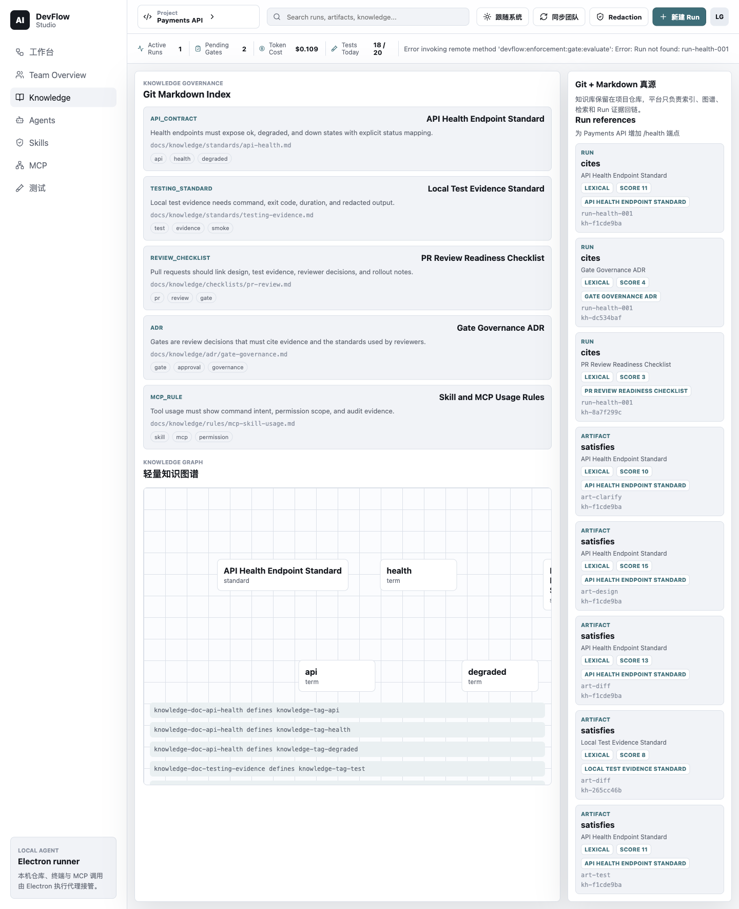
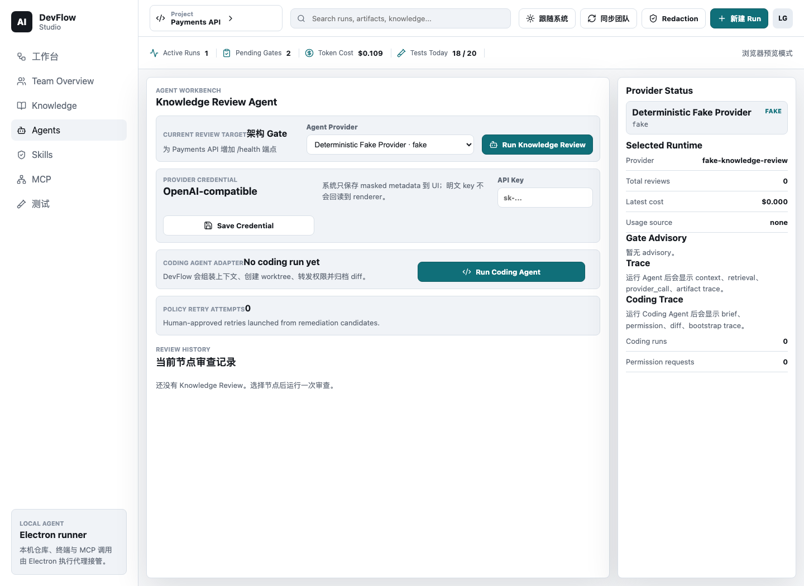
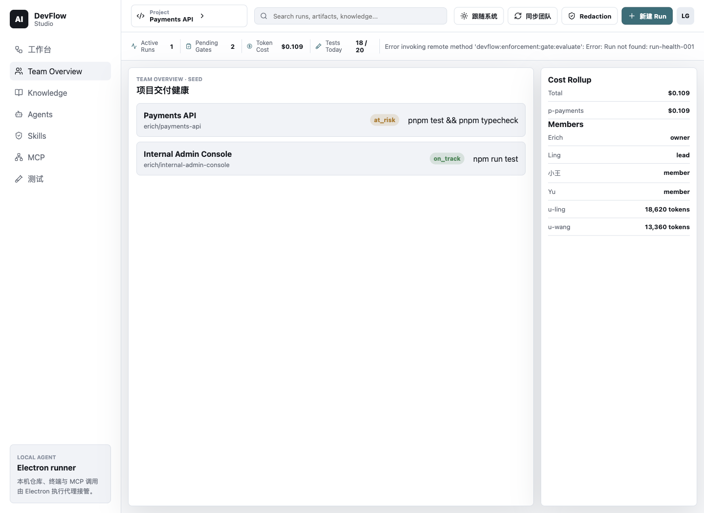
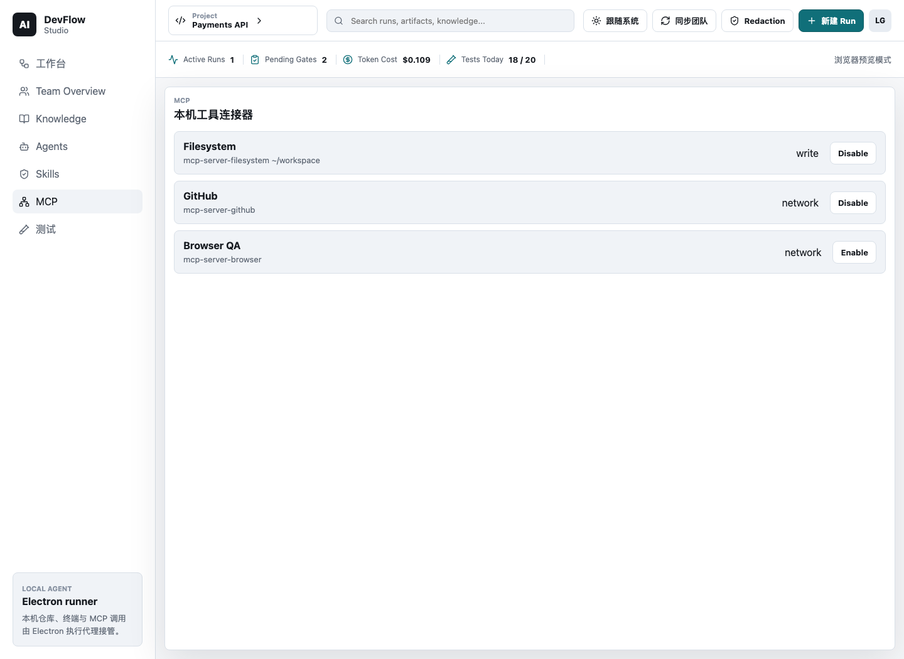

# DevFlow Studio 全量基础功能体验指南

更新时间：2026-07-31

Status: Historical V1.3 guide; preserved for the V1.3 product and release context only.

适用版本：仅限 `v1.3.0` 历史体验，不是当前 V1.5 操作指南。

当前开发态的演示与 smoke 入口见
[`demo-and-smoke.md`](../engineering/demo-and-smoke.md)；候选绑定的 V1.5 GitHub Delivery
验收见 [`devflow-studio-v1.5-walkthrough.md`](./devflow-studio-v1.5-walkthrough.md)。
This historical guide does not authorize paid-provider smoke.

这份指南用于体验 DevFlow Studio 已经落地的基础能力。它不是某一个版本的 release
walkthrough，而是按 V1.3 当时的产品入口把 v0.2 到 v1.3 的核心能力串起来：本地仓库、Run/Gate、
Knowledge、基于知识的门禁审查（Knowledge-Grounded Gate Review）、Coding Agent、测试证据、Team/Web、Pairing、Budget、Tool / Skill
Trace、PR Draft 和 Acceptance Bundle。

这里的 Knowledge 是审查依据；审查对象是当前 Gate、门禁条件和关联的阶段产物与证据。

本指南列出目标体验路径，不代表任何候选已自动通过验收。v1.3.0 的实际发布状态只以
`docs/releases/v1.3.0/` 的四份证据、`corepack pnpm release:status` 的对应模式结果和
`v1.3.0` tag 指向为准。

## 候选形成前历史快照（2026-07-31）

2026-07-25 的失败
Computer Use 基线见
[devflow-studio-v1.3-walkthrough-result-2026-07-25.md](./devflow-studio-v1.3-walkthrough-result-2026-07-25.md)。
在该快照中，收尾工作树尚未生成新的 dated result。

默认路径不调用真实付费模型。真实
`opencode` + 豆包/Volcengine provider smoke 是 release-only 验证项，放在最后单独执行。
截至该历史快照，V1.3 收尾工作树已加入以下边界：

- 共享可信命令负责 Agent/Gate/Build/Test/PR/Acceptance 的顺序和证据检查；
- Electron main 从本地 store 重载 canonical state，并以事务提交 Run 与候选交付证据；
- Pairing 绑定 Local Project 与 Team Project，同 id 本地状态在同步合并时保持权威；
- `DEVFLOW_ENABLE_FAKE_RUNTIME=true` 显式提供 deterministic fake Agent provider 并允许
  fake Coding Engine；
- archived Test Evidence 将已知 workspace root 替换为 `<workspace>`；
- API/Worker dist 有隔离运行 smoke，Verify/Release workflow 覆盖 build/output、E2E、
  Electron、Windows、Postgres 和 Docker gate。

这些是当时的实现边界，不是发布结论。该快照中，新的 Computer Use、完整候选 gate、
付费 real-opencode 记录、版本对齐和 tag 尚未完成；后续是否完成必须重新检查 release
evidence、`release:status` 和 tag。

## 0. 启动环境

在项目根目录运行：

```bash
# 从 workbench 根目录进入本 Project
cd projects/agent-engineering/ai-devflow-studio

DEVFLOW_ENABLE_DEMO_DATA=true \
DEV_AUTH_ENABLED=true \
DEVFLOW_ENABLE_FAKE_RUNTIME=true \
DEVFLOW_API_BASE_URL=http://127.0.0.1:4310 \
NEXT_PUBLIC_DEVFLOW_API_URL=http://127.0.0.1:4310 \
corepack pnpm dev:api
```

另开一个终端：

```bash
DEVFLOW_ENABLE_DEMO_DATA=true \
DEVFLOW_API_BASE_URL=http://127.0.0.1:4310 \
NEXT_PUBLIC_DEVFLOW_API_URL=http://127.0.0.1:4310 \
corepack pnpm dev:web
```

另开一个终端：

```bash
DEVFLOW_ENABLE_DEMO_DATA=true \
DEVFLOW_ENABLE_FAKE_RUNTIME=true \
DEVFLOW_CODING_ENGINE=fake \
DEVFLOW_API_BASE_URL=http://127.0.0.1:4310 \
NEXT_PUBLIC_DEVFLOW_API_URL=http://127.0.0.1:4310 \
corepack pnpm dev:electron
```

通过标准：

- API health 可访问：`http://127.0.0.1:4310/health`。
- Web Console 可访问：`http://127.0.0.1:4311`。
- Electron 窗口标题是 `AI DevFlow Studio`，不是 Electron default app。
- 左侧能看到 `工作台`、`Team Overview`、`Knowledge`、`Agents`、`Skills`、`MCP`、`测试`。


## 1. Workbench：本地仓库与六阶段 Run

入口：左侧 `工作台`

要体验：

- 选择本地仓库。
- 保存测试命令。
- 搜索 Run / Artifact / Knowledge。
- 新建 Run，输入真实需求。
- 查看六阶段：`clarify -> design -> build -> test -> pr -> accept`。

建议输入：

- 标题：`修复 webhook retry 失败边界`
- 需求：`请澄清 webhook retry 的失败边界，设计最小实现方案，完成本地实现、测试、PR handoff 和验收证据。`

通过标准：

- 新 Run 从 `clarifying` 开始。
- Inspector 能看到 `Raw request` artifact。
- Gate approval 会推进 `currentNodeId`，不会把所有 Gate 硬编码成 `building`。
- Build task 才显示 `Coding Agent`。
- PR 节点显示 `生成 PR Draft`。
- Acceptance 节点显示 `生成验收证据包`。


## 2. Gate Enforcement：策略、阻断、补救

入口：Workbench Inspector 的 `GATE ENFORCEMENT`

要体验：

- 选中 Gate 节点。
- 查看 policy source、version、syncedAt。
- 查看 blocking/warning reason。
- 查看 Remediation Plan。
- 尝试在未满足策略时 approve Gate。

通过标准：

- blocked Gate 不会只靠 renderer 禁用按钮；Electron main 写路径也会拒绝。
- `blocked_policy_unavailable` 只阻止 Gate approve，不阻止门禁审查、测试、Coding 等本地工作。
- hard-block 时应显示 remediation，不显示 override 逃生口。
- confirmed override 和 provisional/rejected override 的 UI 语义不同。

## 3. Knowledge：知识治理与引用

入口：左侧 `Knowledge`

要体验：

- Markdown knowledge documents。
- Knowledge Governance checks。
- Knowledge Graph。
- Retrieval/reference 命中。
- 搜索 `api`、`test`、`security` 等关键词。

通过标准：

- 能看到 standards/checklists/ADR-like knowledge。
- Governance checks 是 evidence-driven；retrieval-only reference 不会自动满足 evidence。
- Inspector 里能看到当前节点关联的 Knowledge Governance 状态。



## 4. 门禁审查 Agent：审查、trace、finding

入口：Workbench Inspector 的“门禁审查”或左侧 `Agents`

`DEVFLOW_ENABLE_FAKE_RUNTIME=true` 时会列出 `Deterministic Fake Provider`，不花模型钱；
它适合本地 walkthrough 和 CI，但不代表真实模型审查。运行前明确选择它；关闭该 flag
后，旧 fake provider 选择必须隐藏或被 main 拒绝。

如果要让门禁审查 Agent 调用豆包/Volcengine Ark：

1. 打开左侧 `Agents`。
2. 在“门禁审查模型凭证”中确认：
   - Provider ID：`doubao-review`
   - Base URL：`https://ark.cn-beijing.volces.com/api/coding/v3`
   - Model：`ark-code-latest`
3. 输入 API Key，点击 `Save Credential`。
4. 在“门禁审查模型 Provider”下拉框选择保存后的 live provider，再运行“门禁审查”。

边界说明：豆包/Volcengine 只提供 OpenAI-compatible 模型 API。DevFlow 自己组装门禁审查 prompt、检索 Knowledge 作为依据、运行治理检查，并解析结构化门禁审查结果；当前 Gate、门禁条件与阶段产物或证据才是审查对象。门禁审查 Agent 不由 `opencode` 执行；`opencode` 只用于 Coding Agent。

要体验：

- 选中一个 Gate 或 Build 节点。
- 点击“门禁审查”。
- 打开 `Agents` 查看门禁审查历史。
- 查看 trace、token/cost、Agent Policy Finding、warning/blocking advisory。

通过标准：

- 门禁审查生成可审计结果和 artifact。
- Provider 显示能区分 fake/no-cost 与 live/may spend tokens。
- 门禁审查 finding 默认不会 hard-block。
- Gate Advisory 是否阻断由 policy evaluation 决定，不由 Agent core 直接决定。



## 5. Coding Agent：fake 默认路径、permission relay、diff、worktree

入口：Build task 的 `Coding Agent`，然后左侧 `Agents`

要体验：

- 在 Build task 点击 `Coding Agent`。
- 在 Agents 视图查看 permission request。
- 点击 approve。
- 查看 fake diff、managed worktree、bootstrap/test evidence、terminal state。

通过标准：

- Coding Agent 只允许从 `stage: build` 且 `kind: task` 启动。
- renderer 不传 prompt；coding brief 由 main/shared 从 Run、Node、Artifact、Knowledge、Policy、
  Remediation、Test Evidence 组装。
- 主仓库不被直接修改。
- diff artifact 只保存 redacted/reviewable 内容。
- cleanup 状态可见。
- Build 只在匹配当前节点的 Coding Run 完成且 Diff 已持久化后推进到 Test。


## 6. Tool / Skill Timeline：可观测性

入口：左侧 `Agents`

要体验：

- 查看 permission timeline。
- 查看 `Tool / Skill Timeline`。
- 查看 `tool_call` / `tool_result`。
- 查看 source：`opencode_metadata`、`inferred` 或未来的 `opencode_event_stream`。

通过标准：

- fake engine 不应被误导成真实 opencode Skill 调用。
- 如果缺少 skillName，UI 显示 `Unknown skill` 或 inferred 标记。
- 本地 event metadata 也必须脱敏，不保存 raw stdout/stderr、raw prompt、provider secret、
  完整 cwd 或完整 patch body。
- 当前不能保证还原 opencode 内部私有 Skill 调用栈。

## 7. Tests：本地测试证据

入口：左侧 `测试`

要体验：

- 查看 Local test evidence。
- 运行保存的测试命令。
- 尝试保存危险命令，例如 `rm -rf /`。

通过标准：

- 安全命令可以执行并生成 Test Evidence。
- 危险命令被 command safety 阻断。
- Evidence 显示 command/status/exit code/duration。
- stdout/stderr summary 经过 redaction。
- 只有当前 Test 节点可以执行；失败 Test 保持当前并将 Run 标为 `failed`，通过后才进入
  PR。
- Test report 中的已知 POSIX/Windows workspace root 显示为 `<workspace>`；上传到 Team
  的 summary 继续省略 cwd 和原始输出。


## 8. Remediation / Retry Coding

入口：被 policy/finding 阻断的节点 Inspector

要体验：

- 让 Gate Enforcement 或 Agent finding 产生 Remediation Plan。
- 查看 remediation candidates。
- 点击 retry/coding 相关 action。
- 在 Agents 里批准新的 permission。

通过标准：

- Retry 是 human-approved，不自动绕过 Gate。
- Retry Attempt 有记录。
- Coding Brief 带 remediation context。
- Team/Web 只接收 redacted delivery summary。

## 9. PR Draft 与 Acceptance Bundle

入口：Workbench 的 PR 节点和 Acceptance 节点

要体验：

- 在 PR 节点点击 `生成 PR Draft`。
- 在 Acceptance 节点点击 `生成验收证据包`。
- 最后通过 Acceptance Gate。

通过标准：

- PR Draft 包含 request、changed paths、Test Evidence、Policy、Budget、门禁审查、safe
  compare URL。
- Acceptance Bundle 引用 Raw Request、PR Draft、diff、tests、policy、budget、门禁审查结果。
- 当前 v1.3 只生成 PR handoff artifact，不创建真实 GitHub PR。
- 系统不会自动 push、merge 或自动通过 Gate。
- PR 只在当前 PR 节点、completed Coding Run/Diff 和最新 passing Test/report 都匹配时
  完成。
- Acceptance Bundle 还要求已附着 PR Draft；final Acceptance 再要求 bundle、授权角色、
  非阻断 policy、匹配且非阻断的门禁审查和非阻断 budget decision。
- 被拒绝的可信命令不会留下孤立的 delivery artifact/event。

## 10. Team Overview：团队视角与 redacted sync

入口：左侧 `Team Overview`，以及浏览器 `http://127.0.0.1:4311`

要体验：

- Desktop Team Overview。
- Web Team Console。
- 点击 Desktop 的 `同步团队`。
- 查看 Web 是否出现 redacted Run/Test/Review/Coding/Cost summary；内部 `Review` 类型在界面显示为“门禁审查”。

通过标准：

- Web 只显示 redacted summary，不显示 raw prompt、raw logs、cwd、patch、provider secret。
- Team Overview 能展示项目、成员、成本、风险、delivery summary。
- API seed mode 可以用于本地 demo；Postgres/Docker 是独立显式路径。
- Pairing credential 必须绑定当前 `localProjectId` 与一个 Team Project。
- 远端 Test/Review/Coding Evidence 写入前必须先有同项目 canonical Run；其中内部 `Review` 对应门禁审查。cross-project、
  stale 或缺 Run 的写入会被拒绝。
- 同 id 的本地 Run/Artifact/Event 优先于远端 summary，远端只补充 remote-only 数据。




## 11. Runtime Budget：成本、策略、approval retry

入口：Web Team Console 的 `Runtime Budget`，以及 Desktop Agents/Inspector 的 budget trace

要体验：

- Web 查看 Runtime Budget policy。
- Web 创建 Budget Approval。
- Desktop 在 Coding Agent 被 budget guard 阻断时查看 projected/current/limit cost。
- 输入 approval id 后 retry。

通过标准：

- paid provider 调用前先过 budget guard。
- over-budget 且无有效 approval 时，必须在 `engine.start(...)` 前阻断。
- Desktop 传 approval id，runtime/team boundary 解析完整 approval record。
- fake/default path 不花模型钱。

## 12. Desktop Pairing 与 self-hosted pilot

入口：

- 本地 API 测试前置可调用 `POST /api/team/projects/:projectId/pairing-codes` 创建一次性 code；调用者须有 lead/owner 权限。
- Desktop 顶栏：`Desktop pairing code` + `绑定`
- 自托管指南：[devflow-studio-self-hosted-pilot.md](./devflow-studio-self-hosted-pilot.md)

要体验：

- 可由本地 API 测试前置创建 pairing code，但不得把这记录为 Web pairing UI 通过。
- Computer Use 在 Desktop 中亲自输入 code，点击 `绑定`，然后点击 `同步团队`。
- 关闭并以同一隔离 `userData` 重启 Electron，再次同步。

通过标准：

- Desktop sync 使用 Bearer token，不回退 demo headers。
- renderer 不接收明文 bearer token。
- pairing code 是 copy-once / short-lived。
- 绑定持久化当前 `localProjectId` 和 Team Project，重启后仍可同步。
- 结果文档和截图不记录 pairing code 或 token。
- Docker Compose 路径通过 `corepack pnpm test:docker-smoke` 验证，不属于默认 `verify`。

若 pairing code 由本地 API 前置创建，本次证据只能签核 Desktop 绑定、同步和重启持久化；
除非 Computer Use 另外真实操作并记录 Web pairing UI，否则不得声称该 Web UI 已通过。

## 13. Skills 与 MCP

入口：左侧 `Skills`、`MCP`

要体验：

- 查看 Skill catalog。
- 查看 MCP server 定义。
- enable/disable MCP server。

通过标准：

- Skill/MCP 当前是管理壳和未来 runtime 扩展位置。
- MCP 开关本地持久化。
- 当前不启动真实 MCP 进程。
- 当前不要宣称 MCP 真执行或 MCP policy enforcement 已完成。

当前实测说明：Skills 显示未加载真实团队能力，MCP 显示未加载本地连接器；这两个页面当前
应按管理壳计，不按可用 runtime 计。



## 14. Release-only 真实 opencode + 豆包/Volcengine

这一步会产生真实模型调用，不属于默认体验。

门禁审查的真实模型 smoke 走 OpenAI-compatible provider：

```bash
DEVFLOW_AGENT_OPENAI_API_KEY=... \
DEVFLOW_AGENT_OPENAI_BASE_URL=https://ark.cn-beijing.volces.com/api/coding/v3 \
DEVFLOW_AGENT_OPENAI_MODEL=ark-code-latest \
corepack pnpm test:agent-live
```

这条 smoke 验证门禁审查 Agent 能用真实豆包/Volcengine 模型返回结构化门禁审查结果。它不验证 `opencode`。

先检查本机 runtime：

```bash
corepack pnpm opencode:status
```

确认要花真实 provider 配额后，再运行：

```bash
export ANTHROPIC_AUTH_TOKEN="<set in shell only; never commit>"
export DEVFLOW_RUN_OPENCODE_SMOKE=1
export DEVFLOW_CODING_ENGINE=opencode-http
export DEVFLOW_OPENCODE_PROVIDER_ID=double
export DEVFLOW_OPENCODE_MODEL_ID=ark-code-latest
export DEVFLOW_OPENCODE_API_KEY_ENV=ANTHROPIC_AUTH_TOKEN

corepack pnpm opencode:status
corepack pnpm test:opencode-smoke

unset ANTHROPIC_AUTH_TOKEN DEVFLOW_RUN_OPENCODE_SMOKE DEVFLOW_CODING_ENGINE
unset DEVFLOW_OPENCODE_PROVIDER_ID DEVFLOW_OPENCODE_MODEL_ID DEVFLOW_OPENCODE_API_KEY_ENV
```

通过标准：

- `opencode serve` 启动。
- permission relay 可见。
- diff capture 可见。
- fixture Test Evidence 通过。
- process/worktree cleanup 完成。
- 不打印 provider secret。

任一 preflight、permission、diff/tool evidence、Test Evidence、cleanup 或 redaction 条件失败，
都不得生成 `status: "passed"` 的 `docs/releases/v1.3.0/real-opencode.json`。完整 JSON
格式见 [release-only policy](../plans/release-only-real-opencode-smoke.md)。

## 15. 全量体验核对表

| 模块 | 入口 | 必看点 | 通过标准 |
| --- | --- | --- | --- |
| Desktop launch | `corepack pnpm dev:electron` | AI DevFlow Studio | 不是 Electron default app |
| Workbench | 工作台 | 六阶段 Run | request 创建 Run，Gate 可推进 |
| Local project | 工作台 | 仓库选择/测试命令 | command safety 阻断危险命令 |
| Gate Enforcement | Inspector | policy/reason/remediation | 写路径不能绕过 blocking |
| Knowledge | Knowledge | docs/graph/reference/check | retrieval 不等于 evidence |
| 门禁审查 | Inspector/Agents | 门禁审查 artifact/trace/finding | finding 不 hard-block |
| Coding Agent | Build task/Agents | permission/diff/worktree | fake path 可重复、主仓不改 |
| Tool / Skill Timeline | Agents | tool_call/tool_result/source | skill 缺失时显示 unknown/inferred |
| Tests | 测试 | Test Evidence | redacted status/command/duration |
| Remediation Retry | Inspector/Agents | Retry Attempt | human-approved，不自动绕 Gate |
| PR Draft | PR 节点 | PR handoff artifact | 不创建真实 GitHub PR |
| Acceptance Bundle | Acceptance 节点 | 验收证据包 | final Gate 仍受 policy 约束 |
| Team Overview | Desktop/Web | redacted summaries | 不上传 raw repo/log/prompt/patch |
| Runtime Budget | Web/Desktop | policy/approval/retry | paid run 前阻断超预算 |
| Pairing | Web/Desktop | pairing code/token sync | bearer token 不进 renderer |
| Skills/MCP | Skills/MCP | catalog/server toggles | 不宣称真实 MCP 执行 |
| Real opencode | Terminal | release-only smoke | 只在接受费用时执行 |

Release status 必须显式区分两个阶段：

```bash
# 创建 tag 前
corepack pnpm release:status -- --mode=pre-tag

# 仅在全部签核并创建 tag 后
corepack pnpm release:status -- --mode=tagged
```

## 版本验收的宣称边界

- 只有 clean `S` 的 pre-tag 与 tagged 检查均通过、且 `v1.3.0` tag 精确指向 `S` 后，
  才能宣称 v1.3 已完成正式签核并发布。
- 2026-07-25 的失败结果是历史基线，不能替代绑定候选 `C` 的新 Computer Use 结果。
- 不要说 Windows、Postgres、Docker、全部 CI 或 candidate-bound release evidence 已通过，
  除非它们已在同一候选 SHA 上实际运行并记录。
- 不要说 release-only 真实 opencode 已通过，除非得到付费调用授权并完成记录。
- 如果 pairing code 由本地 API 测试前置创建，不要说 Web pairing UI 已通过。
- 不要在 pre-tag 签核完成前创建或宣称 v1.3 tag。
- 不要说新 Web 壳已经闭环 intake、Gate、pairing 和 run selection。
- 不要说真实 opencode 是默认 CI/verify 路径。
- 不要说 fake engine 是真实 provider 行为。
- 不要说当前能还原 opencode 内部私有 Skill 调用栈。
- 不要说 v1.3 已创建真实 GitHub PR。
- 不要说系统会自动 push、merge 或自动通过 Gate。
- 不要说 MCP 真执行 / MCP policy enforcement 已完成。
- 不要说 RAG/vector retrieval 已接入。
- 不要说 Windows Electron full smoke 已完成。
