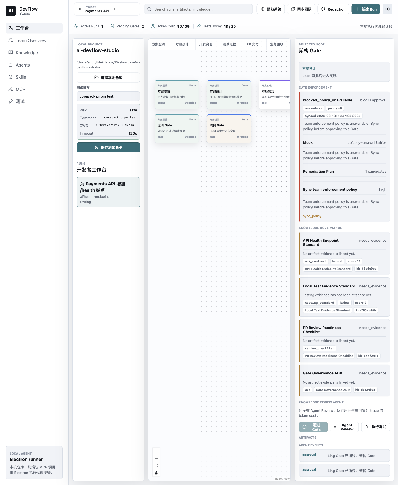
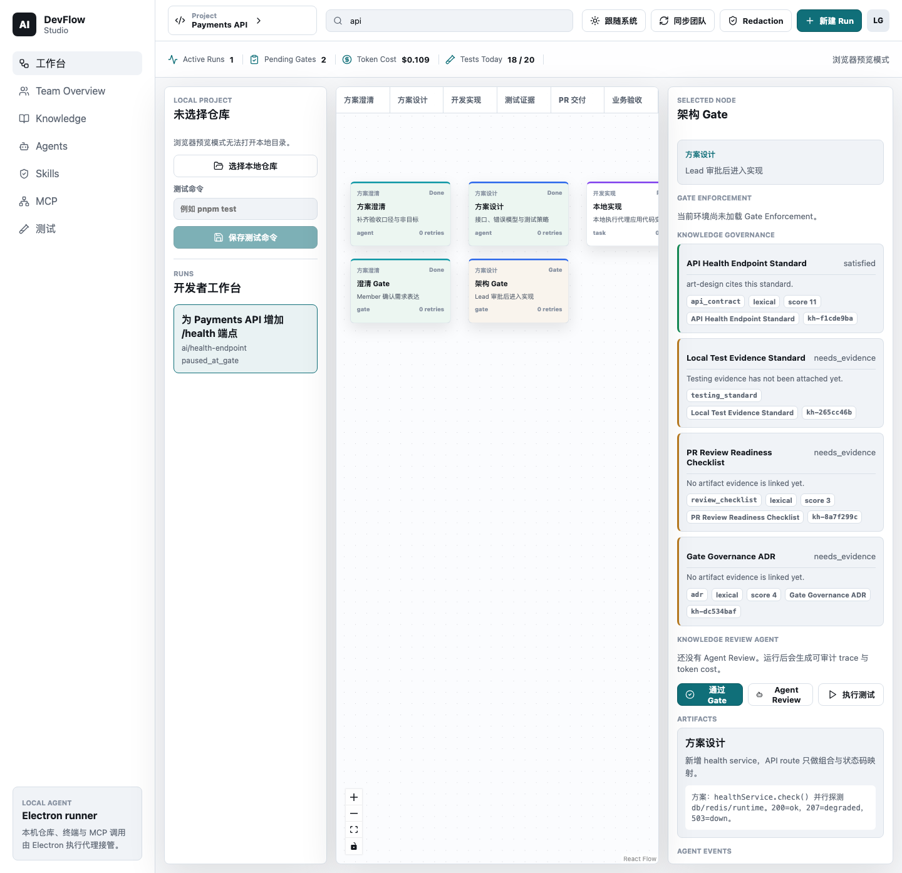
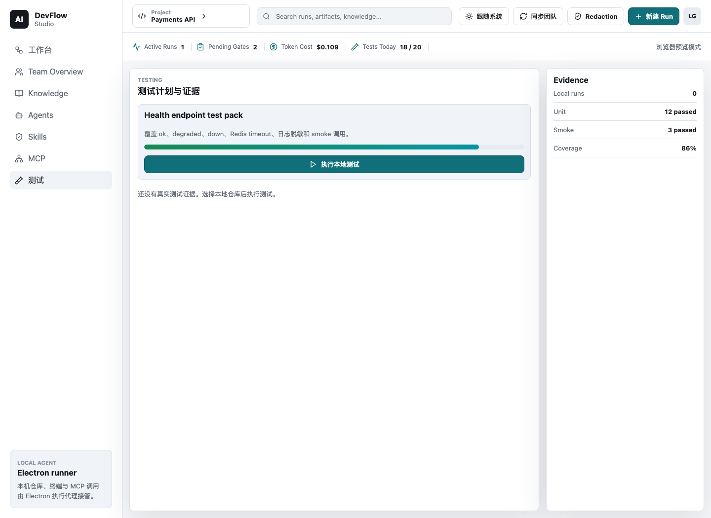
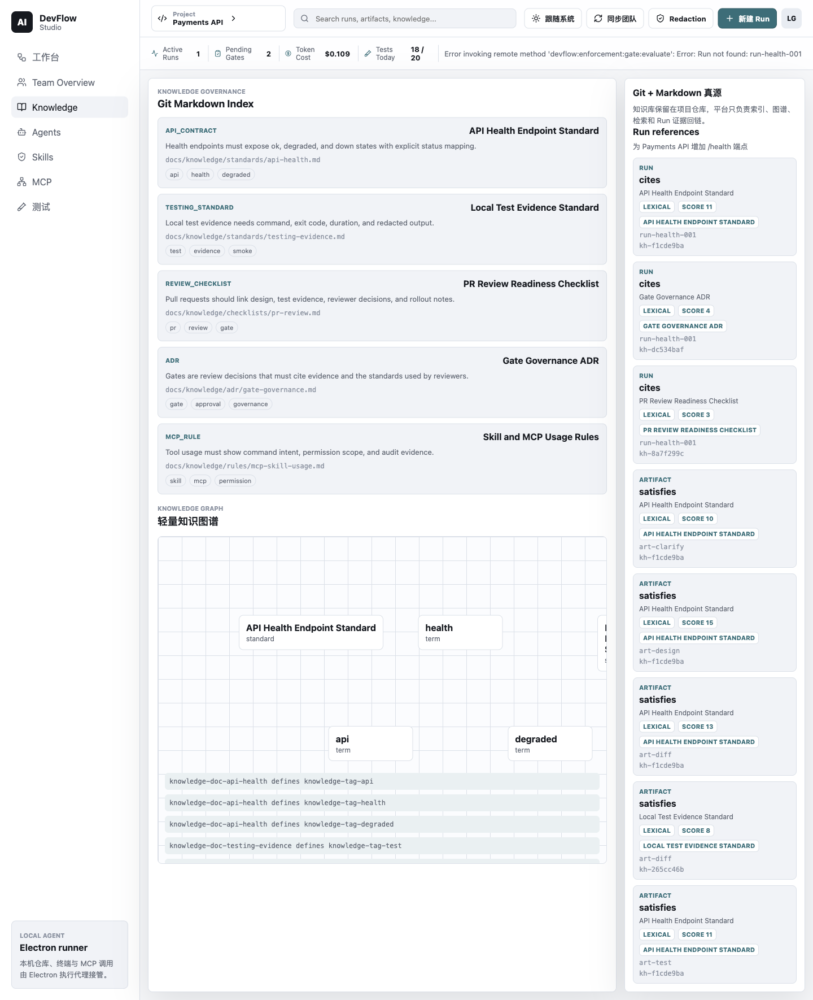
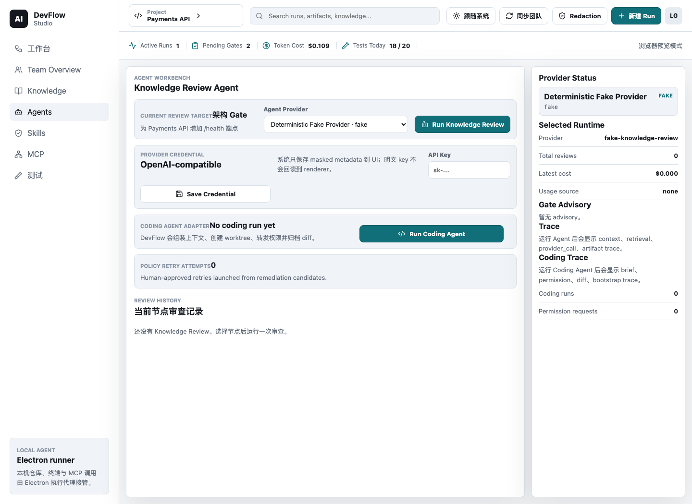
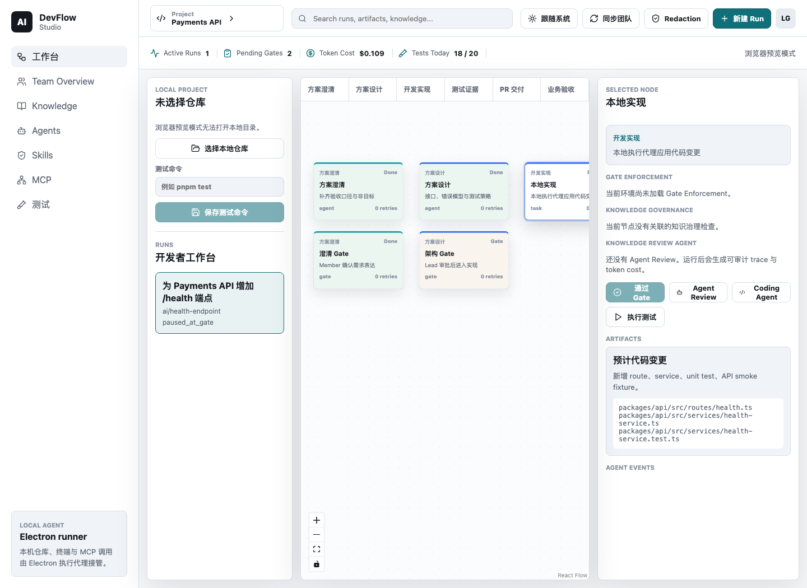
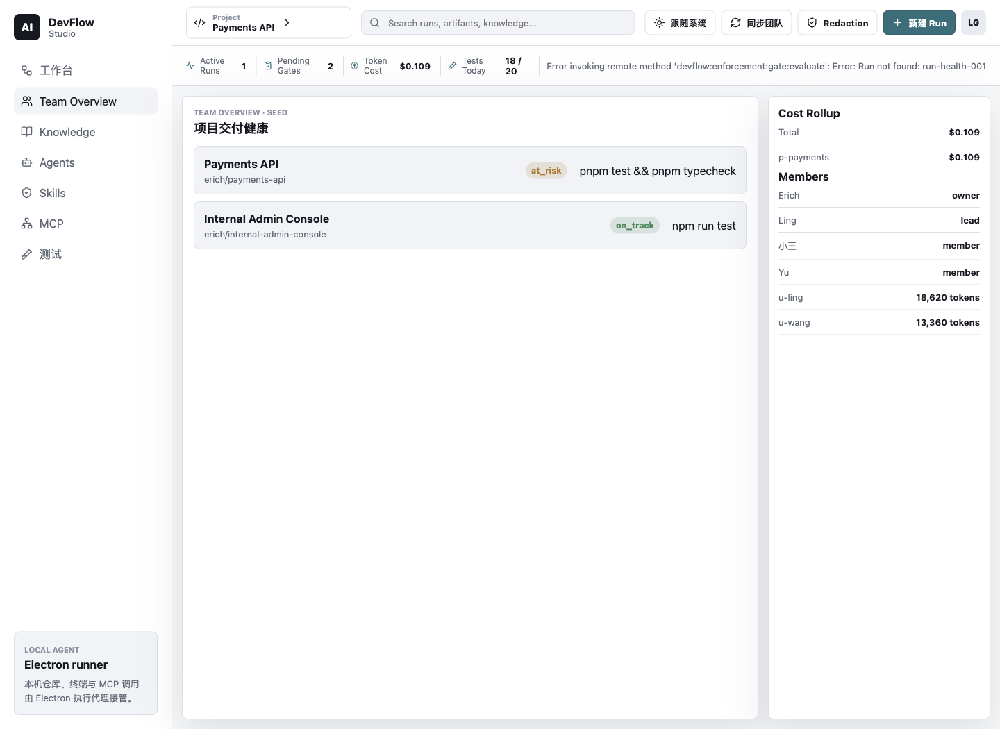
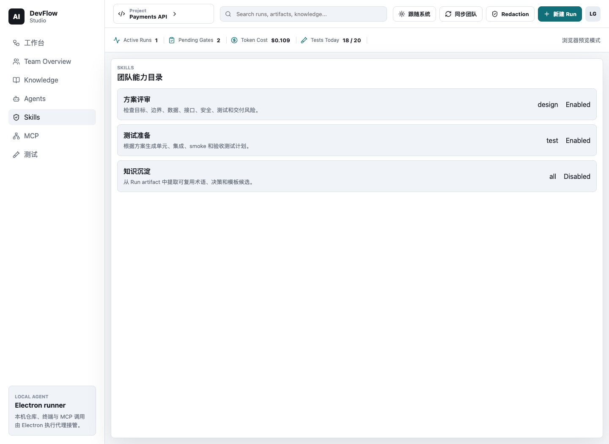
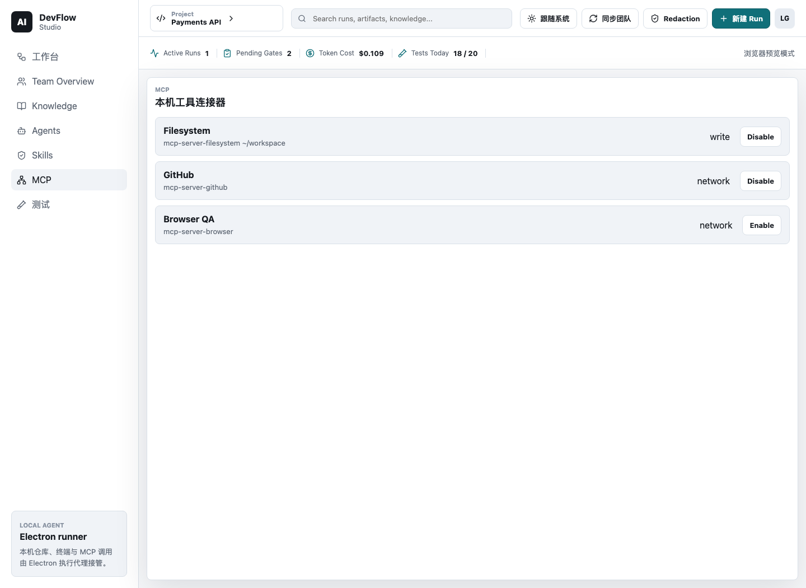
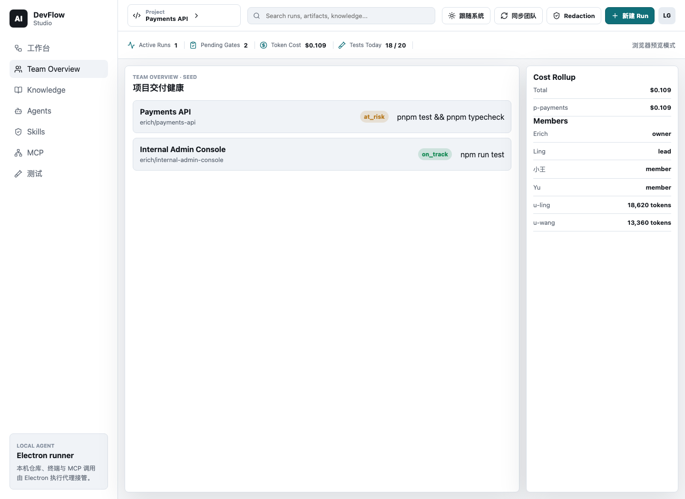

# DevFlow Studio v0.8 使用指南与全量功能验收

更新时间：2026-06-20
适用版本：`v0.8.1` release candidate。当前代码已完成 v0.8 Policy-Aware Delivery、PR #2 smoke hardening，以及 PR #3 的 v0.9 runtime planning / opencode live-smoke preflight hardening；package metadata 仍为 `0.7.5`，将在 v0.8.1 walkthrough 通过后统一 bump 到 `0.8.1` 并打 tag。

## 结论

DevFlow Studio 现在已经具备从 `v0.1` 到 `v0.8` 的主流程能力：团队开发 workflow、真实 Electron 本地执行、测试证据、知识治理、Knowledge Review Agent、Coding Agent adapter、Gate Enforcement、以及 v0.8 的 remediation/retry 闭环。当前 v0.8.1 收口只做 release signoff、版本对齐和演示核对，不新增运行时能力。

本轮验收使用了三层验证：

- 真实 Electron 窗口读屏：通过 Computer Use 读取 `AI DevFlow Studio` 的可访问性树，确认当前启动的是业务应用而不是 Electron default app。
- 人类式点击与截图：通过 Playwright 对同一个本地 UI 执行导航、搜索、页面切换、节点选择，并保存截图。
- 自动化签收：`verify`、`build`、Electron smoke、Postgres smoke 已在 v0.8.1 release-candidate 分支上通过。

此外，v0.9 的真实 opencode runtime smoke 已经增加 preflight gate：默认仍走 fake engine；只有同时显式设置 `DEVFLOW_RUN_OPENCODE_SMOKE=1` 和 `DEVFLOW_CODING_ENGINE=opencode-http` 时，才会进入真实 provider/opencode 路径。

注意：当前 Computer Use 插件在本机能读屏，但 click 调用持续返回 “Computer Use is not active”。所以本轮“点击模拟”由 Playwright 执行，真实 Electron 路径由 `test:electron-smoke` 覆盖。这个限制属于当前 Computer Use 工具层，不是 DevFlow UI 功能缺失。

远端 CI 注意：PR #3 最新一次远端 GitHub Actions 没有真正启动 job，GitHub 返回了
billing/spending-limit 级别的 annotation。当前功能判断以本地 `verify`、`build`、
`test:electron-smoke` 和显式 Postgres smoke 为准；处理 GitHub billing 后需要重新 rerun PR
checks。

## 启动方式

在项目根目录运行：

```bash
cd /Users/erich/File/claude/10-showcase/ai-devflow-studio
corepack pnpm dev:electron
```

启动成功后，应看到窗口标题为 `AI DevFlow Studio`，左侧有：

- 工作台
- Team Overview
- Knowledge
- Agents
- Skills
- MCP
- 测试

如果看到 Electron 默认欢迎页，说明没有用 DevFlow 的 app path 启动，应使用上面的 `corepack pnpm dev:electron`。

## 功能总览

| 版本 | 能力 | 当前状态 | 主要入口 |
|---|---|---|---|
| v0.1 | Fixture-backed workflow workbench、Run/Node/Gate、基础 UI | 已完成 | 工作台 |
| v0.2 | Electron 本地仓库、测试命令识别/执行、SQLite 持久化 Test Evidence | 已完成 | 工作台、测试 |
| v0.3 | Team API/Web/Postgres、团队概览、同步摘要 | 已完成 | Team Overview、Web Console |
| v0.4 | Knowledge Governance、Markdown 知识索引、Knowledge Reference | 已完成 | Knowledge、Inspector |
| v0.5 | Knowledge Review Agent、trace、token/cost、warning-only advisory | 已完成 | Agent Review、Agents |
| v0.6 | Coding Agent adapter、managed worktree、permission relay、diff/test evidence | 已完成 | 工作台 Build 节点、Agents |
| v0.7 | Configurable Gate Enforcement、policy floor、override、offline contract | 已完成 | Inspector、Team Policy |
| v0.8 | Remediation Plan、policy-aware Coding Brief、human-approved retry、manager delivery summary | 已完成 | Inspector、Agents、Team Overview |

## 1. 工作台：查看团队开发 workflow



工作台是开发者主界面。你可以在这里看到：

- 当前 Run：例如 `为 Payments API 增加 /health 端点`
- 六阶段流程：方案澄清、方案设计、开发实现、测试证据、PR 交付、业务验收
- 本地仓库：当前 Electron 连接的本机项目路径
- 测试命令：例如 `corepack pnpm test`
- Inspector：选中节点后的 Gate、Knowledge、Agent、Artifact、Event 信息

推荐操作：

1. 点击左侧 `工作台`。
2. 点击 Run 列表中的当前 Run。
3. 点击画布中的任意节点，例如 `架构 Gate` 或 `本地实现`。
4. 看右侧 Inspector 是否更新为对应节点。

## 2. 搜索：快速过滤 Run / Artifact / Knowledge



顶部搜索框支持按关键词过滤当前视图。可以输入：

- `api`
- `health`
- `test`
- `gate`

搜索只影响 UI 过滤，不会写入数据库。

## 3. Gate Enforcement：查看为什么 Gate 被拦


选中 Gate 节点后，Inspector 会显示 Gate Enforcement 状态。常见状态包括：

- `pass`：可以审批
- `warn`：允许审批，但有风险提示
- `blocked`：策略要求先补证据或 review
- `hard_blocked`：组织策略禁止 override，必须按 remediation 修复
- `overridden`：Lead 已带理由覆盖
- `blocked_policy_unavailable`：团队项目没有可用策略快照，不能降级到本地默认

v0.8 新增的 `Remediation Plan` 会把 blocking reason 转成可执行建议，例如：

- 运行 Knowledge Review Agent
- 补测试证据
- 修复失败测试
- 修复 API contract
- 同步团队策略

如果候选项适合 Coding Agent，会出现 `Retry Coding` 操作。该动作仍然需要人点击批准，不会自动修改主仓库。

## 4. 本地测试证据



测试能力来自 Electron 主进程，不是浏览器直接执行 shell。

推荐流程：

1. 在工作台左侧确认本地仓库路径。
2. 查看或编辑测试命令，例如 `corepack pnpm test`。
3. 点击 `保存测试命令`。
4. 在测试节点或 Inspector 中点击 `执行测试`。
5. 打开左侧 `测试` 页面查看最新证据。

测试证据会保存：

- status
- exit code
- duration
- stdout/stderr 摘要
- redaction 状态
- 关联 Run / Node / Artifact

## 5. Knowledge Governance



Knowledge 页面用于查看 DevFlow 内置知识文档、标签、引用和治理检查。

你可以用它确认：

- 当前 Run 引用了哪些标准
- Gate/Node 应该参考哪些知识
- 哪些 evidence gap 仍然存在
- Retrieval 命中只是推荐引用，不会自动变成治理证据

v0.4.x 后，知识层已经为未来 RAG 做好边界：retrieval hit 不等于 governance evidence。

## 6. Knowledge Review Agent 与 Agents 页面



在 Inspector 中点击 `Agent Review` 后，Knowledge Review Agent 会读取：

- 当前 Run / Node
- Knowledge References
- Governance Checks
- Test Evidence 摘要
- Artifact 摘要

它会生成：

- Agent Review Artifact
- trace
- token/cost
- Gate Advisory
- v0.7+ Agent Policy Findings

打开左侧 `Agents` 可以查看 review history、trace、cost，以及 v0.8 的 retry attempt 记录。

## 7. Coding Agent 与 v0.8 Retry



选中 `本地实现` / Build task 节点后，可以启动 Coding Agent。当前设计原则是：

- DevFlow 不重做一个完整 opencode。
- DevFlow 托管 coding engine，负责上下文组装、worktree、权限、证据、Gate。
- Coding 运行在 managed worktree，不直接修改主仓库。
- renderer 不传 prompt；brief 由 main/shared 从 Run、Node、Artifact、Knowledge、Policy、Remediation 中组装。

v0.8 的 retry flow：

1. Gate Enforcement 产生 blocking/warning reason。
2. `buildRemediationPlan` 转成 remediation candidates。
3. 人在 Inspector 里点击 `Retry Coding`。
4. Electron main 创建 `RetryAttempt`。
5. Coding brief 自动带上 remediation context。
6. Coding 结果、diff、test evidence、event 持久化。

这是一条 human-approved retry loop，不是自动修复，也不会绕过 Gate。

## 8. Team Overview 与管理者视角



Team Overview 用于管理者看项目、成员、成本、风险和交付摘要。

v0.8 后，团队侧可以看到 Policy-Aware Delivery Summary，包括：

- warning count
- blocked count
- override count
- remediation plan count
- retry attempt count
- remaining evidence gaps

这些摘要只上传 redacted summary，不上传本地 cwd、raw stdout/stderr、raw prompt、patch 或 provider secret。

## 9. Skills 与 MCP





Skills / MCP 当前是团队开发平台的管理壳：

- 展示 skill 能力、状态、适用场景
- 展示 MCP server 定义与开关
- MCP 开关本地持久化

当前不启动真实 MCP 进程，不做真实 MCP policy enforcement；这些属于后续 runtime 扩展。

## 10. Web Team Console



Web Console 用于团队/管理者侧查看同步摘要和策略配置。v0.7 后策略真源在 API/Postgres，Desktop 消费和缓存策略。

团队策略包含：

- warn-only 默认策略
- Recommended Enforcement Preset
- policy floor
- project override clamp
- Lead override audit
- stale policy version 拒绝

## 验收记录

本轮已通过的自动验证（2026-06-20 刷新）：

```bash
corepack pnpm verify
corepack pnpm build
corepack pnpm release:status
corepack pnpm opencode:status
DEVFLOW_DATABASE_URL=postgresql://erich@127.0.0.1:55436/devflow_ci_fix corepack pnpm test:postgres-smoke
```

其中：

- `verify` 包含 typecheck、231 个 unit tests、cross-platform checks、3 个 browser E2E、Electron smoke。
- `build` 覆盖 API、worker、desktop renderer/electron/preload、web。
- `release:status` 检查 package version、release docs、git 工作树、tag 和人工 walkthrough 状态；在正式打 tag 前可用 `DEVFLOW_RELEASE_WALKTHROUGH=passed corepack pnpm release:status -- --strict` 做硬门禁。
- `opencode:status` 不接触 provider，只检查本机 opencode binary、默认 fake-engine 姿态、live smoke gate 和 provider profile 配置状态。
- `postgres-smoke` 使用一次性本地 Postgres，覆盖迁移、seed、policy/evaluate/override/stale-version、overview audit，并验证 API dev service 能在 smoke 结束后可靠退出。

仍需在 `v0.8.1` tag 前完成人工 walkthrough：

- 工作台加载
- Gate Enforcement 状态、policy source、blocking reason、Remediation Plan
- Agent Review trace、token/cost、advisory
- Retry Coding：remediation CTA -> permission relay -> diff -> Test Evidence
- Build/Coding 节点选择
- 测试页面 evidence
- Web Team Console 的 redacted policy/remediation/retry summaries

真实 opencode 修复能力不属于 v0.8.1 验收范围；它是 v0.9 `Real opencode Runtime + Observability + Demo Readiness` 的主线。
当前可先用 `corepack pnpm opencode:status` 复查 v0.9.1 的本机 runtime contract：`opencode --version`、默认 fake-engine verify 姿态、live-smoke gate，以及 provider profile 是否已显式配置。
v0.9 的 5 分钟演示线见 [`devflow-studio-v0.9-demo-script.md`](./devflow-studio-v0.9-demo-script.md)。

## 当前边界

这些不是 bug，而是当前 roadmap 边界：

- 不做自动无审批修复。
- 不自动绕过 Gate。
- 不把 raw prompt、raw trace、patch、cwd、secret 上传到团队后端。
- MCP 真执行与 MCP policy enforcement 后续再做。
- RAG/向量检索后续再做；当前是 RAG-ready retrieval 边界。
- Electron packaging、签名、自动更新还未进入正式发布阶段。
- Windows smoke 已作为架构约束，但当前主要验证仍在 macOS。

## 推荐演示脚本

1. 打开 Electron：`corepack pnpm dev:electron`
2. 在工作台选中 `架构 Gate`，展示 Gate Enforcement 和 Remediation Plan。
3. 切到 Knowledge，说明治理标准和 evidence gap。
4. 回工作台点击 `Agent Review`，说明 review artifact、trace、token cost。
5. 选中 `本地实现`，说明 Coding Agent 的 managed worktree 和 policy-aware brief。
6. 打开 Tests，展示本地测试证据。
7. 打开 Team Overview，说明管理者看项目、成本、policy-aware delivery summary。
8. 打开 Skills/MCP，说明未来 runtime 扩展位置。

一句话介绍：

> DevFlow Studio 是一个团队开发者平台：开发者在 Electron 里完成本地执行、测试、知识治理和 Agent 协作；管理者在团队视角看到项目进展、策略风险、证据和成本。v0.8 开始，系统不仅能拦住 Gate，还能解释为什么、建议怎么修，并让人批准后进入 coding retry。
