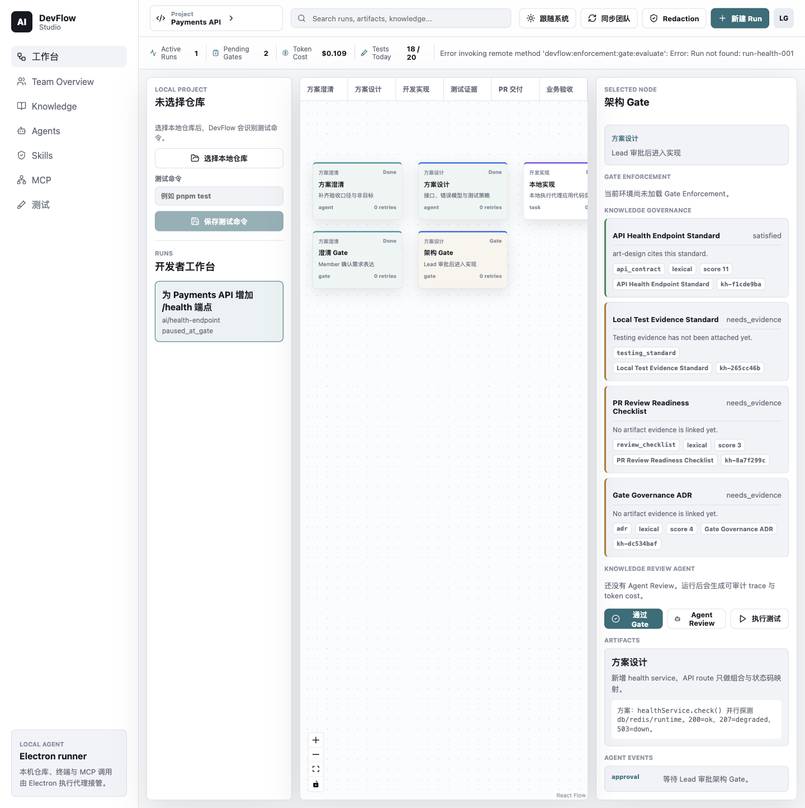

# DevFlow Studio v1.0 用户指南

更新时间：2026-06-20  
适用版本：`v1.0.0` / package metadata `1.0.0`

这份指南是给你亲自动手体验 DevFlow Studio 用的。它把之前分散在 v0.8 用户指南、v0.9
真实 runtime 演示脚本、自托管试点指南里的内容合并成一条可操作路径。

## 你可以体验到什么

v1.0 不是一个打包签名后的商业发行版，而是一个能跑通本地开发者工作台和最小团队试点的产品基线：

- Electron Desktop：本地仓库选择、Workflow、Gate Enforcement、Knowledge、Agent、Coding、Tests。
- Knowledge Governance：文档检索、治理检查、Knowledge Review Agent、可审计 review artifact。
- Policy-Aware Delivery：blocked/warned Gate、Remediation Plan、人工批准的 Retry Coding。
- Coding Agent：默认 fake engine 可重复演示；真实 `opencode` runtime 可通过显式 env-gated smoke 验证。
- Runtime Observability：permission relay、tool/skill timeline、diff、test evidence、cleanup、terminal state。
- Web Team Console：团队 overview、policy summary、Agent Review、delivery summary、Desktop pairing code。
- Self-hosted pilot：Docker Compose 运行 Web/API/Postgres，Desktop 使用 pairing token 同步 redacted summary。

## 先记住三条边界

1. **默认路径不花模型钱。** `corepack pnpm verify`、Electron smoke、fake Coding Agent 都不调用真实模型。
2. **真实 opencode 路径会消耗 provider 配额。** 只有你显式运行 `DEVFLOW_RUN_OPENCODE_SMOKE=1` 时才会走豆包/Volcengine 等真实后端。
3. **v1.0 不是 public SaaS。** 没有 Electron installer/signing、自动 HTTPS、Kubernetes、多人并发 hardening、GitHub PR 自动交付。

## 环境准备

在项目根目录：

```bash
cd /Users/erich/File/claude/10-showcase/ai-devflow-studio
corepack pnpm install
```

推荐先确认基础质量门：

```bash
corepack pnpm verify
corepack pnpm build
```

如果是第一次在这台机器跑 Playwright：

```bash
corepack pnpm exec playwright install
```

## 路径一：本地 Desktop 全功能体验

启动真实 Electron 工作台：

```bash
corepack pnpm dev:electron
```

它会构建 Electron main/preload，启动 Vite renderer，并打开真实 Electron app。不要只用浏览器打开
`localhost:5173`，浏览器模式没有本地文件夹选择、SQLite、受控 IPC 和本地命令执行能力。


### 1. 选择本地仓库

你可以直接选择当前仓库：

```text
/Users/erich/File/claude/10-showcase/ai-devflow-studio
```

通过标准：

- Workbench 顶部或 Inspector 能显示当前项目/仓库状态。
- renderer 不直接访问 shell；本地能力由 Electron main/preload 提供。

### 2. 熟悉 Workbench 与 workflow

在 `Workbench` 中查看六阶段流程：clarify、design、build、test、PR、acceptance。


建议先点这些节点：

- clarify/design 类 Agent 节点：看上游 IR 和说明。
- build task 节点：后续 Coding Agent 只能从 build task 启动。
- gate/acceptance 节点：看 Gate Enforcement 和 Remediation Plan。

### 3. 搜索与过滤

用搜索框过滤 run、node、artifact、knowledge 相关信息。


通过标准：

- 输入关键词后列表会收窄。
- 不需要重启 app。

### 4. Gate Enforcement 与 Remediation Plan

选中 protected Gate，例如架构 Gate 或验收 Gate。Inspector 里会出现 `Gate Enforcement`。

你要重点看：

- status：`pass / warn / blocked / hard_blocked / overridden / blocked_policy_unavailable`
- policy source/version/syncedAt
- blocking reason
- remediation candidate
- `Retry Coding` 按钮是否只对可 retry 的候选出现



通过标准：

- warn-only 默认策略不会莫名禁止人工 Gate。
- Recommended Enforcement 或 cached team policy 触发 blocking 时，会显示原因和补救动作。
- hard-block 只显示 remediation，不提供 override 表单。

### 5. Knowledge Governance

打开 `Knowledge` 视图，搜索 `api`、`testing`、`gate` 等关键词。


你要看：

- Markdown source path
- tag/category
- chunk / section
- Knowledge Reference
- Governance Check

通过标准：

- 引用能显示到具体 section/chunk，而不是只有整篇文档。
- Retrieval hit 不会单独把治理检查标成 satisfied；真正 evidence 仍来自 artifact/test/gate/agent review。

### 6. Knowledge Review Agent

回到 Gate 节点，点击 `Agent Review`。完成后打开 `Agents`。


你要看：

- provider status
- review artifact
- trace steps
- conclusion / risks / missing evidence / suggested tests
- token/cost source
- Gate Advisory
- Agent Policy Findings

通过标准：

- 默认 fake provider 可重复、无模型成本。
- Agent finding 默认只作为 warn，除非团队 policy 显式配置为 block。
- 本地路径、raw stdout/stderr、raw prompt、secret 不应出现在团队 summary 中。

### 7. Run Tests 与 Test Evidence

打开 `Tests` 页面或在相关节点触发本地测试。


通过标准：

- 能看到 command、status、exit code、duration。
- 失败/超时的测试会成为 remediation 和 governance 的输入。
- 测试输出会做 redaction 和长度控制。

### 8. Coding Agent / Retry Coding

选中 build task 节点，或从 Gate 的 remediation candidate 点击 `Retry Coding`。


默认演示路径使用 fake coding engine：

- 创建 managed worktree。
- 生成 permission request。
- 你批准后产生 redacted diff。
- 运行 worktree test command。
- 归档 diff/test evidence/runtime event。

通过标准：

- Coding Agent 只能从 `stage: build` 且 `kind: task` 的节点启动。
- `Retry Coding` 必须由人点击，不会自动绕过 Gate。
- 主仓库不会被直接修改；变更发生在 managed worktree。

### 9. Tool / Skill Timeline 与 runtime trace

在 `Agents` 的 Coding Agent run 中查看 runtime trace。

你要看：

- permission ask/reply/expired
- `tool_call`
- `tool_result`
- Tool / Skill Timeline
- source：`opencode_metadata` / `inferred` / `opencode_event_stream`
- decision/status
- cleanup status
- terminal state：`completed / failed / cancelled / timed_out / interrupted`

当前能力边界：

- DevFlow 能观察 opencode permission/tool relay。
- 如果 opencode metadata 没有 skill 名，UI 会显示 `Unknown skill` 或 `Inferred tool`。
- 当前不承诺还原 opencode 内部私有 Skill 调用栈。

通过标准：

- fake engine 和 real opencode 的事件来源应能区分。
- 本地 SQLite 中的 tool metadata 也必须脱敏，不只远端 summary 脱敏。

### 10. Skills 与 MCP 管理

打开 `Skills` 和 `MCP` 视图。


通过标准：

- 你能看到团队/项目侧可用的 skill/MCP 配置。
- v1.0 不执行真实 MCP policy enforcement；这里是 registry/config 管理与展示，不是完整 MCP runtime。

## 路径二：Web / API 开发模式

如果你只想体验 Web Team Console 和 API：

```bash
corepack pnpm dev:api
corepack pnpm dev:web
```

打开：

```text
http://127.0.0.1:4311
```


你要看：

- Team Overview
- Projects
- Gate Enforcement Policy
- Policy-Aware Delivery
- Knowledge Review Agent
- Desktop pairing code 面板

通过标准：

- Web 能显示团队侧 redacted summary。
- Web 不展示本地 raw cwd、stdout/stderr、prompt、patch body、provider secret。

## 路径三：v1.0 Self-Hosted Team Pilot

这是 v1.0 的重点：最小自托管团队试点。

### 1. 配置 `.env`

```bash
cp .env.example .env
```

至少替换：

- `DEVFLOW_SESSION_SECRET`
- `POSTGRES_PASSWORD`

真实 GitHub OAuth 需要配置：

- `GITHUB_CLIENT_ID`
- `GITHUB_CLIENT_SECRET`
- `GITHUB_OAUTH_REDIRECT_URI=http://127.0.0.1:4310/api/auth/github/callback`

Docker smoke 可以不配置真实 GitHub OAuth；它会走测试/演示路径。

### 2. 启动 Docker Compose

```bash
docker compose up --build
```

打开：

```text
Web:        http://127.0.0.1:4311
API health: http://127.0.0.1:4310/health
```

### 3. Web 创建 Desktop pairing code

在 Web Team Console：

1. 找到 Projects panel。
2. 点击 `Create desktop pairing code`。
3. 复制生成的一次性 code。

### 4. Desktop 配对

在 Electron Desktop 顶部：

1. 粘贴 Web 生成的 `Pairing code`。
2. 点击 `Pair`。
3. 成功后会显示 `Paired <projectId>`。
4. 点击 `同步团队`。


通过标准：

- Desktop 使用 Bearer token 同步，不再依赖 demo headers。
- token 失效时需要重新配对，不允许悄悄回退到 demo mode。
- Web 能看到同步后的 run/evidence/review/coding summary。

### 5. Docker smoke 验证

```bash
corepack pnpm test:docker-smoke
```

它会启动隔离 Compose project，创建 pairing code，交换 Desktop token，同步 redacted run summary，并清理容器与 volume。

## 路径四：真实 opencode + 豆包/Volcengine 后端

这条路径会产生真实模型调用，只有你明确要验证真实 runtime 时再跑。

先做无成本状态检查：

```bash
corepack pnpm opencode:status
```

使用 Volcengine Ark Coding Plan / 豆包配置时，推荐通过 shell 环境传 key，不要写进文档或 commit：

```bash
export ANTHROPIC_AUTH_TOKEN="<your-volcengine-api-key>"

DEVFLOW_RUN_OPENCODE_SMOKE=1 \
DEVFLOW_CODING_ENGINE=opencode-http \
DEVFLOW_OPENCODE_PROVIDER_ID=double \
DEVFLOW_OPENCODE_MODEL_ID=ark-code-latest \
DEVFLOW_OPENCODE_API_KEY_ENV=ANTHROPIC_AUTH_TOKEN \
corepack pnpm test:opencode-smoke
```

通过标准：

- 能启动 `opencode serve`。
- 能收到真实 permission request。
- 能捕获 `tool_call` / `tool_result`。
- 能生成 diff 和 Test Evidence。
- 能看到 cleanup event。
- smoke output 不打印 provider key。

如果 provider 临时不可用，可以保留录制 trace 做展示材料，但不能替代最终 real smoke signoff。

## 推荐人工 walkthrough 核对表

| 步骤 | 入口 | 操作 | 通过标准 |
| --- | --- | --- | --- |
| 1 | Electron | `corepack pnpm dev:electron` | 打开真实 `AI DevFlow Studio`，不是 Electron default app |
| 2 | Project picker | 选择当前 repo | Workbench 显示本地仓库上下文 |
| 3 | Workbench | 选中 protected Gate | Inspector 显示 Gate Enforcement、policy source、blocking reason |
| 4 | Gate Enforcement | 查看 Remediation Plan | 能看到 `Retry Coding` 或明确人工补救动作 |
| 5 | Agent Review | 点击 `Agent Review` | Agents 页面出现 review artifact、trace、cost source |
| 6 | Tests | 运行或查看测试证据 | Test Evidence 有 status、exit code、duration、redaction |
| 7 | Coding Agent | 从 build task 或 remediation 启动 | 出现 permission relay；批准后有 diff/test evidence |
| 8 | Agents | 查看 Tool / Skill Timeline | 能区分 tool_call/tool_result、Unknown skill/Inferred tool、cleanup |
| 9 | Web | `corepack pnpm dev:api` + `corepack pnpm dev:web` | Web Team Overview 可见 team summary |
| 10 | Self-hosted | `docker compose up --build` | Web/API/Postgres 可在容器中运行 |
| 11 | Pairing | Web 创建 code，Desktop Pair | Desktop 显示 paired project，sync 使用 bearer token |
| 12 | Security check | 检查 UI/summary | 不暴露 cwd、raw logs、prompt、patch、secret |

## 常用验证命令

```bash
corepack pnpm typecheck
corepack pnpm test
corepack pnpm test:e2e
corepack pnpm test:electron-smoke
corepack pnpm test:cross-platform
corepack pnpm verify
corepack pnpm build
corepack pnpm test:docker-smoke
corepack pnpm test:postgres-smoke
corepack pnpm opencode:status
corepack pnpm test:opencode-smoke
```

注意：

- `verify` 不包含 Docker smoke、Postgres smoke、真实 opencode paid smoke。
- `test:postgres-smoke` 需要 `DEVFLOW_DATABASE_URL`。
- `test:docker-smoke` 需要 Docker。
- `DEVFLOW_RUN_OPENCODE_SMOKE=1` 才会跑真实 opencode provider。

## 常见问题

### Electron 打开了默认 Electron 页面怎么办？

说明启动脚本没有把 app path 传给 Electron。使用：

```bash
corepack pnpm dev:electron
```

不要直接运行 Electron binary。

### Web 能打开，但 Desktop pairing 失败怎么办？

检查：

- API 是否运行在 `http://127.0.0.1:4310`
- pairing code 是否过期或已被使用
- Docker/Web 是否使用同一套 API URL
- Desktop 顶部是否显示 `Paired <projectId>`

### Gate 被 blocking 卡住怎么办？

看 `Gate Enforcement` 中的 remediation：

- missing review：运行 `Agent Review`
- failed/timed_out tests：运行测试并生成 passing Test Evidence
- API contract / governance violation：按引用文档修复后重新生成证据
- hard-block：只能按 remediation 修复，不能 override

### 我能看到 opencode 调用了哪个 Skill 吗？

能看到 DevFlow relay 层能观察到的 Tool / Skill Timeline：

- metadata 有 skill/skillName 时显示 Skill 名。
- metadata 只有 tool/command/path 时显示 Tool，Skill 为 Unknown。
- metadata 为空时显示 Inferred tool。

当前不能保证还原 opencode 内部私有 Skill 调用栈。这个边界是刻意写清楚的，避免把 permission
trace 误讲成完整内部链路。

### 哪些东西现在还不能宣称完成？

- Electron installer、签名、公证、自动更新。
- 生产 HTTPS / KMS / SaaS onboarding。
- 多 Desktop 并发 hardening。
- GitHub PR 自动创建/合并。
- 真实 MCP execution / MCP policy enforcement。
- RAG/vector retrieval provider。
- Windows Electron full smoke。

## 建议你的第一次体验顺序

如果你今天只想完整体验一遍，按这个顺序走：

1. `corepack pnpm dev:electron`
2. 选择当前 repo。
3. Workbench 选 Gate，看 Gate Enforcement。
4. 点击 `Agent Review`。
5. 打开 `Agents`，看 review trace。
6. 选 build task，跑 fake Coding Agent。
7. 看 Tests 和 Tool / Skill Timeline。
8. `docker compose up --build`
9. Web 创建 pairing code。
10. Desktop Pair 后点击 `同步团队`。
11. Web Team Overview 验证 redacted summary。
12. 最后如果你愿意消耗豆包/Volcengine 配额，再跑真实 `test:opencode-smoke`。
