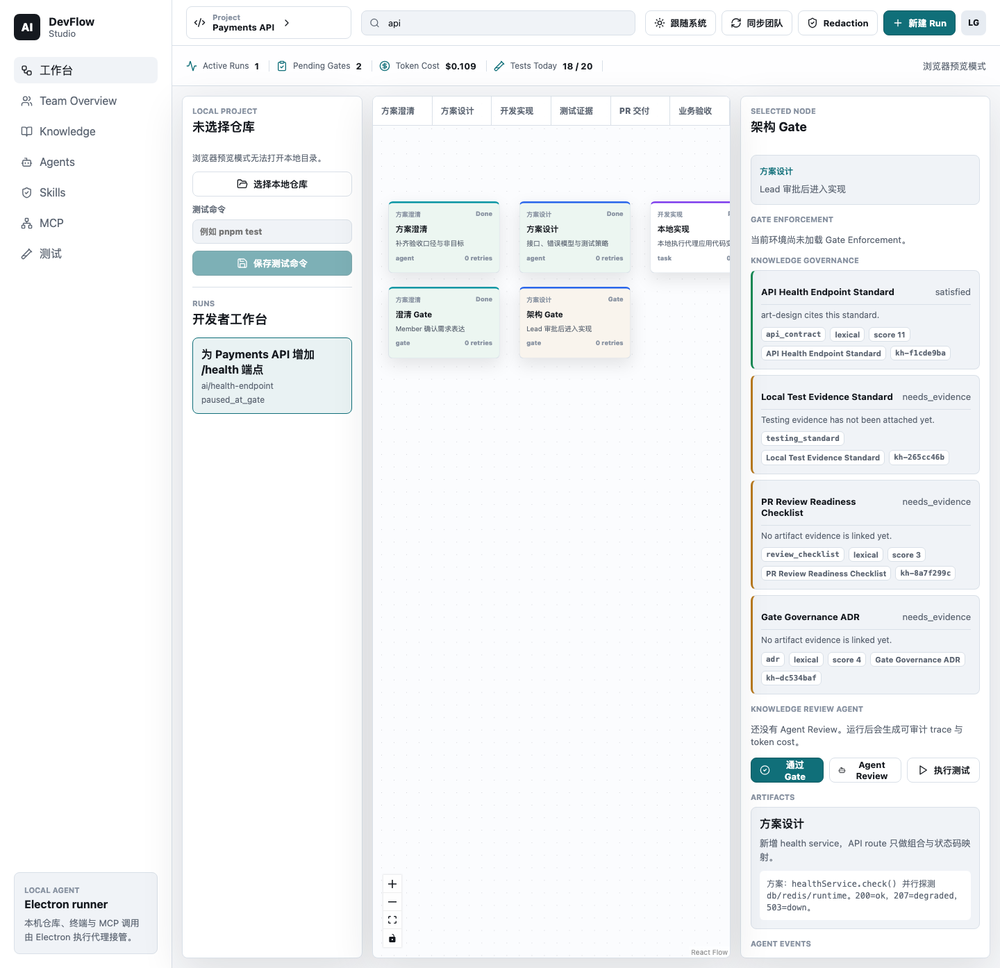
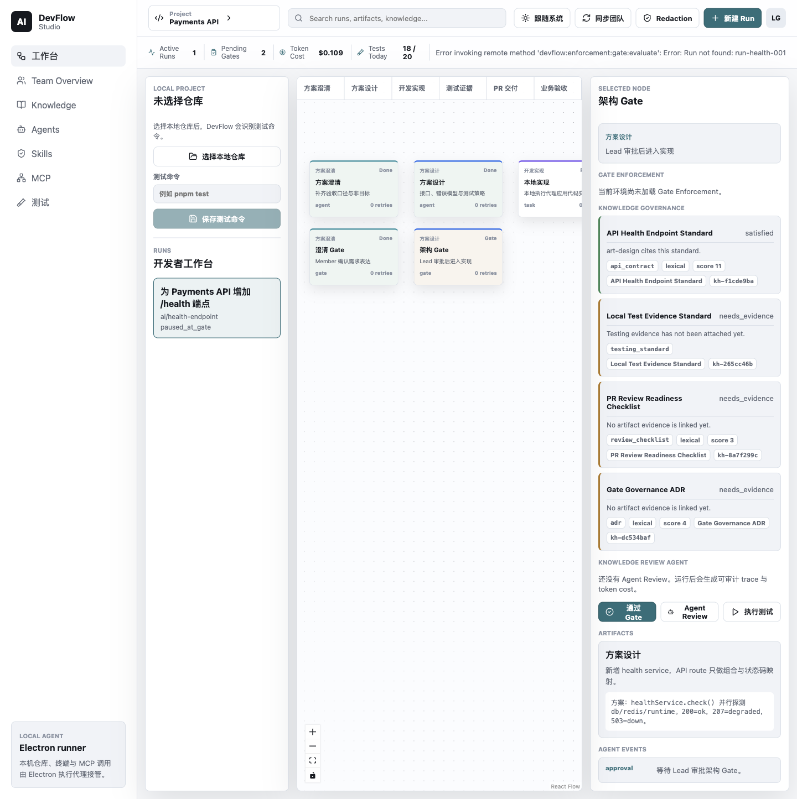
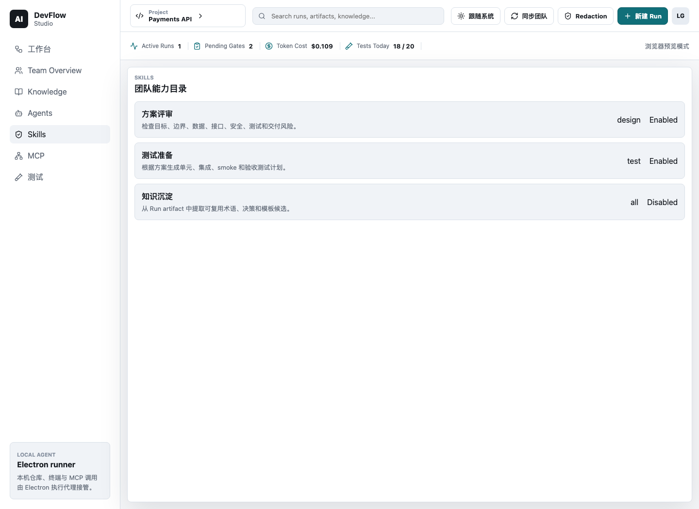

# DevFlow Studio v1.0 用户指南

> 历史指南：本文适用于 V1.0，保留当时的功能边界、按钮名称和真实截图。当前界面以节点工作区的新布局为准；当前部署必须使用[自托管试点指南](./devflow-studio-self-hosted-pilot.md)的完整配置，不能照搬本节历史最小环境变量。

更新时间：2026-06-20  
适用版本：`v1.0.0` / 包元数据 `1.0.0`

这份指南是给你亲自动手体验 DevFlow Studio 用的。它把之前分散在 v0.8 用户指南、v0.9
真实运行时演示脚本、自托管试点指南里的内容合并成一条可操作路径。

## 你可以体验到什么

v1.0 不是一个打包签名后的商业发行版，而是一个能跑通本地开发者工作台和最小团队试点的产品基线：

- Electron 桌面端：本地仓库选择、工作流、门禁策略执行、知识、Agent、编码、测试。
- 知识治理：文档检索、治理检查、知识审查 Agent、可审计审查产物。
- 策略驱动交付：被阻断或警告的门禁、处理建议计划、人工批准的重试编码。
- 编码 Agent：默认模拟引擎可重复演示；真实 `opencode` 运行时可通过环境变量显式启用冒烟验证。
- 运行时可观测性：权限转发、工具与技能时间线、代码差异、测试证据、清理、终止状态。
- Web 团队控制台：团队概览、策略摘要、Agent 审查、交付摘要、桌面配对码。
- 自托管试点：Docker Compose 运行 Web/API/Postgres，桌面端使用配对令牌同步脱敏摘要。

## 先记住三条边界

1. **默认路径不花模型钱。** `corepack pnpm verify`、Electron 冒烟测试、模拟编码 Agent 都不调用真实模型。
2. **真实 OpenCode 路径会消耗模型服务商配额。** 只有你显式运行 `DEVFLOW_RUN_OPENCODE_SMOKE=1` 时才会走豆包/Volcengine 等真实后端。
3. **v1.0 不是公开 SaaS。** 没有 Electron 安装器与签名、自动 HTTPS、Kubernetes、多人并发加固、GitHub PR 自动交付。

## 环境准备

在项目根目录：

```bash
# 从 workbench 根目录进入本 Project
cd projects/agent-engineering/ai-devflow-studio
corepack pnpm install
```

推荐先确认基础质量门：

```bash
corepack pnpm verify
corepack pnpm build
```

如果是第一次在这台机器跑 Playwright：

```bash
corepack pnpm exec playwright install
```

<a id="路径一本地-desktop-全功能体验"></a>

## 路径一：本地桌面端全功能体验

启动真实 Electron 工作台：

```bash
corepack pnpm dev:electron
```

它会构建 Electron 主进程与预加载脚本，启动 Vite 渲染器，并打开真实 Electron 应用。不要只用浏览器打开
`localhost:5173`，浏览器模式没有本地文件夹选择、SQLite、受控 IPC 和本地命令执行能力。


### 1. 选择本地仓库

你可以在文件选择器中选择当前项目根目录；从 workbench 根目录看，它是：

```text
projects/agent-engineering/ai-devflow-studio
```

通过标准：

- 工作台顶部或节点检查面板能显示当前项目/仓库状态。
- 渲染器不直接访问命令行；本地能力由 Electron 主进程与预加载脚本 提供。

<a id="2-熟悉-workbench-与-workflow"></a>

### 2. 熟悉工作台与工作流

在 `Workbench` 中查看六阶段流程：需求澄清、方案设计、开发实现、测试证据、PR 交付、业务验收。


建议先点这些节点：

- 需求澄清/方案设计类 Agent 节点：看上游中间产物（IR）和说明。
- 开发任务节点：后续编码 Agent 只能从开发任务启动。
- 门禁/业务验收节点：看门禁策略执行和处理建议计划。

### 3. 搜索与过滤

用搜索框过滤运行、节点、产物、知识相关信息。



通过标准：

- 输入关键词后列表会收窄。
- 不需要重启应用。

<a id="4-gate-enforcement-与-remediation-plan"></a>

### 4. 门禁策略执行与处理建议计划

选中受保护门禁，例如方案评审门禁或验收门禁。节点检查面板里会出现 `Gate Enforcement`。

你要重点看：

- 状态：`pass / warn / blocked / hard_blocked / overridden / blocked_policy_unavailable`
- 策略来源、版本与同步时间（syncedAt）
- 阻断原因
- 处理建议候选项
- `Retry Coding` 按钮是否只对可重试的候选出现



通过标准：

- 仅警告默认策略不会莫名禁止人工门禁。
- 推荐强制策略或缓存的团队策略触发阻断时，会显示原因和补救动作。
- 强制阻断只显示处理建议，不提供覆盖审批表单。

<a id="5-knowledge-governance"></a>

### 5. 知识治理

打开 `Knowledge` 视图，搜索 `api`、`testing`、`gate` 等关键词。


你要看：

- Markdown 源路径
- 标签/分类
- 分块/章节
- 知识引用
- 治理检查

通过标准：

- 引用能显示到具体章节/分块，而不是只有整篇文档。
- 检索命中不会单独把治理检查标成已满足；真正证据仍来自产物、测试、门禁或 Agent 审查。

<a id="6-knowledge-review-agent"></a>

### 6. 知识审查 Agent

回到门禁节点，点击 `Agent Review`。完成后打开 `Agents`。


你要看：

- 模型服务商状态
- 审查产物
- 执行轨迹步骤
- 结论、风险、缺失证据与建议测试
- Token 与费用来源
- 门禁建议
- Agent 策略发现项

通过标准：

- 默认模拟模型服务商可重复、无模型成本。
- Agent 发现项默认只作为警告，除非团队策略显式配置为阻断。
- 本地路径、原始标准输出/错误、原始提示词、密钥不应出现在团队摘要中。

<a id="7-run-tests-与-test-evidence"></a>

### 7. 执行测试与测试证据

打开 `Tests` 页面或在相关节点触发本地测试。


通过标准：

- 能看到命令、状态、退出码、耗时。
- 失败/超时的测试会成为处理建议和治理的输入。
- 测试输出会做脱敏和长度控制。

<a id="8-coding-agent--retry-coding"></a>

### 8. 编码 Agent / 重试编码

选中开发任务节点，或从门禁的处理建议候选项点击 `Retry Coding`。


默认演示路径使用模拟编码引擎：

- 创建托管工作树。
- 生成权限请求。
- 你批准后产生 脱敏代码差异。
- 运行工作树测试命令。
- 归档代码差异、测试证据与运行时事件。

通过标准：

- 编码 Agent 只能从 `stage: build` 且 `kind: task` 的节点启动。
- `Retry Coding` 必须由人点击，不会自动绕过门禁。
- 主仓库不会被直接修改；变更发生在托管工作树。

<a id="9-tool--skill-timeline-与-runtime-trace"></a>

### 9. 工具与技能时间线与运行时轨迹

在 `Agents` 的编码 Agent 运行中查看运行时轨迹。

你要看：

- 权限请求/回复/过期
- `tool_call`
- `tool_result`
- 工具与技能时间线
- 来源：`opencode_metadata` / `inferred` / `opencode_event_stream`
- 决策/状态
- 清理状态
- 终止状态：`completed / failed / cancelled / timed_out / interrupted`

当前能力边界：

- DevFlow 能观察 OpenCode 权限/工具转发。
- 如果 OpenCode 元数据没有技能名，UI 会显示 `Unknown skill` 或 `Inferred tool`。
- 当前不承诺还原 OpenCode 内部私有技能调用栈。

通过标准：

- 模拟引擎和真实 OpenCode 的事件来源应能区分。
- 本地 SQLite 中的工具元数据也必须脱敏，不只远端摘要脱敏。

<a id="10-skills-与-mcp-管理"></a>

### 10. 技能与 MCP 管理

打开 `Skills` 和 `MCP` 视图。




通过标准：

- 你能看到团队/项目侧可用的技能/MCP 配置。
- v1.0 不执行真实 MCP 策略检查；这里是注册表/配置管理与展示，不是完整 MCP 运行时。

## 路径二：Web / API 开发模式

如果你只想体验 Web 团队控制台和 API：

```bash
corepack pnpm dev:api
corepack pnpm dev:web
```

打开：

```text
http://127.0.0.1:4311
```


你要看：

- 团队概览
- 项目
- 门禁执行策略
- 策略驱动交付
- 知识审查 Agent
- 桌面配对码面板

通过标准：

- Web 能显示团队侧脱敏摘要。
- Web 不展示本地原始工作目录、标准输出/错误、提示词、补丁正文、模型服务商密钥。

<a id="路径三v10-self-hosted-team-pilot"></a>

## 路径三：v1.0 自托管团队试点

这是 v1.0 的重点：最小自托管团队试点。

### 1. 配置 `.env`

```bash
cp .env.example .env
```

至少替换：

- `DEVFLOW_SESSION_SECRET`
- `POSTGRES_PASSWORD`

真实 GitHub OAuth 需要配置：

- `GITHUB_CLIENT_ID`
- `GITHUB_CLIENT_SECRET`
- `GITHUB_OAUTH_REDIRECT_URI=http://127.0.0.1:4310/api/auth/github/callback`

Docker 冒烟测试可以不配置真实 GitHub OAuth；它会走测试/演示路径。

### 2. 启动 Docker Compose

```bash
docker compose up --build
```

打开：

```text
Web:        http://127.0.0.1:4311
API health: http://127.0.0.1:4310/health
```

<a id="3-web-创建-desktop-pairing-code"></a>

### 3. Web 创建桌面配对码

在 Web 团队控制台：

1. 找到项目面板。
2. 点击 `Create desktop pairing code`。
3. 复制生成的一次性配对码。

<a id="4-desktop-配对"></a>

### 4. 桌面端配对

在 Electron 桌面端顶部：

1. 粘贴 Web 生成的 `Pairing code`。
2. 点击 `Pair`。
3. 成功后会显示 `Paired <projectId>`。
4. 点击 `同步团队`。


通过标准：

- 桌面端使用 Bearer 令牌同步，不再依赖演示请求头。
- 令牌失效时需要重新配对，不允许悄悄回退到演示模式。
- Web 能看到同步后的运行、证据、审查与编码摘要。

<a id="5-docker-smoke-验证"></a>

### 5. Docker 冒烟测试验证

```bash
corepack pnpm test:docker-smoke
```

它会启动隔离 Compose 项目，创建配对码，交换桌面令牌，同步 脱敏运行摘要，并清理容器与数据卷。

<a id="路径四真实-opencode--豆包volcengine-后端"></a>

## 路径四：真实 OpenCode + 豆包/Volcengine 后端

这条路径会产生真实模型调用，只有你明确要验证真实运行时时再跑。

历史规则曾将这条路径列为仅发布时执行的验收门禁：默认 CI 不调用真实模型；对应发布验收需要一次真实 `opencode` + 豆包/Volcengine 冒烟证据。其适用范围现限定于要求该证据的 V1.3/V1.4 发布流程，V1.5 不要求额外付费冒烟。这段历史说明不授权新的模型调用；各版本应以正式验收契约为准。详见[真实 OpenCode 发布验收](../plans/release-only-real-opencode-smoke.md)（`docs/plans/release-only-real-opencode-smoke.md`）。

先做无成本状态检查：

```bash
corepack pnpm opencode:status
```

使用 Volcengine Ark Coding Plan / 豆包配置时，推荐通过命令行环境传入密钥，不要写进文档或提交：

```bash
export ANTHROPIC_AUTH_TOKEN="<your-volcengine-api-key>"

DEVFLOW_RUN_OPENCODE_SMOKE=1 \
DEVFLOW_CODING_ENGINE=opencode-http \
DEVFLOW_OPENCODE_PROVIDER_ID=double \
DEVFLOW_OPENCODE_MODEL_ID=ark-code-latest \
DEVFLOW_OPENCODE_API_KEY_ENV=ANTHROPIC_AUTH_TOKEN \
corepack pnpm test:opencode-smoke
```

通过标准：

- 能启动 `opencode serve`。
- 能收到真实权限请求。
- 能捕获 `tool_call` / `tool_result`。
- 能生成代码差异和测试证据。
- 能看到清理事件。
- 冒烟输出不打印模型服务商密钥。

如果模型服务商临时不可用，可以保留录制执行轨迹做展示材料，但不能替代最终真实冒烟验收。

<a id="推荐人工-walkthrough-核对表"></a>

## 推荐人工演练核对表

| 步骤 | 入口 | 操作 | 通过标准 |
| --- | --- | --- | --- |
| 1 | Electron | `corepack pnpm dev:electron` | 打开真实 `AI DevFlow Studio`，不是 Electron 默认应用 |
| 2 | 项目选择器 | 选择当前仓库 | 工作台显示本地仓库上下文 |
| 3 | 工作台 | 选中受保护门禁 | 节点检查面板显示门禁策略执行、策略来源、阻断原因 |
| 4 | 门禁策略执行 | 查看处理建议计划 | 能看到 `Retry Coding` 或明确人工补救动作 |
| 5 | Agent 审查 | 点击 `Agent Review` | Agents 页面出现审查产物、执行轨迹、费用来源 |
| 6 | 测试 | 运行或查看测试证据 | 测试证据有状态、退出码、耗时、脱敏 |
| 7 | 编码 Agent | 从开发任务或处理建议启动 | 出现权限转发；批准后有差异与测试证据 |
| 8 | Agents | 查看工具与技能时间线 | 能区分 tool_call/tool_result、未知技能/推断工具、清理 |
| 9 | Web | `corepack pnpm dev:api` + `corepack pnpm dev:web` | Web 团队概览可见团队摘要 |
| 10 | 自托管 | `docker compose up --build` | Web/API/Postgres 可在容器中运行 |
| 11 | 配对 | Web 创建配对码，桌面配对 | 桌面端显示已配对项目，同步使用 Bearer 令牌 |
| 12 | 安全检查 | 检查 UI/摘要 | 不暴露工作目录、原始日志、提示词、补丁、密钥 |

## 常用验证命令

```bash
corepack pnpm typecheck
corepack pnpm test
corepack pnpm test:e2e
corepack pnpm test:electron-smoke
corepack pnpm test:cross-platform
corepack pnpm verify
corepack pnpm build
corepack pnpm test:docker-smoke
corepack pnpm test:postgres-smoke
corepack pnpm opencode:status
corepack pnpm test:opencode-smoke
```

注意：

- `verify` 不包含 Docker 冒烟测试、Postgres 冒烟测试、真实 OpenCode 付费冒烟。
- `test:postgres-smoke` 需要 `DEVFLOW_DATABASE_URL`。
- `test:docker-smoke` 需要 Docker。
- `DEVFLOW_RUN_OPENCODE_SMOKE=1` 才会跑真实 OpenCode 模型服务商。

## 常见问题

### Electron 打开了默认 Electron 页面怎么办？

说明启动脚本没有把应用路径传给 Electron。使用：

```bash
corepack pnpm dev:electron
```

不要直接运行 Electron 可执行文件。

<a id="web-能打开但-desktop-pairing-失败怎么办"></a>

### Web 能打开，但桌面配对失败怎么办？

检查：

- API 是否运行在 `http://127.0.0.1:4310`
- 配对码是否过期或已被使用
- Docker/Web 是否使用同一套 API URL
- 桌面端顶部是否显示 `Paired <projectId>`

<a id="gate-被-blocking-卡住怎么办"></a>

### 门禁被阻断卡住怎么办？

看 `Gate Enforcement` 中的处理建议：

- 缺少审查：运行 `Agent Review`
- 失败或超时测试：运行测试并生成通过的测试证据
- API 契约 / 治理违规：按引用文档修复后重新生成证据
- 强制阻断：只能按处理建议修复，不能覆盖审批

<a id="我能看到-opencode-调用了哪个-skill-吗"></a>

### 我能看到 OpenCode 调用了哪个技能吗？

能看到 DevFlow 转发层能观察到的工具与技能时间线：

- 元数据有 `skill` / `skillName` 字段时显示技能名。
- 元数据只有 `tool` / `command` / `path` 字段时显示工具，技能为未知。
- 元数据为空时显示推断工具。

当前不能保证还原 OpenCode 内部私有技能调用栈。这个边界是刻意写清楚的，避免把权限轨迹误讲成完整内部链路。

### 哪些东西现在还不能宣称完成？

- Electron 安装器、签名、公证、自动更新。
- 生产 HTTPS / KMS / SaaS 入门流程。
- 多桌面端并发加固。
- GitHub PR 自动创建/合并。
- 真实 MCP 执行 / MCP 策略执行。
- RAG/向量检索提供方。
- Windows Electron 完整冒烟。

## 建议你的第一次体验顺序

如果你今天只想完整体验一遍，按这个顺序走：

1. `corepack pnpm dev:electron`
2. 选择当前仓库。
3. 工作台选门禁，看门禁策略执行。
4. 点击 `Agent Review`。
5. 打开 `Agents`，看审查执行轨迹。
6. 选开发任务，跑模拟编码 Agent。
7. 看测试和工具与技能时间线。
8. `docker compose up --build`
9. Web 创建配对码。
10. 桌面配对后点击 `同步团队`。
11. Web 团队概览验证脱敏摘要。
12. 最后如果你愿意消耗豆包/Volcengine 配额，再跑真实 `test:opencode-smoke`。
