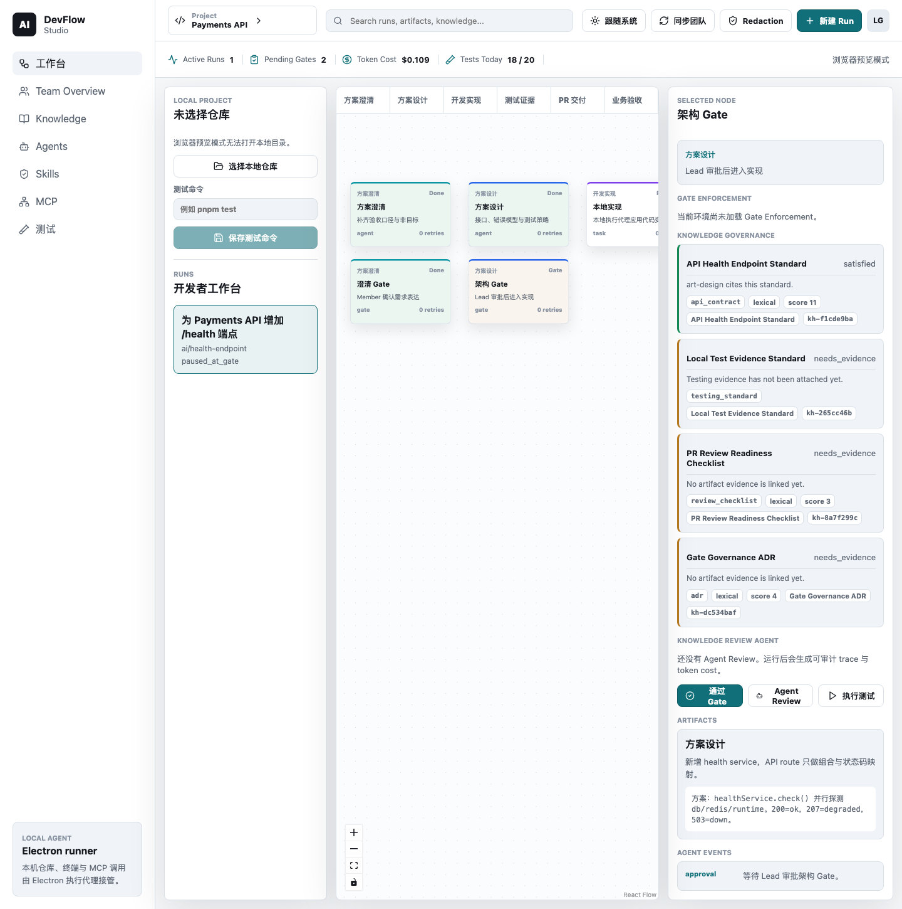

# DevFlow Studio v1.2 手动 Walkthrough 指南

更新时间：2026-06-21  
适用版本：`v1.2.0`

这份指南用于你亲自动手走一遍 DevFlow Studio 当前已经具备的主要能力。它不是测试报告，而是人工体验脚本：按顺序启动、点击、观察、核对。

## 你会验证什么

- Electron Desktop 本地工作台：仓库选择、Workflow、Gate、Knowledge、Agents、Tests、Coding。
- Gate Enforcement：策略来源、blocking reason、remediation、override 状态。
- Policy-Aware Delivery：从 Gate reason 生成 remediation，再由人批准 Retry Coding。
- Runtime Observability：permission、Tool / Skill Timeline、diff、test evidence、cleanup、terminal state。
- Runtime Cost / Budget：Web 管理 budget policy 和 approval，Desktop 使用 approval id 重试。
- Team Pilot：Web/API/Postgres 自托管、Desktop pairing、redacted sync。
- Release-only real opencode smoke：真实豆包/Volcengine provider 路径，明确会消耗 provider 配额。

## 先记住边界

1. 默认 walkthrough 不花模型钱。Electron 默认 fake provider / fake coding engine，可重复、可离线。
2. 真实 `opencode` + 豆包/Volcengine smoke 会产生真实模型调用，只在你明确要验证 release-only runtime 时跑。
3. Team Console 展示的是 redacted summary，不应该看到 raw cwd、raw stdout/stderr、raw prompt、完整 patch、provider secret。
4. 当前能观察 opencode permission/tool relay；当前不能保证还原 opencode 内部私有 Skill 调用栈。
5. 当前不是商业发行版：没有 signed installer、自动更新、Kubernetes、public SaaS、Windows full Electron smoke。

## 0. 环境准备

在项目根目录：

```bash
cd /Users/erich/File/claude/10-showcase/ai-devflow-studio
corepack pnpm install
```

先跑基础检查：

```bash
corepack pnpm release:status
corepack pnpm verify
corepack pnpm build
```

如果 Playwright 首次缺浏览器：

```bash
corepack pnpm exec playwright install
```

## 1. 打开真实 Electron Desktop

```bash
corepack pnpm dev:electron
```

不要只打开浏览器 Vite 页面。浏览器模式没有本地文件夹选择、SQLite、受控 IPC、命令执行和 Electron preload API。


通过标准：

- App 标题或界面显示 AI DevFlow Studio，而不是 Electron default app。
- 能看到 Workbench、Team Overview、Knowledge、Agents、Skills、MCP、Tests 等入口。
- 选择本地仓库时，可以选当前仓库：

```text
/Users/erich/File/claude/10-showcase/ai-devflow-studio
```

## 2. Workbench 与 Gate Enforcement

进入 `Workbench`，选择一个 protected Gate，例如架构 Gate 或验收 Gate。



重点观察 Inspector：

- enforcement status：`pass / warn / blocked / hard_blocked / overridden / blocked_policy_unavailable`
- policy source / version / syncedAt
- matched rule / blocking reason
- remediation candidate
- override 或 hard-block remediation

通过标准：

- 默认 warn-only 不会无故阻止人工 Gate。
- 如果推荐策略或 team cached policy 触发 blocking，界面必须说明为什么被拦。
- hard-block 只展示补救说明，不展示 override 表单。
- renderer 只是展示状态，最终 approve 写路径由 Electron main 校验。

## 3. Knowledge Governance

打开 `Knowledge` 视图，搜索 `api`、`testing`、`gate`。


重点观察：

- source path
- section / chunk
- Knowledge Reference
- Governance Check
- 检索结果与治理 evidence 的区别

通过标准：

- 检索命中不会自动满足 governance evidence。
- evidence 仍来自 artifact、test evidence、agent review、gate decision。

## 4. Knowledge Review Agent

回到 Gate 节点，点击 `Agent Review`，完成后打开 `Agents`。


重点观察：

- provider / model / fake or real source
- review artifact
- trace steps
- conclusion、risks、missing evidence、suggested tests
- token usage / cost source
- Gate Advisory
- Agent Policy Findings

通过标准：

- 默认 fake provider 不产生真实模型费用。
- Agent finding 默认不 hard-block。
- team-visible summary 不包含 raw prompt、raw trace、cwd、stdout/stderr、secret。

## 5. Tests 与 Test Evidence

打开 `Tests` 页面或从相关节点运行测试。


重点观察：

- command
- status
- exit code
- duration
- redaction / truncation
- Test Evidence 是否进入 Gate / Remediation 输入

通过标准：

- 测试失败或超时能变成 remediation 信号。
- 不应泄露本地绝对路径、raw stdout/stderr 或 secret。

## 6. Coding Agent 与 Retry Coding

选中 build task 节点，或从 Gate 的 remediation candidate 点击 `Retry Coding`。


默认路径使用 fake coding engine：

- 创建 managed worktree。
- 产生 permission request。
- 人工 approve 后生成 redacted diff。
- 在 worktree 内运行测试。
- 保存 diff artifact、test evidence、runtime event。

通过标准：

- Coding Agent 只允许从 `stage: build` 且 `kind: task` 的节点启动。
- Retry Coding 必须由人点击，不会自动修改主仓库或自动通过 Gate。
- 主仓库不被直接改动。

## 7. Runtime Trace 与 Tool / Skill Timeline

在 `Agents` 中打开 Coding Agent run。

重点观察：

- permission ask / reply / expired
- `tool_call`
- `tool_result`
- Tool / Skill Timeline
- source：`opencode_metadata` / `inferred` / `opencode_event_stream`
- Tool、Skill、command/file summary
- terminal state：`completed / failed / cancelled / timed_out / interrupted`
- cleanup status

通过标准：

- fake engine 和 real opencode evidence 能区分。
- 缺少 skill metadata 时显示 `Unknown skill` 或 `Inferred tool`，不能编造 Skill 名。
- tool metadata 本地落库前也必须脱敏，不只远端 summary 脱敏。

## 8. Runtime Cost 与 Budget Admin

启动 API/Web：

```bash
corepack pnpm dev:api
corepack pnpm dev:web
```

打开：

```text
http://127.0.0.1:4311
```

进入 Team Console 的 `Runtime Budget` 区域。


重点操作：

1. 找到 `Runtime Budget` 面板。
2. 保存 budget policy：
   - enabled
   - monthly limit
   - warning threshold
3. 创建 `Budget Approval`：
   - requestedBy
   - providerId
   - maxAdditionalCostUsd
   - reason
   - expiresAt
4. 复制生成的 approval id。

通过标准：

- Lead 可保存 policy。
- Lead 可创建 approval。
- 页面显示当前 spend、policy、approval list。
- Web 不显示 raw prompt、patch body、cwd、provider secret。

## 9. Desktop 使用 Budget Approval 重试

回到 Electron Desktop 的 Coding Agent / Runtime Budget 区域。

当 budget guard 返回 `requires_lead_approval` 时：

1. 在 `Runtime budget approval ID` 输入 Web 创建的 approval id。
2. 点击 `Retry with approval`。
3. 观察新的 coding run budget decision。

通过标准：

- 没有 approval id 时，超预算 run 在 `engine.start(...)` 之前被阻断，不产生 provider 调用。
- 有有效 approval id 时，runtime guard 解析完整 approval record 后再评估。
- 过期、拒绝、项目不匹配、provider 不匹配或额度不足的 approval 不应通过。
- Agents trace 里能看到 budget status、projected cost、limit、approval id。

## 10. Self-Hosted Team Pilot

如果要体验 Web/API/Postgres 自托管最小闭环：

```bash
cp .env.example .env
docker compose up --build
```

打开：

```text
Web:        http://127.0.0.1:4311
API health: http://127.0.0.1:4310/health
```

### Desktop Pairing

1. Web Team Console 中点击 `Create desktop pairing code`。
2. 复制一次性 code。
3. Electron Desktop 顶部粘贴 pairing code。
4. 点击 `Pair`。
5. 点击 `同步团队`。


通过标准：

- Desktop 使用 Bearer token 同步。
- token 无效时不能回退 demo session。
- Web 能看到 redacted run / evidence / review / coding / cost summary。

可选自动验证：

```bash
corepack pnpm test:docker-smoke
```

## 11. Release-only 真实 opencode + 豆包/Volcengine Smoke

这一步会消耗真实 provider 配额。只在你要验证真实 runtime 或做 release signoff 时跑。

先做无成本检查：

```bash
corepack pnpm opencode:status
```

推荐 Volcengine / 豆包配置：

```bash
export ANTHROPIC_AUTH_TOKEN="<set in shell only; never commit>"

DEVFLOW_RUN_OPENCODE_SMOKE=1 \
DEVFLOW_CODING_ENGINE=opencode-http \
DEVFLOW_OPENCODE_PROVIDER_ID=double \
DEVFLOW_OPENCODE_MODEL_ID=ark-code-latest \
DEVFLOW_OPENCODE_API_KEY_ENV=ANTHROPIC_AUTH_TOKEN \
corepack pnpm test:opencode-smoke
```

通过标准：

- smoke 启动 `opencode serve`。
- 创建 managed worktree。
- 收到真实 permission request。
- relay permission。
- 捕获 redacted diff。
- 运行 fixture test evidence。
- 记录 runtime cost / token source。
- 完成 process/worktree cleanup。
- 输出不包含 provider key、本地 raw cwd、raw stdout/stderr、raw prompt、完整 patch。

记录模板见：

```text
docs/plans/release-only-real-opencode-smoke.md
```

## 12. 人工 Walkthrough 核对表

| 步骤 | 入口 | 操作 | 通过标准 |
| --- | --- | --- | --- |
| Release status | Terminal | `corepack pnpm release:status` | package/tag/docs/git state 正常；manual walkthrough 可显示 pending |
| Desktop launch | Terminal | `corepack pnpm dev:electron` | 打开 AI DevFlow Studio，不是 default Electron app |
| Local project | Workbench | 选择当前仓库 | 能加载 workflow 和 project state |
| Gate Enforcement | Workbench Inspector | 选择 protected Gate | 显示 policy source、blocking reason、remediation |
| Agent Review | Gate Inspector / Agents | 点击 Agent Review | 生成 review artifact、trace、advisory、finding |
| Test Evidence | Tests | 运行或查看测试 | 显示 command/status/exit/duration，输出脱敏 |
| Retry Coding | Gate / Coding node | 点击 Retry Coding 并 approve permission | 创建 managed worktree，产生 diff/test evidence，不改主仓库 |
| Tool / Skill Trace | Agents | 查看 Coding Agent run | 显示 tool_call/tool_result、Unknown skill/Inferred tool、cleanup |
| Runtime Budget | Web Team Console | 保存 policy，创建 approval | policy 和 approval list 可见 |
| Budget Retry | Desktop Agents | 输入 approval id 并 Retry with approval | budget decision 从 requires approval 变为 approved_over_budget 或可执行 |
| Pairing Sync | Web + Desktop | 创建 pairing code，Desktop Pair，同步团队 | Web 显示 redacted team summary |
| Real opencode | Terminal | env-gated `test:opencode-smoke` | 真实 provider smoke 通过；仅在你接受费用时执行 |

人工走完并确认后，可以标记 release walkthrough：

```bash
DEVFLOW_RELEASE_WALKTHROUGH=passed corepack pnpm release:status -- --strict
```

## 当前不要宣称

- 不要说真实 opencode 是默认 CI/verify 路径。
- 不要说系统会自动修复并自动通过 Gate。
- 不要说已支持 public SaaS、企业 SSO、计费、Kubernetes。
- 不要说 MCP 真执行 / MCP policy enforcement 已完成。
- 不要说能完整还原 opencode 内部私有 Skill 调用栈。
- 不要说 Windows Electron full smoke 已完成。
