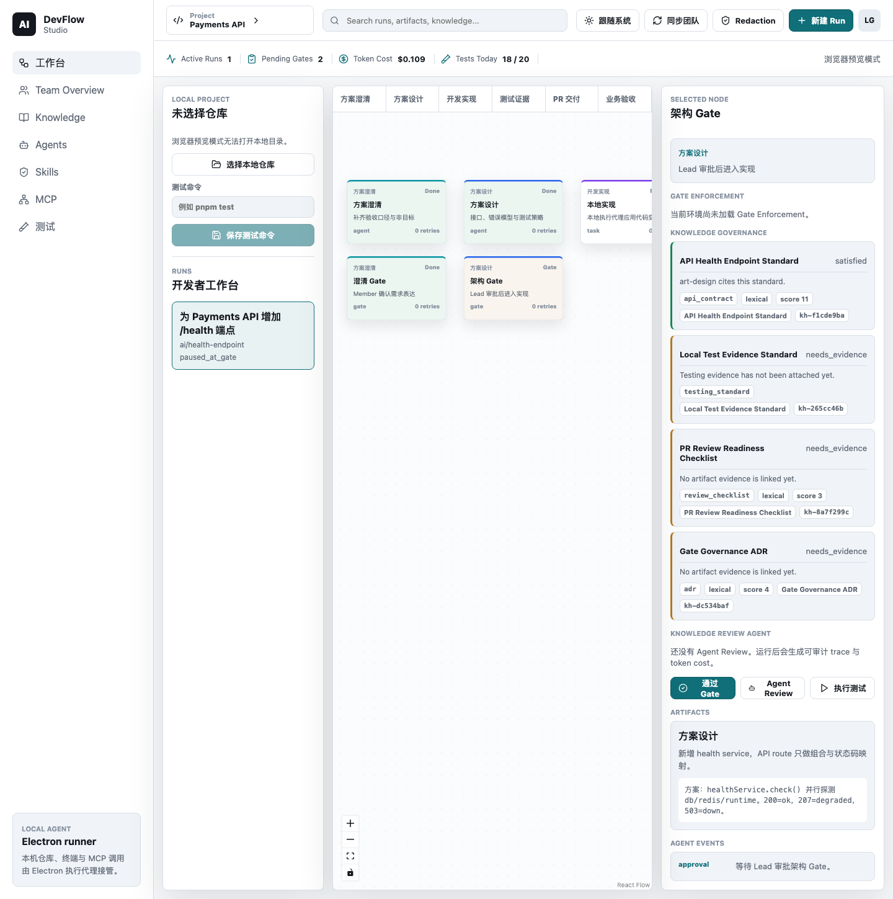
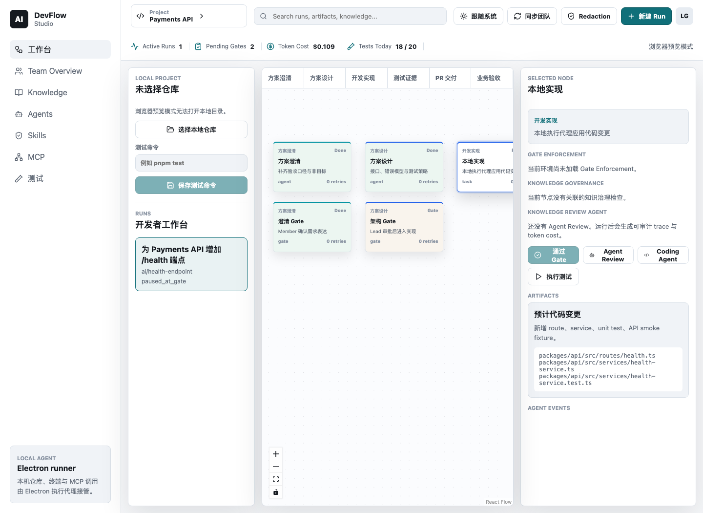
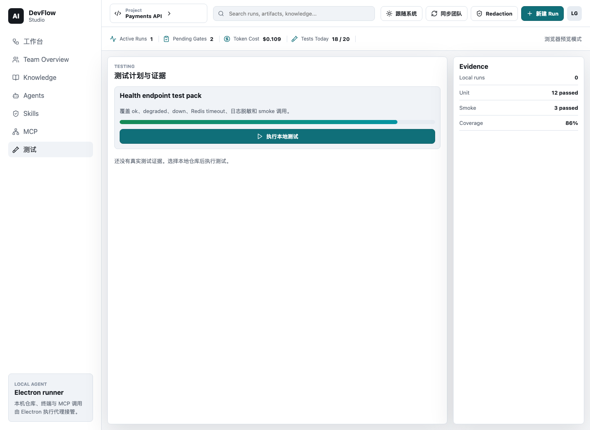
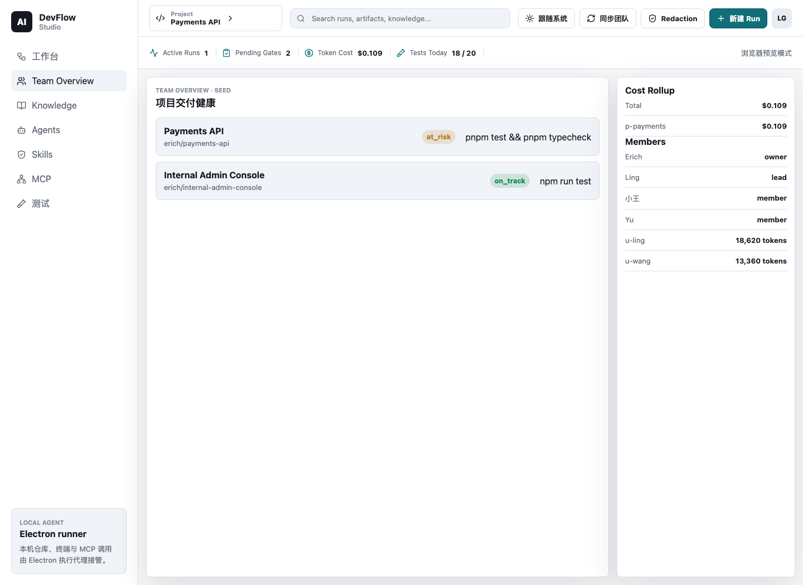

# DevFlow Studio v1.3 手动 Walkthrough 指南

更新时间：2026-07-31

适用版本：`v1.3.0` 候选提交 `C` 与签核提交 `S`；仓库候选标识：
`v1.3 delivery-flow candidate`

这份指南用于人工验证 DevFlow Studio 的端到端交付流程：从需求创建，到澄清/设计 Gate，
再到 Coding、测试、PR Draft、验收证据包。它描述的是目标通过路径，不代表当前主干已经
签核通过。实际发布状态只以 `docs/releases/v1.3.0/` 的四份证据、
`corepack pnpm release:status` 的对应模式结果和 `v1.3.0` tag 指向为准。

## 候选形成前历史快照（2026-07-31）

2026-07-25 的失败基线：
[devflow-studio-v1.3-walkthrough-result-2026-07-25.md](./devflow-studio-v1.3-walkthrough-result-2026-07-25.md)。
该结果用于解释本轮收尾来源，不代表 2026-07-31 工作树已经完成新的 Computer Use 签核。

2026-07-31 已做一次隔离的 Computer Use 收尾演练：真实 UI 完成了 Run 创建、Clarify、
两次 Knowledge Review / Gate、fake Coding permission/diff 和独立 Test，随后在未绑定
Local Project ↔ Team Project 时正确阻断 PR Draft。由于点击 `绑定` 会创建 Desktop access
token，本轮没有在缺少 action-time confirmation 时越过该边界。因此这次演练不是正式
`passed` walkthrough，也没有生成 release evidence；在该历史快照中，正式签核仍须在
候选提交 `C` 上重跑
完整 Pairing → PR → Acceptance → Team Sync → restart 流程。

截至 2026-07-31，收尾工作树已经针对该失败基线完成以下实现校准：

- Electron main 使用共享可信命令推进 Agent、Gate、Build、Test、PR 和 Acceptance；renderer
  不再提交自建 Run/交付 artifact。
- Run 变更与本次产生的 artifact/event/Test Evidence 通过本地事务原子提交，并拒绝 stale
  Run。
- Build 必须有匹配的 completed Coding Run + Diff，Test 只有通过才进入 PR，PR 和 Acceptance
  都会核验上游证据。
- Pairing 显式绑定 Local Project 与 Team Project；同 id 的本地 Run/Artifact/Event 在同步
  合并中优先保留。
- `DEVFLOW_ENABLE_FAKE_RUNTIME=true` 会显式提供 deterministic fake Agent provider，同时
  允许 fake Coding Engine。
- Test Evidence 会先将已知 POSIX/Windows workspace root 替换为 `<workspace>`，再做 secret
  redaction。

以上均为候选 `C` 形成前的历史状态，不是 release signoff。该快照中，六个 package 已统一
为 `1.3.0`，本地 `verify:demo`、build/output、Docker 和 PostgreSQL 已通过；当时候选 SHA
绑定的 Windows gate、新的完整 Computer Use 结果、真实付费 opencode smoke、证据提交和
`v1.3.0` tag 尚未完成。后续是否完成必须重新检查 release evidence、`release:status` 和 tag。

## 你会验证什么

- 从真实用户需求创建 Workflow Run，而不是克隆 seed run。
- `clarify -> design -> build -> test -> pr -> accept` 六阶段在画布中可见。
- Gate approval 会沿 workflow edge 推进 `currentNodeId`，不会再把所有 Gate 都硬编码成
  `building`。
- PR 阶段可以生成本地 `PR Draft` artifact。
- Acceptance 阶段可以生成 `Acceptance Bundle` artifact。
- Coding、Test Evidence、Gate Enforcement、Agent Review、Budget、Tool / Skill Trace 仍保持
  v1.2 行为。

## 0. 启动前检查

```bash
# 从 workbench 根目录进入本 Project
cd projects/agent-engineering/ai-devflow-studio
corepack pnpm install
corepack pnpm verify
```

`release:status -- --mode=pre-tag` 不是候选 `C` 的启动前检查。它只在四份证据已提交到
clean `S`、且 tag 尚不存在时运行。

如果只是人工体验，可以先运行真实 Electron：

```bash
DEVFLOW_ENABLE_DEMO_DATA=true \
DEV_AUTH_ENABLED=true \
DEVFLOW_ENABLE_FAKE_RUNTIME=true \
DEVFLOW_CODING_ENGINE=fake \
corepack pnpm dev:electron
```

`DEV_AUTH_ENABLED=true` 只用于本机演示/CLI header session；任何可被其他主机访问的 API 都必须保持关闭。

通过标准：

- 打开的是真实 `AI DevFlow Studio`，不是 Electron default app。
- 左侧能看到 Workbench、Team Overview、Knowledge、Agents、Skills、MCP、Tests。
- fake/no-cost 路径不产生真实模型费用。
- `DEVFLOW_ENABLE_FAKE_RUNTIME=true` 时，Provider 列表出现
  `Deterministic Fake Provider`；运行 Clarification/Design/Knowledge Review 前明确选择
  它。关闭该 flag 后，旧 fake provider 选择必须隐藏或被拒绝。


## 1. 选择本地仓库

在 Workbench 的 `Local Project` 面板中选择当前 Project 根目录；从 workbench 根目录看，它是：

```text
projects/agent-engineering/ai-devflow-studio
```

通过标准：

- 本地项目名称和路径显示出来。
- 测试命令可以保存。
- 危险命令会被 command safety 阻断。

### 1.1 正式走查的 Team Project 绑定

正式 Computer Use 走查可以把一次性 pairing code 作为本地 API 测试前置条件创建。
对应端点是 `POST /api/team/projects/:projectId/pairing-codes`，调用者仍须具有该项目的
lead/owner 权限。

如果 code 由 API 测试前置创建，dated result 必须如实记录 `local API prerequisite`。
这只证明 API 能产生 code，不能记录为 Web pairing UI 通过。

Computer Use 必须在真实 Electron UI 中亲自完成以下操作，不得用直接调用
pairing exchange API 替代：

1. 确认已选中要绑定的 Local Project。
2. 在 `Desktop pairing code` 输入框粘贴一次性 code，点击 `绑定`。
3. 确认界面显示已绑定的 Team Project，再点击 `同步团队`。
4. 关闭并重启同一隔离 `userData` 的 Electron，确认绑定仍存在并可再次同步。

通过标准：

- Pairing 必须将 Team Project 与当前 `localProjectId` 一起持久化。
- code 和交换后的 bearer token 不得写入结果文档、截图、日志或 release JSON。
- 重启后的同步仍使用已保存的绑定，不要求重新输入 code。

## 2. 从需求创建 Run

点击顶部 `新建 Run`。

填写：

- 标题：`修复 webhook retry 失败边界`
- 一句话需求：`请澄清 webhook retry 的失败边界，设计最小实现方案，完成本地实现、测试、PR handoff 和验收证据。`

点击 `创建并开始澄清`。

通过标准：

- Run 列表出现新标题。
- 新 Run 的状态是 `clarifying`。
- 画布出现六个阶段：需求澄清、方案设计、开发实现、测试证据、PR 交付、业务验收。
- 澄清节点 Inspector 中出现 `Raw request` artifact，内容是你输入的需求。

## 3. Gate 推进

选择需求确认 Gate，点击 `通过 Gate`。

通过标准：

- 当前节点推进到 Design 阶段。
- Run 状态变成 `designing`。
- toast 显示 Gate 已通过或流程已推进。
- 不应出现旧行为：所有 Gate approval 都把 Run 强行改成 `building`。

继续选择方案评审 Gate，点击 `通过 Gate`。

通过标准：

- 当前节点推进到 Build task。
- Run 状态变成 `building`。
- Build task 才显示 `Coding Agent` 操作。



## 4. Coding Agent 与 Test Evidence

选择 Build task，点击 `Coding Agent`。

默认 fake path：

- 创建 managed worktree。
- 产生 permission request。
- 在 Agents 视图批准 permission。
- 生成 redacted diff artifact。
- 生成 bootstrap / test evidence。

通过标准：

- Coding Agent 只从 `stage: build` 且 `kind: task` 的节点启动。
- 主仓库不被直接修改。
- Agents 中能看到 permission、Tool / Skill Timeline、diff、cleanup、terminal state。
- 只有匹配当前 Build 节点的 Coding Run 已完成且 Diff 已持久化后，可信
  `complete_build` 才把当前节点推进到 Test。



选择 Test 节点或 Tests 视图运行测试。

通过标准：

- 测试证据显示 command/status/exit code/duration。
- 输出经过 redaction，不应暴露 secret 或完整本地敏感路径。
- Test IPC 只接收 project/run/node id；main 必须拒绝非当前 Test 节点。
- 失败结果留在当前 Test 并将 Run 标为 `failed`；重新执行并通过后才能推进到 PR。
- artifact 中已知 workspace root 显示为 `<workspace>`；POSIX、Windows、file URL 和编码
  路径都要覆盖。



## 5. 生成 PR Draft

选择 PR 节点，点击 `生成 PR Draft`。

通过标准：

- Inspector 的 Artifacts 中出现 `PR Draft:`。
- 内容包含：
  - Request；
  - changed paths；
  - Test Evidence；
  - Policy；
  - Budget；
  - Agent Review；
  - safe compare URL，若仓库映射不安全则显示 unavailable。
- PR Draft 不包含 raw patch body、raw stdout/stderr、provider secret 或完整本地 cwd。

当前 v1.3 只生成 PR handoff artifact，不创建真实 GitHub PR。

PR Draft 通过专用 IPC 生成；main 会重新读取当前 Run、Coding Diff、Test Evidence、
Review、Policy 和 Budget。Local Project 必须已经 Pair 到明确的 Team Project，repository
来自该绑定项目的远端快照；未绑定或不匹配的旧 credential 应 fail closed。

## 6. 生成验收证据包

选择 Acceptance 节点，点击 `生成验收证据包`。

通过标准：

- Inspector 的 Artifacts 中出现 `Acceptance Bundle:`。
- 内容引用：
  - Raw Request；
  - PR Draft；
  - changed paths；
  - Tests；
  - Policy；
  - Budget；
  - Agent Review。
- Acceptance approval 仍走 Gate Enforcement 写路径，不因生成 bundle 自动通过。
- 非当前 Acceptance、缺失 completed Coding Run/Diff、最新 Test 未通过或 PR Draft 未附着
  时，bundle 命令必须被可信写路径拒绝，且不能留下孤立 artifact/event。

## 7. Final Acceptance Gate

在 Acceptance 节点点击 `通过 Gate`。

通过标准：

- Run 状态变成 `completed`。
- 这是业务验收完成，不是自动 merge 或自动发布。
- 如果 Gate Enforcement 阻断，必须先补证据或走合法 override。
- Final Acceptance 只能在当前 Acceptance 节点执行，并要求 attached bundle、授权角色、
  非阻断 policy、该 Acceptance 节点的最新非阻断 Agent Review，以及非阻断 budget
  decision。任一证据缺失时应保持未完成。

## 8. Team / Budget / Sync 回归检查

打开 Team Overview 和 Web Team Console。

通过标准：

- Web/API/Postgres 自托管路径仍可显示 redacted Run/Evidence/Review/Coding/Cost summary。
- Runtime Budget policy / approval UI 仍可用。
- Desktop pairing 和 `同步团队` 仍通过 Bearer token 工作。
- Pairing 请求必须包含当前 `localProjectId`，credential 保存 Local ↔ Team Project 绑定。
- Test/Review/Coding Evidence 采用 child-first 上传；只有服务端明确返回 canonical-missing
  时，Electron main 才上传一次最新 canonical Run 并重试该 child 一次。跨项目、stale、
  作用域冲突或重试后仍无 canonical Run 的写入被拒绝。
- Child summary ID 只能在原 organization/project/Run/Node scope 内幂等更新；尝试重绑定到
  另一个 Node、Run 或 Project 时返回 409，原记录保持不变。
- 只有 canonical Run Summary 可以推进远端 status/current Node。迟到的 Test/Review/Coding
  child 不得重新激活或阻断非当前 Node，远端最多保留一个 active current Node。
- 独立 Lead 的 Gate override 不重传 creator-owned Run；服务端以当前 canonical Node、exact
  blocker set、policy version、成员角色和职责分离重新判定。Postgres node namespace 在求值时
  规范化，在 accepted audit 的 foreign key 中恢复并保持幂等。
- Remote Agent Review 必须携带重建 exact blocker ID 所需的最小 redacted finding；count-only
  payload 被拒绝。Coding structured metadata、cost/model 与 budget/reason 不得保留未知键、
  secret 或本地绝对路径。
- 合并远端快照时，本地同 id Run/Artifact/Event 保持权威，remote summary 只补充
  remote-only 数据。
- 关闭并重启 Electron 后，Desktop 仍能读取同一 Local ↔ Team Project 绑定并再次同步。

若 pairing code 由本地 API 前置创建，本次证据只能签核 Desktop 绑定、同步与重启持久化；
除非 Computer Use 另外真实操作并记录 Web pairing UI，否则不得声称该 Web UI 已通过。



## 9. Release-only 真实 opencode + 豆包/Volcengine Smoke

这一步会消耗真实 provider 配额，不属于默认 walkthrough。

```bash
export ANTHROPIC_AUTH_TOKEN="<set in shell only; never commit>"
export DEVFLOW_RUN_OPENCODE_SMOKE=1
export DEVFLOW_CODING_ENGINE=opencode-http
export DEVFLOW_OPENCODE_PROVIDER_ID=double
export DEVFLOW_OPENCODE_MODEL_ID=ark-code-latest
export DEVFLOW_OPENCODE_API_KEY_ENV=ANTHROPIC_AUTH_TOKEN

corepack pnpm opencode:status
corepack pnpm test:opencode-smoke

unset ANTHROPIC_AUTH_TOKEN DEVFLOW_RUN_OPENCODE_SMOKE DEVFLOW_CODING_ENGINE
unset DEVFLOW_OPENCODE_PROVIDER_ID DEVFLOW_OPENCODE_MODEL_ID DEVFLOW_OPENCODE_API_KEY_ENV
```

如果 `opencode` 不在 `PATH`，还必须在上述两条命令之前设置
`export DEVFLOW_OPENCODE_BIN=<absolute path to opencode>`。不得用 `ARK_API_KEY` 代替本走查约定的
`ANTHROPIC_AUTH_TOKEN`。

通过标准：

- 真实 opencode permission relay 通过。
- 捕获 redacted diff。
- 保存 fixture Test Evidence。
- 记录 Tool / Skill Timeline。
- process/worktree cleanup 完成。
- 不泄露 provider key、raw cwd、raw stdout/stderr、raw prompt、完整 patch。

任一 preflight 缺失、进程/网络/provider 失败、permission relay 未完成、无 diff、无
tool call/result、Test Evidence 未通过、cleanup 未完成或 redaction 检查失败，都不得把
`real-opencode.json` 写成 `status: "passed"`。

`real-opencode.json` 的完整格式与禁止字段见
[Release-Only Real opencode Provider Smoke](../plans/release-only-real-opencode-smoke.md)。

## 10. 人工 Walkthrough 核对表

Release signoff 使用两个提交：候选提交 `C` 包含产品代码、配置、文档和版本；其直接子提交
`S` 只包含三份 release JSON 与 JSON 引用的 dated walkthrough result。三份 JSON 的
`candidateSha` 都必须是 `C`；tag 最终指向包含证据的 `S`。

Computer Use 通过后，新建的 result 必须命名为
`docs/guides/devflow-studio-v1.3-walkthrough-result-YYYY-MM-DD.md`。对应
`docs/releases/v1.3.0/walkthrough.json` 最少包含：

```json
{
  "targetVersion": "1.3.0",
  "candidateSha": "<C full SHA>",
  "status": "passed",
  "date": "YYYY-MM-DD",
  "method": "computer-use",
  "evidencePath": "docs/guides/devflow-studio-v1.3-walkthrough-result-YYYY-MM-DD.md"
}
```

对应 `docs/releases/v1.3.0/required-gates.json` 最少包含：

```json
{
  "targetVersion": "1.3.0",
  "candidateSha": "<C full SHA>",
  "status": "passed",
  "gates": {
    "verify": "passed",
    "windows-compatibility": "passed",
    "e2e": "passed",
    "electron-smoke": "passed",
    "postgres-smoke": "passed",
    "docker-smoke": "passed",
    "build": "passed",
    "build-output-smoke": "passed"
  }
}
```

dated result 必须写明 pairing code 的来源、Computer Use 完成的 Desktop 绑定/同步操作、
重启持久化结果，以及 Web pairing UI 是否真正被操作。不得记录 code 或 token。

`S` 中不得加入额外截图或日志文件。`C..S` 必须恰好包含 `walkthrough.json`、
`required-gates.json`、`real-opencode.json` 和上述 dated result。先在无 tag 的干净 `S`
运行 pre-tag，通过后才可将 `v1.3.0` 指向同一 `S` 并运行 tagged 检查。

| 步骤 | 入口 | 操作 | 通过标准 |
| --- | --- | --- | --- |
| Pre-tag status | Terminal at `S` | `corepack pnpm release:status -- --mode=pre-tag` | clean tree；`S^1=C`；证据绑定 `C`；`C..S` 仅含四个证据文件；tag 尚不存在 |
| Tagged status | Terminal at `S` | `corepack pnpm release:status -- --mode=tagged` | 仅在 pre-tag 通过并创建 tag 后运行；tag 必须精确指向 `S` |
| Desktop launch | Terminal | `corepack pnpm dev:electron` | 打开 AI DevFlow Studio，不是 default app |
| Pairing prerequisite | Local API test setup | 为目标 Team Project 创建一次性 code | 只记录来源，不记录 code/token，不声称 Web UI 通过 |
| Desktop Pairing | Electron topbar | Computer Use 输入 code，点击 `绑定` 和 `同步团队` | 绑定包含当前 `localProjectId` |
| Request intake | Workbench | 新建 Run 并输入需求 | 创建 raw_request artifact；Run 从 `clarifying` 开始 |
| Workflow advance | Gate Inspector | 通过需求确认 / 方案评审 Gate | `currentNodeId` 推进；Run status 对应下一阶段 |
| Coding | Build task | 点击 Coding Agent 并 approve permission | managed worktree + diff + test evidence |
| PR Draft | PR node | 点击 `生成 PR Draft` | PR draft artifact 出现，含 diff/test/policy/budget/review 摘要 |
| Acceptance Bundle | Acceptance node | 点击 `生成验收证据包` | Acceptance bundle artifact 出现，引用 PR draft 和证据 |
| Acceptance Signoff | Acceptance node | 点击 `通过 Gate` | Run completed；任何阻断都必须先修复，本次不得记为 passed |
| Team Sync | Desktop | 完成后再同步 | 远端只收到 redacted summary，本地完整 Run 保留 |
| Restart persistence | Electron | 关闭并以同一隔离 `userData` 重启 | 绑定和完整 Run 仍在，再次同步成功 |
| Real opencode | Terminal | env-gated `test:opencode-smoke` | 仅在接受真实费用时执行 |

## 签核过程中的宣称边界

- 只有 clean `S` 的 pre-tag 与 tagged 检查均通过、且 `v1.3.0` tag 精确指向 `S` 后，
  才能宣称 v1.3 已完成正式签核并发布。
- 2026-07-25 的失败结果是历史基线，不能替代绑定候选 `C` 的新 Computer Use 结果。
- 不要说 Windows、Postgres、Docker、全部 CI 或 candidate-bound release evidence 已通过，
  除非它们已在同一候选 SHA 上实际运行并记录。
- 候选 `C` 的 Verify（含 `windows-latest`）与签核 `S`/tag 的 Release workflow 都必须成功，
  才能作为远端发布签核证据。
- 不要说 release-only 真实 opencode 已通过，除非得到付费调用授权并完成记录。
- 如果 pairing code 由本地 API 前置创建，不要说 Web pairing UI 已通过。
- 不要在 pre-tag 签核完成前创建或宣称 v1.3 tag。
- 不要说 v1.3 已创建真实 GitHub PR。
- 不要说系统会自动 push、merge 或自动通过 Gate。
- 不要说真实 opencode 是默认 CI/verify 路径。
- 不要说 MCP 真执行 / MCP policy enforcement 已完成。
- 不要说 RAG/vector retrieval 已接入。
- 不要说 Windows Electron full smoke 已完成。
