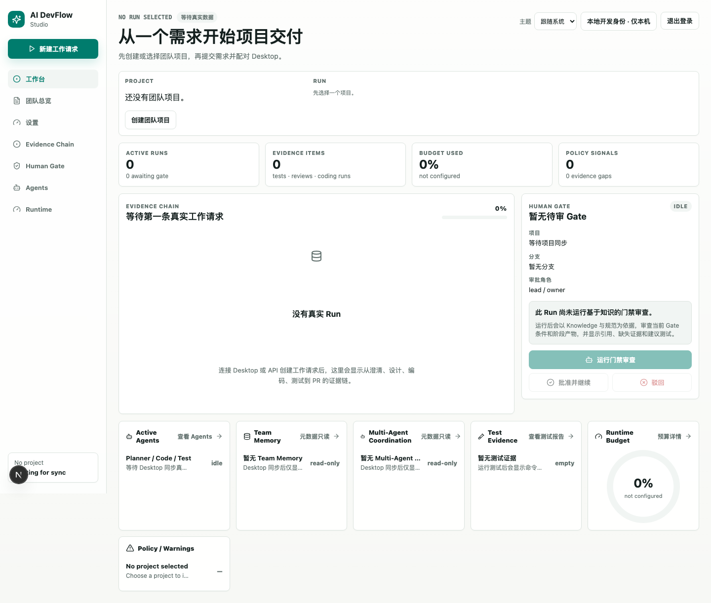
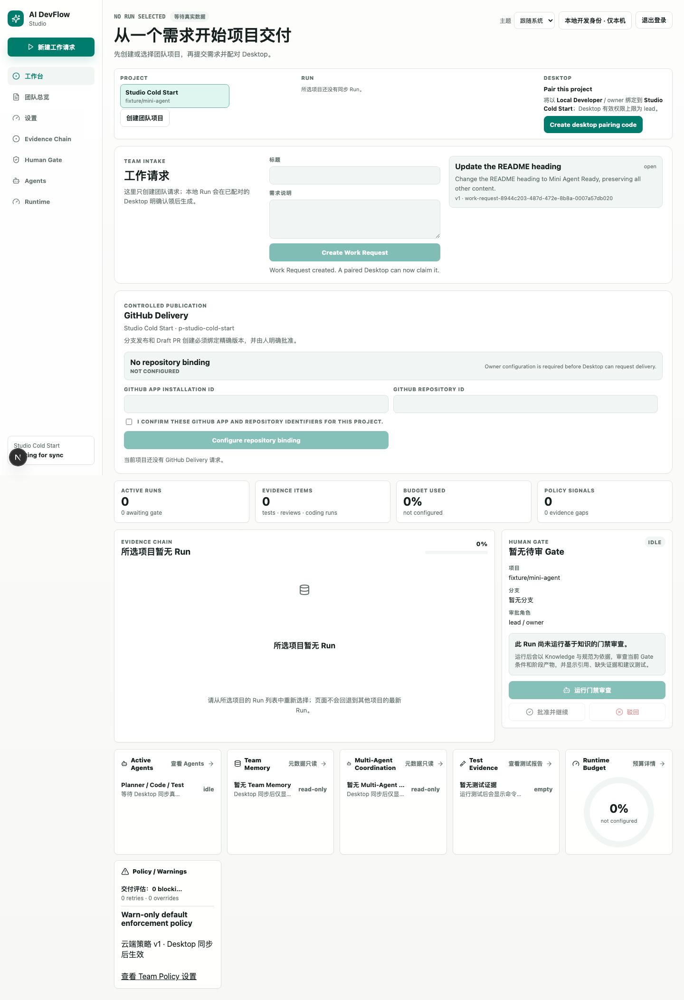
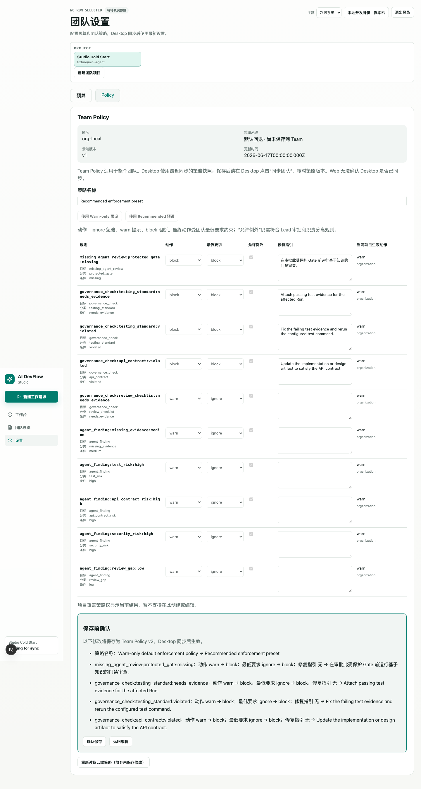

# DevFlow Studio V2.2 新手操作手册

这份手册记录了一次真实的 V2.2 本地演练。

> 截图与结果属于当时的教学运行，不代表本轮发布已通过。当前节点工作区采用常驻标题、状态摘要和操作区，下方为“概览 / 内容与审查 / 证据 / 活动”四个一级标签；节点记录不再整体藏入折叠区。以下旧截图用于对照流程，当前材料、审查和修订入口以“内容与审查”为准。

目标是让第一次接触项目的人看懂：从选择项目开始，一条需求如何经过工作流、Agent 执行、测试和交付准备。

本次演练停在 `approval_required`。系统已经准备好交付材料，但没有在 Web 端批准，因此没有发布远端分支，也没有创建 Draft PR。

## 1. 先认识这个项目

DevFlow Studio 主要有两个操作界面：

- **Web Studio**：管理团队项目、工作请求、团队策略、预算、证据链和 GitHub 交付审批。
- **桌面端**：连接本地代码仓库，运行工作流、Agent、测试和受控 Git 操作。原始代码、工作目录和完整代码差异主要留在本地。

后面还有 API 和 Postgres，仓库中也包含 Worker，它们负责团队数据、任务同步和后台处理。新手日常操作主要在 Web 和桌面端之间来回切换。

一条任务的主流程是：

```text
Web 创建 Work Request
        ↓
Desktop 认领并生成本地 Run
        ↓
需求澄清 → 需求 Gate → 方案设计 → 方案 Gate
        ↓
Coding Agent → 本地测试 → PR Delivery Package
        ↓
Web 人工审批 → 发布分支并创建 Draft PR
```

Agent 能力嵌在这条工作流里，而不是绕开工作流单独工作：

- 工作流阶段 Agent 生成澄清和设计产物。
- 门禁审查 Agent 执行基于知识的门禁审查（Knowledge-Grounded Gate Review）：以检索到的知识和规范为依据，审查当前门禁、门禁条件及阶段产物，指出风险和缺失证据。
- Coding Agent 通过 CRI 接入本地执行器或 OpenCode，在受管工作树中产生受控代码差异。
- Agent 可以给建议、请求权限和生成证据，但不能替人通过门禁，也不能自行批准 GitHub 发布。

V2.2 还支持有边界的独立 Agent 运行时、记忆生命周期和多 Agent 协调。它们默认收在 Agents 页的“高级验收与诊断”折叠区，不是完成当前工作流的必经步骤。

### Agent 执行台的能力边界

进入 Agents 页后，先看顶部“当前任务”。页面只把当前 Run / 节点投影出的动作显示为主操作，例如“生成设计方案”；对象、结果、模型服务商与费用、仓库影响、工作流影响会在按钮前明确列出。其余入口是可选或高级信息：

| 能力 | 操作对象与结果 | 模型服务商 / 成本 | 仓库副作用 | 工作流影响 | 前置条件 |
| --- | --- | --- | --- | --- | --- |
| 工作流阶段 Agent | 当前澄清或设计节点；生成阶段产物 | 调用所选阶段模型服务商，记录 token，可能产生费用 | 只读仓库上下文 | 完成当前节点并推进到对应门禁；不自动批准门禁 | 已选 Run、当前节点、已配置模型服务商 |
| 基于知识的门禁审查 | 当前门禁与上游阶段产物；生成建议、引用和轨迹 | 调用所选审查模型服务商，记录 token，可能产生费用 | 只读知识与证据 | 只提供建议；不批准门禁，不推进工作流 | 当前节点可审查、已配置模型服务商 |
| Coding Agent | 当前开发实现任务；生成受控编码运行、代码差异与测试证据 | 调用项目级编码执行器 / 模型服务商，按调用结算 token 与费用 | 仅在受管工作树读写，不直接修改当前检出目录 | 按现有规则完成开发实现证据；不自动批准后续门禁 | 当前开发实现节点、执行器 / 模型服务商 / 预算就绪，必要权限经人工批准 |
| 独立 Agent 运行时 | 当前 Run / 节点的独立验收实例；固定执行内部无业务副作用场景 `scenario.evaluate`，生成检查点、轨迹与评估 | 不调用当前阶段模型服务商，模型 token / 费用为 0 | 不读写仓库 | 不生成当前阶段产物，不推进工作流，不审批门禁 | 已选本地项目和 Run；不要求团队配对 |
| 多 Agent 协调 | 当前 Run / 节点的固定 `bounded-repair-v1` 验收图；首次只创建调度者、任务图和检查点 | 首次创建不调用阶段模型服务商；后续手动启动的专长 Agent 可能在上限内消耗 token / 费用 | 分析角色只读；后续有界实现 Agent 可能只写受管工作区 | 不生成当前阶段产物，不推进工作流，不审批门禁 | 本地项目必须已配对团队项目；未配对时入口禁用并显示原因 |

“高级验收与诊断”默认折叠；键盘聚焦其标题后可按 Enter 或 Space 展开。默认用户不会看到 `scenario.evaluate`，也不应把它误认为当前设计或开发任务。展开前先读边界说明，再决定是否创建独立运行时或固定多 Agent 验收会话。

## 2. 本次演练环境和结果

本次使用一个已经配对的团队项目和一个非敏感沙箱仓库，Coding Agent 使用本地确定性执行器，不产生模型费用。

| 项目 | 本次结果 |
| --- | --- |
| 教学任务 | `新手演练：验证本地工作流` |
| 工作流 | 澄清、设计、实现、测试已完成 |
| 门禁审查 | 两个门禁前各运行一次，均为仅警告 |
| Coding Agent | 完成 1 个受控文件修改 |
| 测试命令 | `npm test` |
| 测试结果 | 通过，证据已归档 |
| GitHub 交付 | `approval_required` |
| 远端变化 | 无；未批准、未推送、未创建 PR |

这是一条教学 Run，不是 V2.2 的正式发布验收记录。

## 3. 启动前准备

1. 准备一个非敏感 Git 仓库，建议使用专门的沙箱仓库。
2. 启动 Web、API 和 Postgres：

   ```bash
   docker compose up --build
   ```

3. 打开 Web：<http://127.0.0.1:4311>。
4. 启动 DevFlow Studio 桌面端。
5. 确认 API 和 Web 都处于就绪状态。更完整的部署和鉴权说明见 [自托管试点指南](./devflow-studio-self-hosted-pilot.md)。

第一次使用时，还需要完成一次配对：在 Web 项目中生成短期配对码，在桌面端顶部粘贴后点击“绑定”。本次演练开始前已经完成配对，所以没有重新生成配对码。

## 4. 从头操作

<a id="第-1-步辨认-desktop-起始页"></a>

### 第 1 步：辨认桌面端起始页

打开桌面端后，先看左上角的团队项目和本地项目。中间是工作流看板，左侧是工作台、团队、知识、Agents、Skills、MCP 和测试入口。


检查点：

- 团队项目已显示目标项目。
- 本地项目已显示本地仓库。
- 分支是普通工作分支，例如 `main`，不要在分离头指针（detached HEAD）上准备交付。

### 第 2 步：选择本地仓库

在桌面端左侧的本地项目卡片里点击“选择本地仓库”，选择包含 `.git` 的仓库根目录。


选择后，桌面端会读取仓库名称和当前分支。确认显示正确后再继续。


本次操作是重新打开当前仓库的选择器，因此没有切换到其他目录。

### 第 3 步：在 Studio 创建和选择团队项目

进入 Web 根地址 `/`。首次登录且没有项目时，所有者点击“创建团队项目”，在弹窗中填写名称、短标识（Slug）、已有仓库和描述。短标识使用小写字母、数字和单个连字符。



创建成功后会留在 Studio，并自动选中新项目，显示工作请求、桌面配对和 GitHub 交付。已有项目通过项目选择区切换；页面不会擅自选择其他项目的 Run。成员没有创建项目权限，重复短标识、登录过期或保存结果不确定时按表单提示处理。



左侧“工作台”承载需求、配对和交付；“团队总览”查看成员、项目费用、最近 Run 与测试摘要；“设置”分为预算和策略。旧 `/legacy-shell` 地址仅重定向到 Studio，正常操作不再进入旧界面。

在“设置 → Policy”中区分默认回退和团队已保存状态，并查看所有规则、最低要求、例外条件和当前项目的生效动作。所有者可选择预设或编辑规则，先点“预览变更”，核对警告/阻断等变化后“确认保存”；负责人和成员只读。默认回退不会因为名称相同而被标成已保存。



保存后应在桌面端点击“同步团队”，检查策略版本。Web 显示的是云端版本，不能据此断言桌面端已同步。并发修改冲突或保存结果不确定时，先重新读取云端策略，再决定是否继续编辑。项目覆盖策略当前仅显示，不提供编辑入口。

上述三张截图来自 2026-09-10 的独立 Postgres schema、真实 Web / API / Electron 初始化回归；没有调用模型。后续工作流的真实模型服务商验收另行记录。

<a id="第-4-步在-web-创建-work-request"></a>

### 第 4 步：在 Web 创建工作请求

在“工作请求”区域填写标题和需求说明。说明应包含要改什么、如何验证，以及是否需要准备交付。

本次填写：

- 标题：`新手演练：验证本地工作流`
- 说明：创建一个确定性验证标记，执行保存的 `npm test`，准备 Draft PR 交付包，但不要发布 PR。


点击 `Create Work Request`。状态变成 `open`，表示请求已经进入团队队列，尚未被桌面端认领。


<a id="第-5-步在-desktop-认领-work-request"></a>

### 第 5 步：在桌面端认领工作请求

回到桌面端，在 `WORK REQUESTS` 区域点击“刷新”。新任务应显示为“待领取”。


点击“创建本地 Run”。桌面端会认领该请求，在本地 SQLite 中生成唯一 Run，并从需求澄清阶段开始。


此时可以看到六个阶段：需求澄清、方案设计、开发实现、测试证据、PR 交付和业务验收。

### 第 6 步：生成需求澄清

在第一个节点点击“生成需求澄清”。系统会把原始工作请求整理成可验收目标、非目标和后续门禁所需信息。


完成后流程不会直接进入设计，而是停在“需求确认 Gate”。

<a id="第-7-步运行门禁审查再通过需求-gate"></a>

### 第 7 步：运行门禁审查，再通过需求门禁

在门禁的节点检查面板中点击“去 Agents 运行门禁审查”，然后点击“运行门禁审查”。


本次门禁审查以 4 个知识引用为依据，对当前需求门禁和澄清产物进行检查，给出 `warn`、82% 置信度，并指出仍缺少测试证据。该建议不会自动批准或拒绝门禁。

返回节点检查面板，确认以下内容后点击“通过 Gate”：

- 上游澄清产物已关联。
- 门禁审查建议已存在。
- 策略快照允许当前用户审批。


### 第 8 步：生成并评审方案设计

选择“方案设计”卡片，在“设计执行器”选择 Direct Provider（直连模型）或 OpenCode（只读分析），再选择“本节点使用的模型”，点击“生成设计方案”。Direct Provider（直连模型）根据已批准需求生成；OpenCode 还会只读查看仓库。两者都会使用需求门禁已批准的澄清正文和本节点已保存的讨论提案。

设计产物说明实现方式和测试策略；“设计输入与代码核验依据”可以查看本次使用的澄清版本、执行工具、模型和代码引用。生成时可点击“取消生成”，节点不会因取消而推进，可稍后重试。


方案完成后再次进入门禁。按相同方式运行门禁审查，以知识和规范为依据检查当前方案门禁及设计产物，再通过“方案评审 Gate”。


两个门禁都通过后，开发实现节点才成为当前步骤。

### 第 9 步：启动 Coding Agent

先到 Agents 的“项目执行工具”选择开发实现使用的工具：OpenCode 或 DevFlow Native（内置编码执行器）。旧称 `Native Coding Agent` / `Native Executor` 都指 DevFlow Native；v2 是执行器版本，配置修订号是另一件事。模型服务商（例如 DeepSeek）提供模型，执行工具负责受控执行；已保存的模型服务商可以共用，但各入口独立选择。

需求澄清、方案设计在各自节点选择执行方式；右侧聊天在“新对话执行方式”选择。项目工具设置不会自动切换这些入口。

选择 `Implement locally`，点击 `Coding Agent`。Coding Agent 会创建独立的受管工作树，不直接在主工作目录里修改文件。


本次 CRI 后面连接的是本地确定性执行器。接入真实 OpenCode 时，权限、代码差异、测试和证据流程保持相同。

### 第 10 步：处理依赖安装权限

示例仓库没有包管理器锁文件，因此 Agent 先请求一次精确命令授权：

```text
npm install --package-lock=false
```

只在命令和仓库符合预期时点击“仅批准本次”。这个授权只对当前请求生效。


如果不应安装依赖，点击“拒绝”，不要为了推进工作流盲目批准。

### 第 11 步：处理受控文件修改权限

依赖准备完成后，Agent 请求第二次一次性授权。本次只允许写入 `devflow-native-change.txt`。


确认目标文件和任务一致后点击“仅批准本次”。Agent 随后执行修改、运行保存的测试命令，并归档代码差异、轨迹和测试证据。

### 第 12 步：检查 Coding Agent 结果

Agent 完成后，Agents 页面显示：

- 状态：`completed`
- 模型服务商：显示可读的服务商名称；系统生成的内部 `providerId` 不需要用户填写
- 变更路径：1
- 依赖准备：通过
- 测试证据：通过
- 清理：工作树仍保留，可供检查


本次代码差异只新增一行确定性标记。正式任务中应在这里仔细检查完整变更路径、代码差异、工具调用和权限时间线。

### 第 13 步：在测试节点正式归档测试证据

Coding Agent 已经运行过保存的测试，但工作流仍要求在“测试证据”节点明确执行一次。点击“去 Tests 执行本地测试”，确认命令为 `npm test`，再点击“执行本地测试”。


本次结果：

- 退出码：0
- 状态：通过
- 标准输出/错误：按规则脱敏
- 工作流：自动推进到 PR 交付

<a id="第-14-步生成-pr-delivery-package"></a>

### 第 14 步：生成 PR 交付包

进入 `Prepare PR draft`，点击 `生成 PR Delivery Package`。这个动作只汇总材料，不会推送 GitHub。

交付包会绑定：

- 精确编码来源和提交
- 变更路径与差异摘要
- 测试证据版本与摘要
- 策略、预算和门禁审查摘要


<a id="第-15-步prepare-github-delivery"></a>

### 第 15 步：准备 GitHub 交付

交付包生成后，顶部动作变成 `Prepare GitHub Delivery`。点击后，桌面端会在受管工作树中固定提交，复验测试，并创建一个版本绑定的交付请求。

这个动作仍不会获得 Web 审批权限，也不会自行发布。


看到“等待 Web 审批”说明本地准备已完成。桌面端此时会保持在 PR 交付节点。

<a id="第-16-步在-web-检查-github-delivery-请求"></a>

### 第 16 步：在 Web 检查 GitHub 交付请求

回到 Web，重新打开团队项目。GitHub 交付区域应出现 `approval required` 请求。


真正批准前，lead 或 owner 必须核对：

- 仓库与基础分支
- 发布分支
- 预期提交
- 变更路径
- 交付请求、代码差异、PR 交付包 和证据摘要
- 审批有效期

本次没有勾选确认框，也没有点击 `Approve delivery`。

### 第 17 步：查看同步后的 Run 和证据链

在 Web 的 Run 列表中选择教学 Run。状态显示“等待人评”，活动 Agent 显示 Coding Agent 已完成，测试证据显示多次通过记录。


证据链显示当前完成度 86%：澄清、设计、实现、测试已完成，PR 节点仍在运行。


到这里，一条任务已经完成“需求 → 设计 → 实现 → 测试 → 交付准备”的完整本地路径。

## 5. 如果要继续发布

这一步会产生真实远端影响，应由有权限的审查者明确执行：

1. 在 Web 核对交付请求的全部精确字段。
2. 勾选该请求自己的确认框。
3. 点击 `Approve delivery`。
4. 保持桌面端运行，让它获取短期、仓库范围内的凭据并发布精确提交。
5. 等待 API 校验远端分支后创建或复用一个 Draft PR。
6. 回到桌面端和 Web，确认交付状态为已完成，再进入业务验收。

不要手工推送、强制推送，或在数据库中修改交付状态。若远端同名分支指向不同 SHA，应保留现场并创建新的交付请求修订版。

## 6. 常见问题

### Web 显示“请选择项目”或“请选择 Run”

这是正常的显式选择机制。先选择团队项目，再选择该项目下的 Run；页面不会自动回退到其他项目的最新 Run。

<a id="desktop-收不到新-work-request"></a>

### 桌面端收不到新工作请求

确认 Web 和桌面端使用同一个团队项目，然后在桌面端的 `WORK REQUESTS` 区域点击“刷新”。仍不可见时，检查 API 登录、配对状态和项目绑定。

<a id="coding-agent-一直显示-starting"></a>

### Coding Agent 一直显示启动中

打开左侧 `Agents`。多数情况下 Agent 正在等待一次性权限，工作台主卡片不会把完整权限详情展开。

### 为什么测试已经通过，还要再进 Tests

Coding Agent 的已保存测试命令的执行结果证明它自己的改动通过；测试节点的执行负责把结果正式归档到工作流的测试证据。两者作用不同。

<a id="顶部显示-unavailable-或-policy-snapshot-not-loaded"></a>

### 顶部显示 `unavailable` 或策略快照 `not loaded`

重新点击“同步团队”，确认 API 可访问且桌面配对仍有效。门禁前应看到可解释的 策略快照；不要在策略状态不清楚时直接发布。

<a id="github-delivery-停在-approval_required"></a>

### GitHub 交付停在 `approval_required`

这是预期的安全边界，不是失败。桌面端只能准备请求，Web 的 lead/owner 才能批准真实发布。

<a id="prepare-github-delivery-报-base-branch-或-commit-不匹配"></a>

### 准备 GitHub 交付报基础分支或提交不匹配

确认本地仓库位于正常分支，例如 `main`，而不是分离头指针（detached HEAD）；刷新 Git 分支后重新生成绑定到最新精确来源的交付请求。

## 7. 新手术语

| 术语 | 简单解释 |
| --- | --- |
| `Team Project` | Web 端的团队项目和治理边界 |
| `Local Project` | 桌面端连接的本地 Git 仓库 |
| `Work Request` | Web 创建、等待桌面端认领的任务 |
| `Run` | 一条工作请求的本地工作流实例 |
| `Node` | 工作流中的一个步骤 |
| `Artifact` | 澄清、设计、代码差异、报告、交付包等产物 |
| `Evidence` | 测试、门禁审查、权限和执行结果等证据 |
| `Trace` | Agent 或工作流的执行过程记录 |
| `Gate` | 必须由人核对并批准的流程关口 |
| `managed worktree` | Coding Agent 使用的隔离 Git 工作目录 |
| `CRI` | Coding Agent 与 OpenCode/本地执行器之间的运行时接入边界 |
| `Delivery Intent` | 绑定精确提交、证据和摘要的发布请求 |

## 8. 本次操作结论

这次实际操作证明了 V2.2 的主路径已经可以连起来：Web 收集任务，桌面端运行工作流和 Agent，权限按动作转发，代码差异与测试成为证据，最后由 Web 保留发布审批权。

对新手来说，最重要的使用原则只有三条：

1. 先确认当前团队项目、本地项目和 Run。
2. 每个门禁、权限请求和交付摘要都先看证据，再批准。
3. 桌面端负责本地执行，Web 负责团队治理和最终发布授权。
