# DevFlow Studio V2.2 新手操作手册

这份手册记录了一次真实的 V2.2 本地演练。目标不是介绍所有配置，而是让第一次接触项目的人看懂：从选择项目开始，一条需求如何经过 Workflow、Agent、测试和交付准备。

本次演练停在 `approval_required`。系统已经准备好交付材料，但没有在 Web 端批准，因此没有发布远端分支，也没有创建 Draft PR。

## 1. 先认识这个项目

DevFlow Studio 主要有两个操作界面：

- **Web Team Console**：管理 Team Project、Work Request、团队策略、预算、证据链和 GitHub Delivery 审批。
- **Desktop**：连接本地代码仓库，运行 Workflow、Agent、测试和受控 Git 操作。原始代码、工作目录和完整 diff 主要留在本地。

后面还有 API 和 Postgres，仓库中也包含 Worker，它们负责团队数据、任务同步和后台处理。新手日常操作主要在 Web 和 Desktop 之间来回切换。

一条任务的主流程是：

```text
Web 创建 Work Request
        ↓
Desktop 认领并生成本地 Run
        ↓
需求澄清 → 需求 Gate → 方案设计 → 方案 Gate
        ↓
Coding Agent → 本地测试 → PR Delivery Package
        ↓
Web 人工审批 → 发布分支并创建 Draft PR
```

Agent 能力嵌在这条 Workflow 里，而不是绕开 Workflow 单独工作：

- Workflow Stage Agent 生成澄清和设计产物。
- 门禁审查 Agent 执行基于知识的门禁审查（Knowledge-Grounded Gate Review）：以检索到的知识和规范为依据，审查当前 Gate、门禁条件及阶段产物，指出风险和缺失证据。
- Coding Agent 通过 CRI 接入本地执行器或 OpenCode，在 managed worktree 中产生受控 diff。
- Agent 可以给建议、请求权限和生成证据，但不能替人通过 Gate，也不能自行批准 GitHub 发布。

V2.2 还支持有边界的单组 Agent / Multi-Agent Coordination。本手册只走最容易理解的主路径，没有展开独立 Agent Runtime、Memory 生命周期和多 Agent 协调操作。

## 2. 本次演练环境和结果

本次使用一个已经配对的 Team Project 和一个非敏感沙箱仓库，Coding Agent 使用本地确定性执行器，不产生模型费用。

| 项目 | 本次结果 |
| --- | --- |
| 教学任务 | `新手演练：验证本地工作流` |
| Workflow | Clarify、Design、Build、Test 已完成 |
| 门禁审查 | 两个 Gate 前各运行一次，均为 warning-only |
| Coding Agent | 完成 1 个受控文件修改 |
| 测试命令 | `npm test` |
| 测试结果 | 通过，证据已归档 |
| GitHub Delivery | `approval_required` |
| 远端变化 | 无；未批准、未推送、未创建 PR |

这是一条教学 Run，不是 V2.2 的正式发布验收记录。

## 3. 启动前准备

1. 准备一个非敏感 Git 仓库，建议使用专门的沙箱仓库。
2. 启动 Web、API 和 Postgres：

   ```bash
   docker compose up --build
   ```

3. 打开 Web：<http://127.0.0.1:4311>。
4. 启动 DevFlow Studio Desktop。
5. 确认 API 和 Web 都处于 ready 状态。更完整的部署和鉴权说明见 [Self-Hosted Pilot Guide](./devflow-studio-self-hosted-pilot.md)。

第一次使用时，还需要完成一次配对：在 Web 项目中生成短期 pairing code，在 Desktop 顶部粘贴后点击“绑定”。本次演练开始前已经完成配对，所以没有重新生成 code。

## 4. 从头操作

### 第 1 步：辨认 Desktop 起始页

打开 Desktop 后，先看左上角的 Team Project 和 Local Project。中间是 Workflow Board，左侧是工作台、Team、Knowledge、Agents、Skills、MCP 和测试入口。

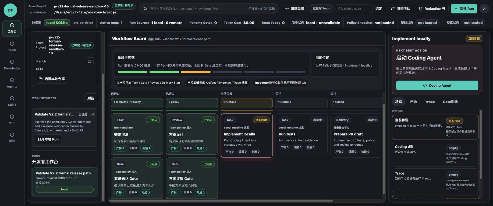

检查点：

- Team Project 已显示目标项目。
- Local Project 已显示本地仓库。
- Branch 是普通工作分支，例如 `main`，不要在 detached HEAD 上准备交付。

### 第 2 步：选择本地仓库

在 Desktop 左侧的 Local Project 卡片里点击“选择本地仓库”，选择包含 `.git` 的仓库根目录。

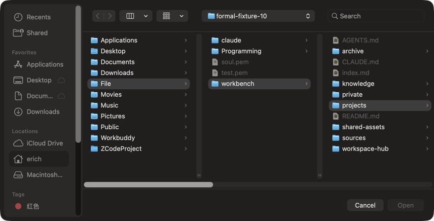

选择后，Desktop 会读取仓库名称和当前分支。确认显示正确后再继续。

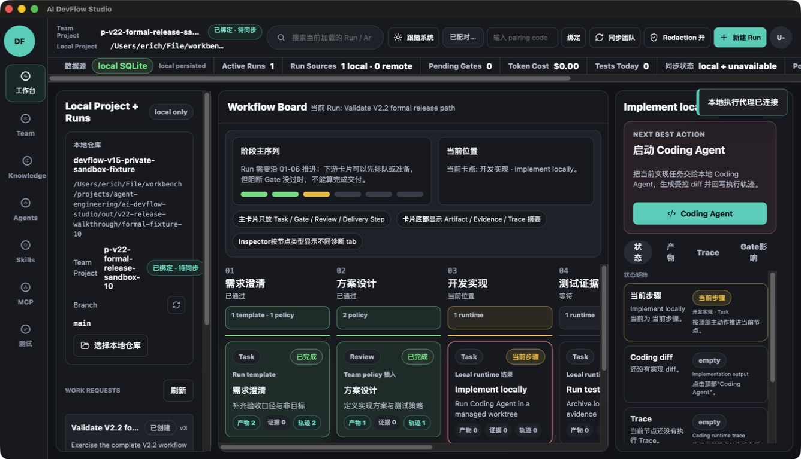

本次操作是重新打开当前仓库的选择器，因此没有切换到其他目录。

### 第 3 步：从旧壳进入当前 Web 工作区

`/legacy-shell` 是旧版管理壳，仍保留 Team、预算、策略和历史数据视图。

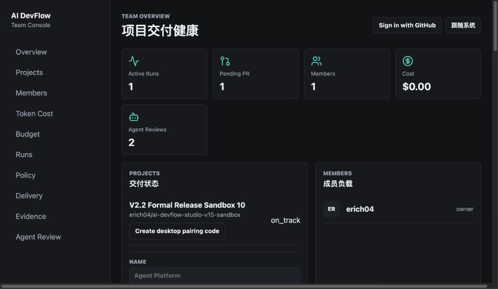

新手主线使用 Web 根地址 `/`。进入后先选择 Team Project；页面不会擅自从其他项目选择一个 Run。

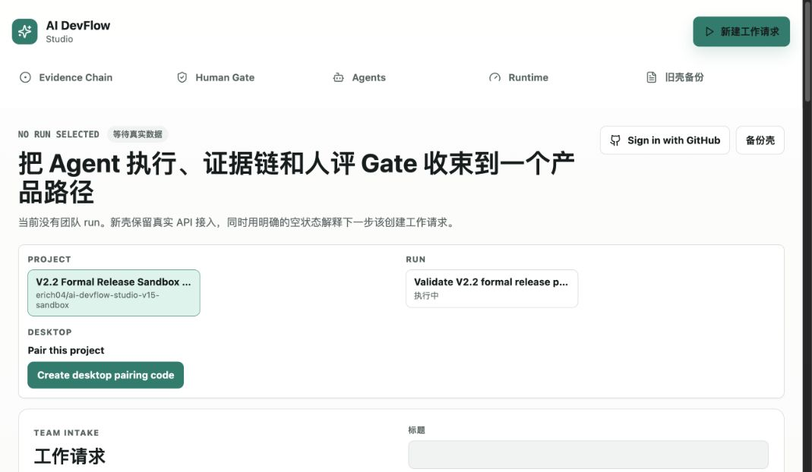

### 第 4 步：在 Web 创建 Work Request

在“工作请求”区域填写标题和需求说明。说明应包含要改什么、如何验证，以及是否需要准备交付。

本次填写：

- 标题：`新手演练：验证本地工作流`
- 说明：创建一个确定性验证标记，执行保存的 `npm test`，准备 Draft PR 交付包，但不要发布 PR。

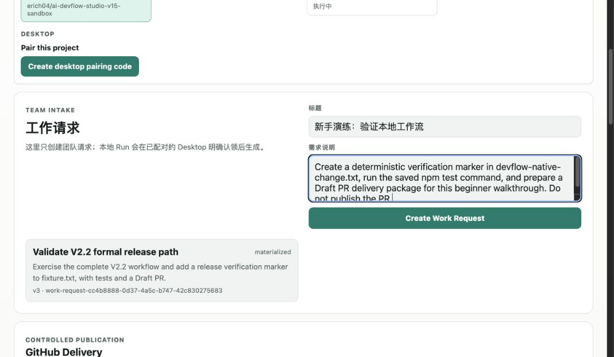

点击 `Create Work Request`。状态变成 `open`，表示请求已经进入团队队列，尚未被 Desktop 认领。

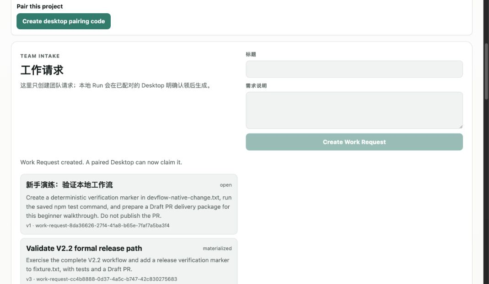

### 第 5 步：在 Desktop 认领 Work Request

回到 Desktop，在 `WORK REQUESTS` 区域点击“刷新”。新任务应显示为“待领取”。

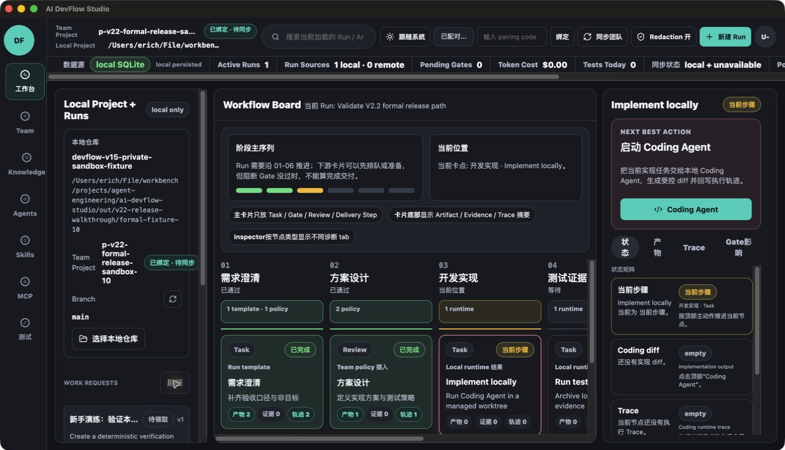

点击“创建本地 Run”。Desktop 会认领该请求，在本地 SQLite 中生成唯一 Run，并从需求澄清阶段开始。

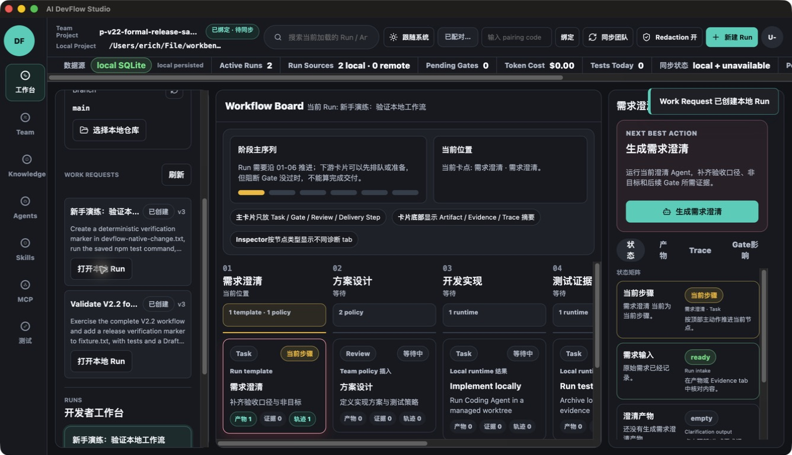

此时可以看到六个阶段：需求澄清、方案设计、开发实现、测试证据、PR 交付和业务验收。

### 第 6 步：生成需求澄清

在第一个节点点击“生成需求澄清”。系统会把原始 Work Request 整理成可验收目标、非目标和后续 Gate 所需信息。

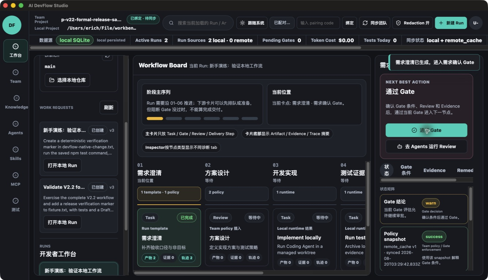

完成后流程不会直接进入设计，而是停在“需求确认 Gate”。

### 第 7 步：运行门禁审查，再通过需求 Gate

在 Gate 的 Inspector 中点击“去 Agents 运行门禁审查”，然后点击“运行门禁审查”。

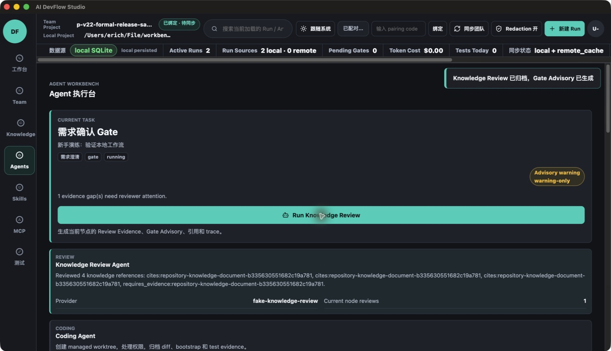

本次门禁审查以 4 个知识引用为依据，对当前需求 Gate 和澄清产物进行检查，给出 `warn`、82% 置信度，并指出仍缺少测试证据。该建议不会自动批准或拒绝 Gate。

返回 Inspector，确认以下内容后点击“通过 Gate”：

- 上游澄清产物已关联。
- 门禁审查建议（Gate Advisory）已存在。
- Policy snapshot 允许当前用户审批。

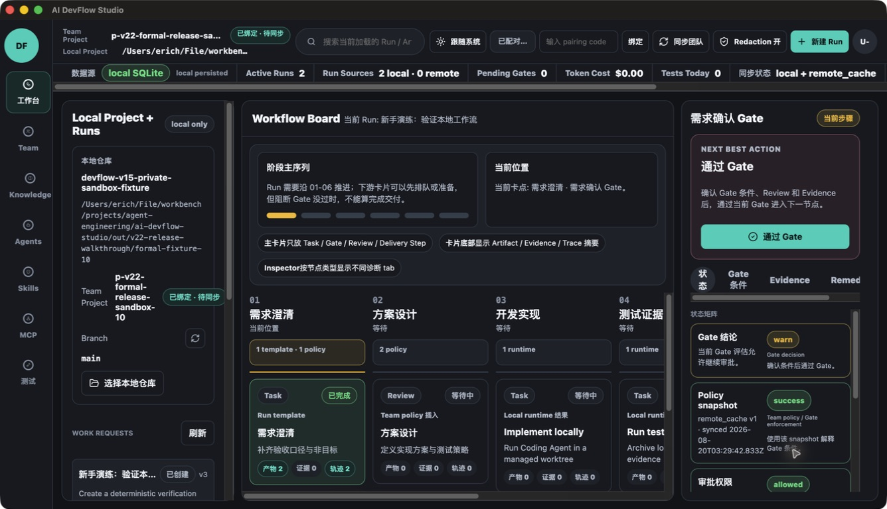

### 第 8 步：生成并评审方案设计

选择“方案设计”卡片，点击“生成设计方案”。产物会说明实现方式和测试策略。

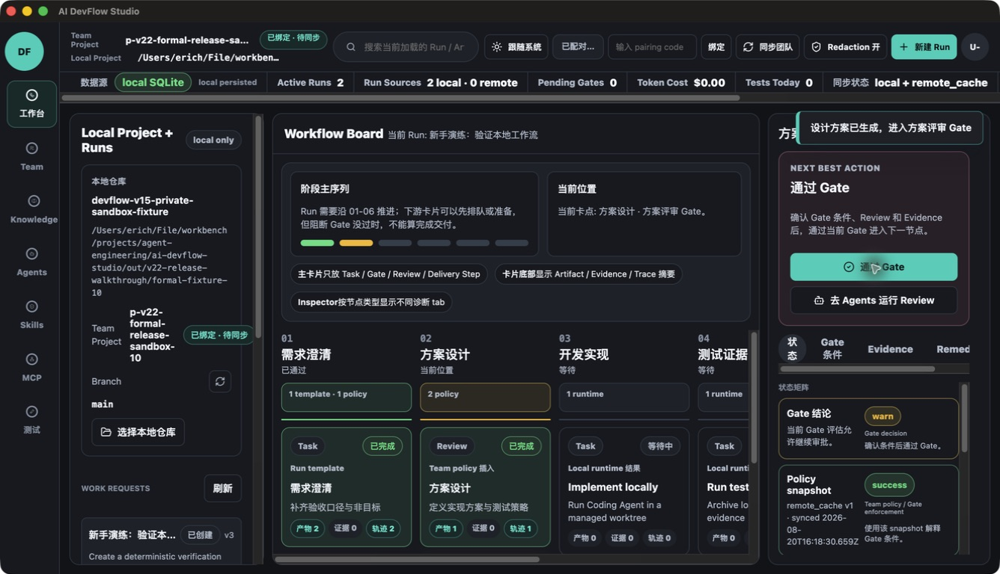

方案完成后再次进入 Gate。按相同方式运行门禁审查，以知识和规范为依据检查当前方案 Gate 及设计产物，再通过“方案评审 Gate”。


两个 Gate 都通过后，开发实现节点才成为当前步骤。

### 第 9 步：启动 Coding Agent

选择 `Implement locally`，点击 `Coding Agent`。Coding Agent 会创建独立的 managed worktree，不直接在主工作目录里修改文件。

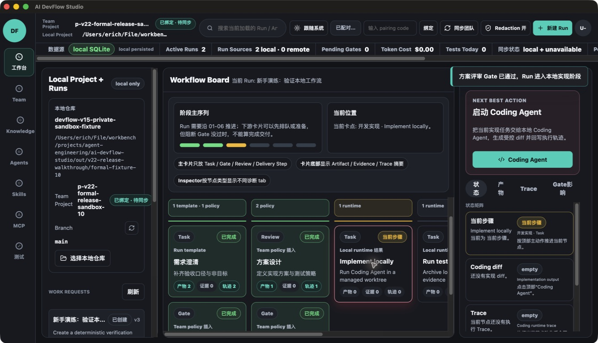

本次 CRI 后面连接的是本地确定性执行器。接入真实 OpenCode 时，权限、diff、测试和证据流程保持相同。

### 第 10 步：处理依赖安装权限

示例仓库没有 package-manager lockfile，因此 Agent 先请求一次精确命令授权：

```text
npm install --package-lock=false
```

只在命令和仓库符合预期时点击 `Approve once`。这个授权只对当前请求生效。

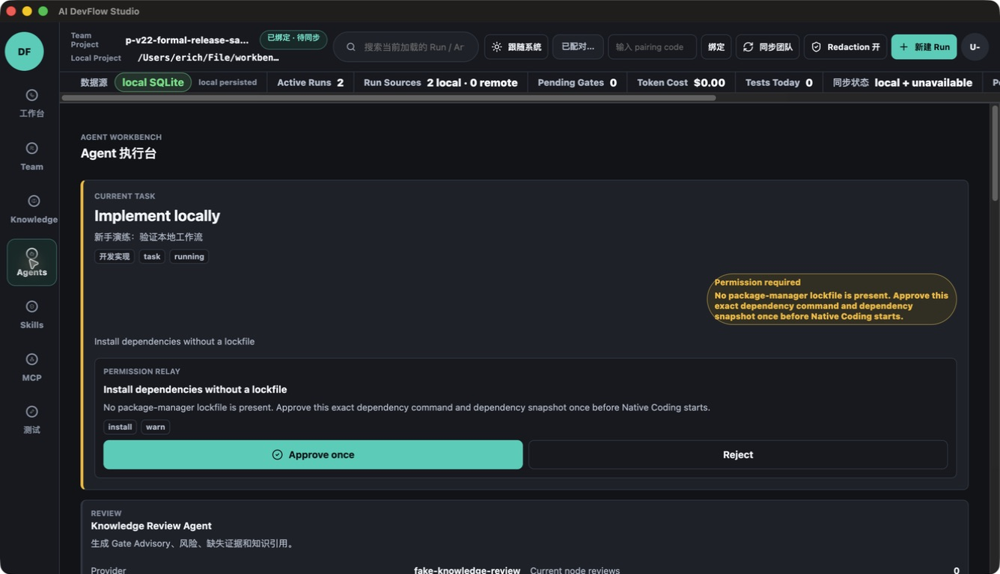

如果不应安装依赖，点击 `Reject`，不要为了推进 Workflow 盲目批准。

### 第 11 步：处理受控文件修改权限

依赖准备完成后，Agent 请求第二次一次性授权。本次只允许写入 `devflow-native-change.txt`。

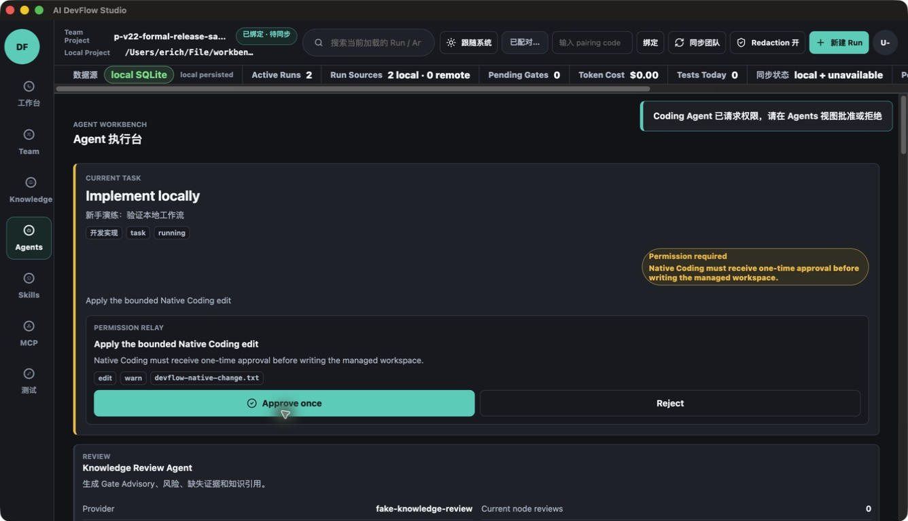

确认目标文件和任务一致后点击 `Approve once`。Agent 随后执行修改、运行保存的测试命令，并归档 diff、Trace 和 Test Evidence。

### 第 12 步：检查 Coding Agent 结果

Agent 完成后，Agents 页面显示：

- 状态：`completed`
- Provider：显示可读的 Provider Name；系统生成的内部 `providerId` 不需要用户填写
- Changed paths：1
- Bootstrap：passed
- Test Evidence：passed
- Cleanup：worktree 仍保留，可供检查

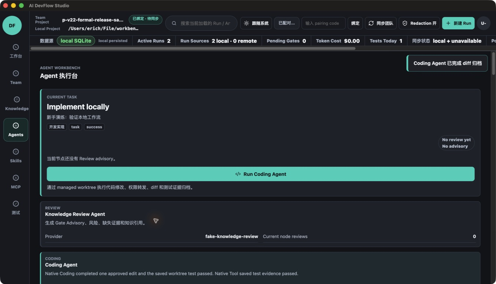

本次 diff 只新增一行确定性标记。正式任务中应在这里仔细检查完整 changed paths、diff、工具调用和权限时间线。

### 第 13 步：在测试节点正式归档测试证据

Coding Agent 已经运行过保存的测试，但 Workflow 仍要求在“测试证据”节点明确执行一次。点击“去 Tests 执行本地测试”，确认命令为 `npm test`，再点击“执行本地测试”。

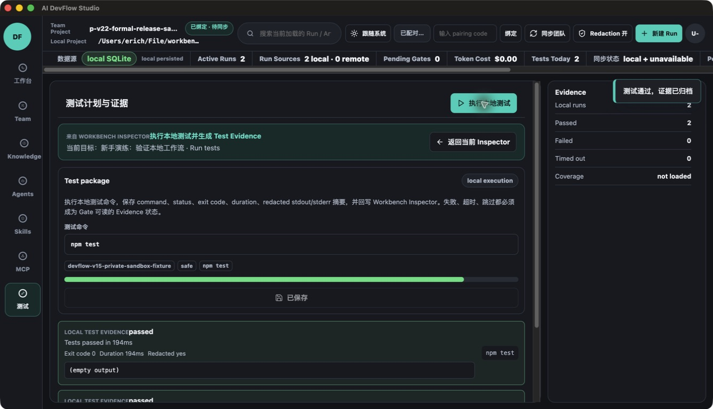

本次结果：

- Exit code：0
- 状态：passed
- stdout/stderr：按规则脱敏
- Workflow：自动推进到 PR 交付

### 第 14 步：生成 PR Delivery Package

进入 `Prepare PR draft`，点击“生成 PR Delivery Package”。这个动作只汇总材料，不会推送 GitHub。

交付包会绑定：

- 精确 coding source 和 commit
- changed paths 与 diff digest
- 测试证据版本与 digest
- policy、budget 和门禁审查摘要

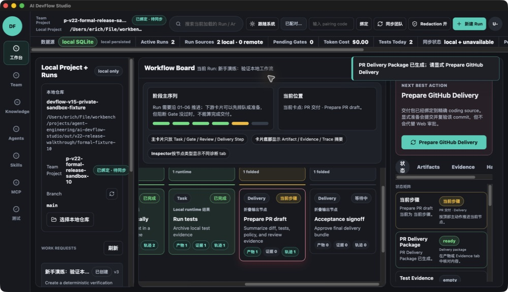

### 第 15 步：Prepare GitHub Delivery

交付包生成后，顶部动作变成 `Prepare GitHub Delivery`。点击后，Desktop 会在 managed worktree 中固定 commit，复验测试，并创建一个版本绑定的 Delivery Intent。

这个动作仍不会获得 Web 审批权限，也不会自行发布。

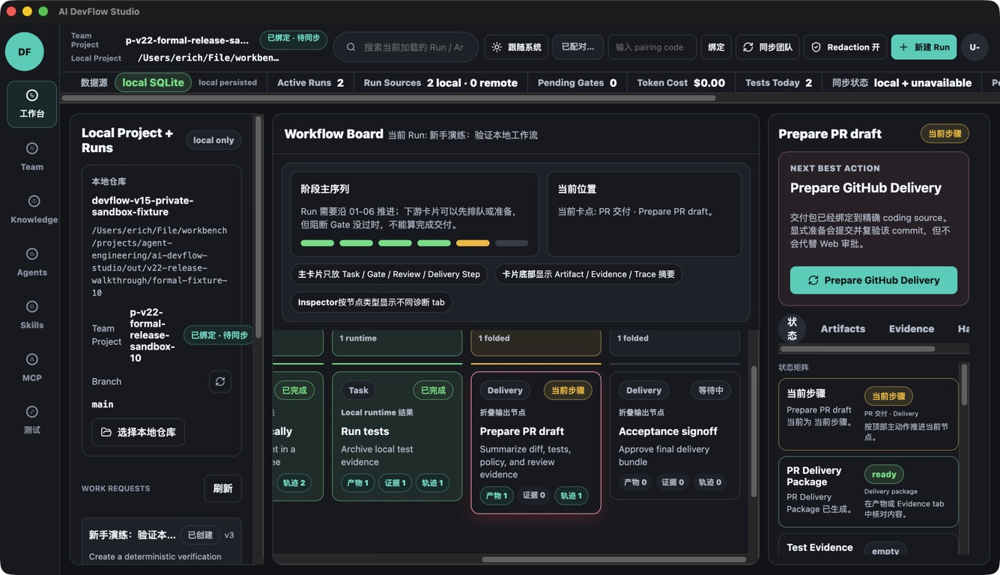

看到“等待 Web 审批”说明本地准备已完成。Desktop 此时会保持在 PR 交付节点。

### 第 16 步：在 Web 检查 GitHub Delivery 请求

回到 Web，重新打开 Team Project。GitHub Delivery 区域应出现 `approval required` 请求。

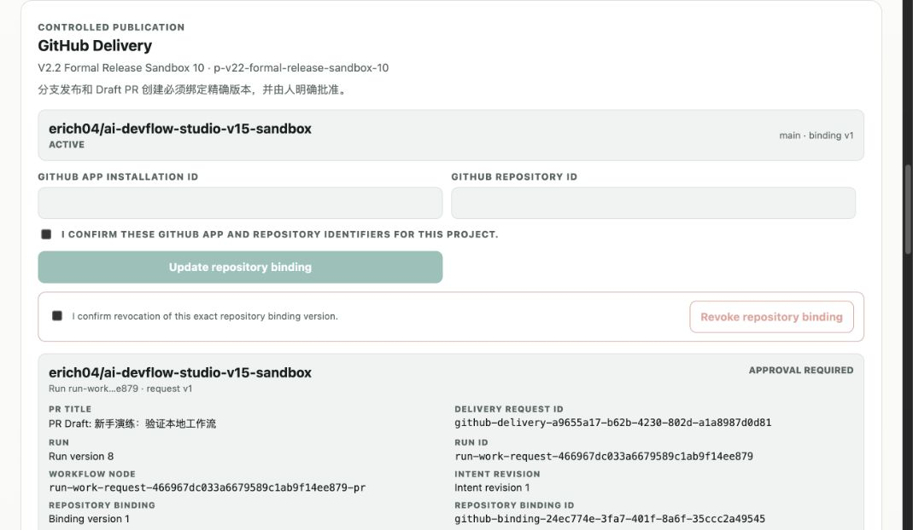

真正批准前，lead 或 owner 必须核对：

- repository 和 base branch
- publication branch
- expected commit
- changed paths
- intent、diff、PR package 和 evidence digest
- 审批有效期

本次没有勾选确认框，也没有点击 `Approve delivery`。

### 第 17 步：查看同步后的 Run 和证据链

在 Web 的 Run 列表中选择教学 Run。状态显示“等待人评”，Active Agents 显示 Coding Agent 已完成，Test Evidence 显示多次通过记录。

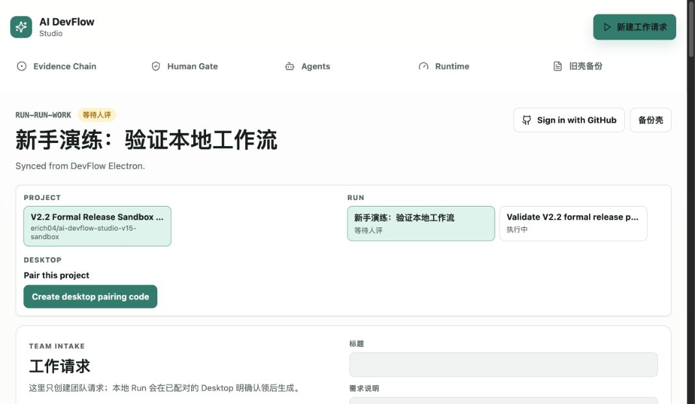

Evidence Chain 显示当前完成度 86%：Clarify、Design、Build、Test 已完成，PR 节点仍在运行。

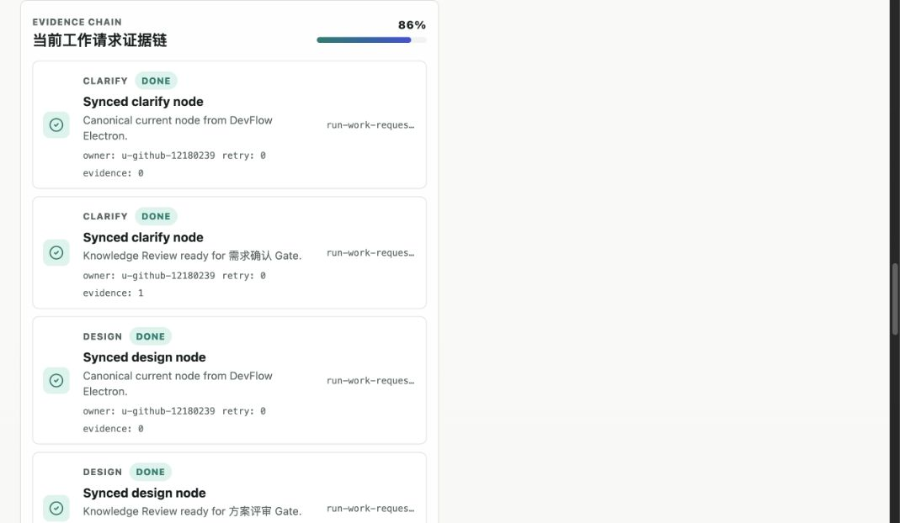

到这里，一条任务已经完成“需求 → 设计 → 实现 → 测试 → 交付准备”的完整本地路径。

## 5. 如果要继续发布

这一步会产生真实远端影响，应由有权限的 reviewer 明确执行：

1. 在 Web 核对 Delivery Intent 的全部精确字段。
2. 勾选该请求自己的确认框。
3. 点击 `Approve delivery`。
4. 保持 Desktop 运行，让它获取短期、仓库范围内的凭据并发布精确 commit。
5. 等待 API 校验远端 branch 后创建或复用一个 Draft PR。
6. 回到 Desktop 和 Web，确认 Delivery 状态为 completed，再进入业务验收。

不要手工 push、force-push，或在数据库中修改 Delivery 状态。若远端同名分支指向不同 SHA，应保留现场并创建新的 Delivery Intent revision。

## 6. 常见问题

### Web 显示“请选择项目”或“请选择 Run”

这是正常的显式选择机制。先选择 Team Project，再选择该项目下的 Run；页面不会自动回退到其他项目的最新 Run。

### Desktop 收不到新 Work Request

确认 Web 和 Desktop 使用同一个 Team Project，然后在 Desktop 的 `WORK REQUESTS` 区域点击“刷新”。仍不可见时，检查 API 登录、pairing 状态和项目绑定。

### Coding Agent 一直显示 Starting

打开左侧 `Agents`。多数情况下 Agent 正在等待一次性权限，Workbench 主卡片不会把完整权限详情展开。

### 为什么测试已经通过，还要再进 Tests

Coding Agent 的 saved test 证明它自己的改动通过；测试节点的执行负责把结果正式归档到 Workflow 的 Test Evidence。两者作用不同。

### 顶部显示 `unavailable` 或 Policy Snapshot `not loaded`

重新点击“同步团队”，确认 API 可访问且 Desktop pairing 仍有效。Gate 前应看到可解释的 policy snapshot；不要在策略状态不清楚时直接发布。

### GitHub Delivery 停在 `approval_required`

这是预期的安全边界，不是失败。Desktop 只能准备请求，Web 的 lead/owner 才能批准真实发布。

### Prepare GitHub Delivery 报 base branch 或 commit 不匹配

确认本地仓库位于正常分支，例如 `main`，而不是 detached HEAD；刷新 Git 分支后重新生成绑定到最新精确 source 的 Delivery Intent。

## 7. 新手术语

| 术语 | 简单解释 |
| --- | --- |
| Team Project | Web 端的团队项目和治理边界 |
| Local Project | Desktop 连接的本地 Git 仓库 |
| Work Request | Web 创建、等待 Desktop 认领的任务 |
| Run | 一条 Work Request 的本地 Workflow 实例 |
| Node | Workflow 中的一个步骤 |
| Artifact | 澄清、设计、diff、报告、交付包等产物 |
| Evidence | 测试、门禁审查、权限和执行结果等证据 |
| Trace | Agent 或 Workflow 的执行过程记录 |
| Gate | 必须由人核对并批准的流程关口 |
| managed worktree | Coding Agent 使用的隔离 Git 工作目录 |
| CRI | Coding Agent 与 OpenCode/本地执行器之间的运行时接入边界 |
| Delivery Intent | 绑定精确 commit、证据和摘要的发布请求 |

## 8. 本次操作结论

这次实际操作证明了 V2.2 的主路径已经可以连起来：Web 收集任务，Desktop 运行 Workflow 和 Agent，权限按动作转发，diff 与测试成为证据，最后由 Web 保留发布审批权。

对新手来说，最重要的使用原则只有三条：

1. 先确认当前 Team Project、Local Project 和 Run。
2. 每个 Gate、权限请求和交付摘要都先看证据，再批准。
3. Desktop 负责本地执行，Web 负责团队治理和最终发布授权。
