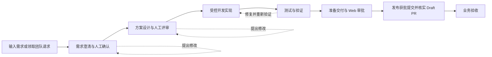
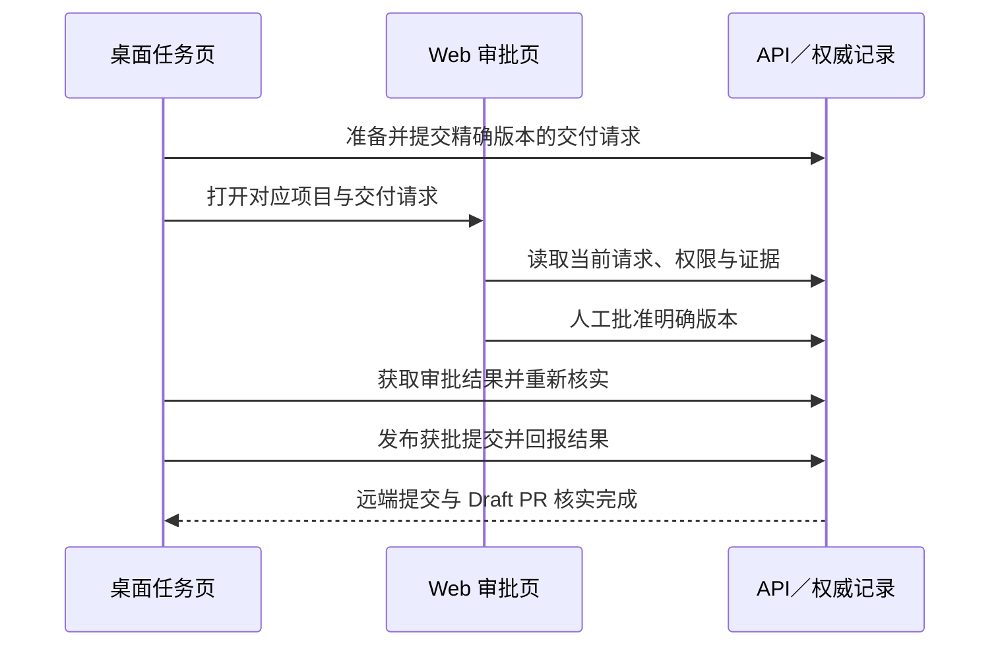
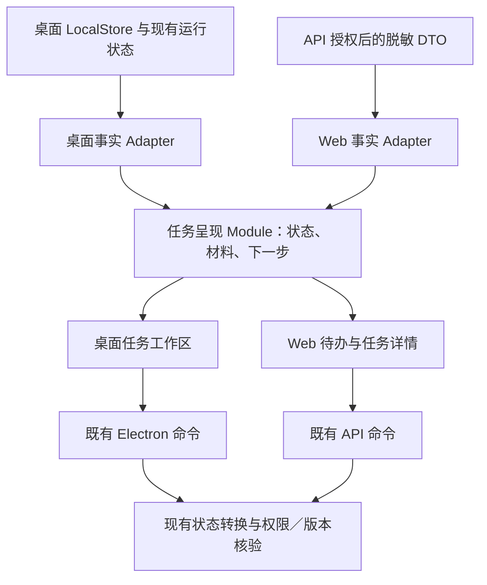

# 以开发任务为中心的工作区改造方案

日期：2026-09-28。状态：**设计提案，待评审，尚未实施**。

代码基线：`main` / `bf18e4aa2347f34d3816239e6bd03ff3c0ad9fd6`。本方案针对当前 AI DevFlow Studio 的增量改造。本文中的新页面、模块名称、交互与验收目标均为提案，不代表当前产品已提供这些能力。

## 1. 要解决的问题与设计结论

用户要完成一次开发，当前却需要在任务进度、节点检查、材料版本、独立对话、执行工具和团队配置之间自行建立联系。已有六阶段导航和节点工作区可以继续使用；改造重点是统一这些信息的关系。

采用三个原则：

1. **流程优先**：用户先选择要完成的开发任务，在任务内完成阅读、讨论、执行、检查和决策。
2. **配置分离**：项目配置集中管理；任务页直接展示实际生效配置及影响，缺少配置时原位引导补齐。
3. **导航分层**：全局导航表达工作目的，阶段导航表达进度，材料与执行记录用于追溯。

每个任务页面必须直接回答：我在处理什么、现在是什么状态、下一步由谁做什么。按钮、状态标题和正文说明使用同一份状态投影，避免分别得出矛盾结论。

### 1.1 当前事实与证据

| 已核对事实 | 影响 | 设计回应 |
| --- | --- | --- |
| 八个平级入口同时容纳任务、团队、知识、工具和诊断 | 用户需要先理解实现架构 | 收敛全局导航，把执行入口留在任务内 |
| 默认已是六阶段精简导航，项目选择已可折叠 | 早期 React Flow 截图不能代表当前默认界面 | 在现有结构上改造，保留高级流程浏览 |
| Gate 摘要与主要动作分别计算，前者未接收“是否实际当前节点” | 同屏出现“可以通过”和“等待上游” | 用同一状态投影生成结论与动作 |
| 新建按钮称“创建并开始澄清”，创建处理只持久化工作流 | 用户可能误以为模型已经开始执行 | 明确创建与生成的两个动作及各自回执 |
| 通用材料列表仅显示标题并默认取第一项；需求 Gate 已有结构化版本阅读器 | 参考资料、草稿、正式版本难以区分 | 扩展既有版本阅读模式，先覆盖需求阶段 |
| 项目对话独立于选中节点，保存提案与生成正式材料是不同操作 | 用户容易把聊天结果当成正式进度 | 明示引用对象和应用步骤，保留独立会话语义 |
| Web 首屏在任务结果前展示创建请求、配对和仓库管理 | 已有任务的待办与交付结果不突出 | 区分待办、任务详情和项目设置 |

依据：[桌面外壳](../../apps/desktop/src/App.tsx)、[节点工作区](../../apps/desktop/src/views/DesktopViews.tsx)、[状态与动作投影](../../apps/desktop/src/app/node-inspector-view-model.ts)、[创建动作](../../apps/desktop/src/app/useDesktopActions.ts)、[版本阅读器](../../apps/desktop/src/components/GateMaterialReader.tsx)、[Web 页面](../../apps/web/app/page.tsx)。界面观察来自本机运行版本，代码结论以本节基线为准。

### 1.2 成功标准

- 已配置项目完成一次需求到验收的正常路径，不必访问 Agents、Skills、MCP 或诊断页面；确有配置缺失时才进入对应设置。
- 任一阶段最多一个推进任务的主要动作；停止、取消和重要拒绝操作保持可见。
- 读旧材料、浏览未来阶段、切换聊天不会改变实际进度或审批对象。
- 用户可以分辨“正在审查的版本”和“此前已确认的依据”。
- 桌面与 Web 对同一权威版本、同一权限和同一证据给出一致业务结论；同步滞后单独说明。

这些是拟议验收目标，尚无用户测试结果支持“已经达到”。

### 1.3 2026-09-28 界面走查意见的采纳记录

本次补充基于用户提供的更新后走查报告、该次 Electron 截图与截图脚本，以及当前源码核对。走查使用演示 API 与模拟模型，流程到达方案评审 Gate；这些材料支持界面问题判断，不构成真实模型、完整开发交付或生产同步验证。以下意见已纳入实施计划，仍未实施。

| 编号 | 采纳内容 | 设计位置 | 实施批次 |
| --- | --- | --- | --- |
| R1 | 顶栏收敛，配对、路径、配置和任务操作各归其位 | 4.4、9.3 | M3；状态含义先在 M1 纠正 |
| R2 | 空讨论区默认收起，保留显式展开偏好、会话和草稿 | 4.3、8 | M2 |
| R3 | 建立用户文案与信息分级规则，避免直接暴露枚举和诊断标识 | 4.4、6.3 | M1 完成关键状态；M3、M4 覆盖各页面 |
| R4 | 区分团队连接、团队数据更新、本地结果上传 | 9.3 | M0 核验正常操作路径；M1 统一状态；M3 收敛入口 |
| R5 | 区分普通动作、警告、阻断和危险操作的视觉语义 | 4.6 | M3；M5 综合验收 |
| R6 | 合并重复 Gate 摘要与同步控件；知识引用分组保留来源关系；反馈贴近相关操作 | 4.5、6.3 | M1 修正错误反馈；M2 整理 Gate；M3 整理团队与知识页 |
| R7 | 测试空态随仓库、命令和执行状态变化 | 6.4 | M1 |

两项归因经核对后作如下处理：

- **“成功拉取后团队数据仍为空”列为待验证项。** 当次脚本直接调用 `pairDesktop`，绕过正常界面中的 `setDesktopPairing`，随后点击拉取；截图显示“请先绑定团队项目”，不能视为拉取成功。M0 必须通过正常绑定表单复现，并核对拉取回执、项目范围及团队列表；复现成立后才登记同步缺陷。同步概念难以区分的问题独立成立，按 R4 改进。
- **提示位置问题已采纳，组件归属判断修正。** 当前提示是窗口右上的全局浮层，视觉上覆盖讨论区，并非挂载在会话内部。按 4.5 调整反馈位置与持续方式，不因此重构会话数据模型。

证据可复核于[绑定与团队拉取动作](../../apps/desktop/src/app/useDesktopActions.ts)、[提示定位样式](../../apps/desktop/src/styles.css)、[知识与团队视图](../../apps/desktop/src/views/DesktopViews.tsx)及[测试视图](../../apps/desktop/src/views/SupportViews.tsx)。当次临时材料为 `test-results/ui-capture.mjs` 与 `test-results/ui-walkthrough/`，属于未纳入 Git 的本机走查产物，不作为其他环境必须存在的依赖。

## 2. 角色、对象和产品边界

| 对象／角色 | 对用户的表达 | 约束 |
| --- | --- | --- |
| Work Request | 团队请求 | 团队提出的需求；待桌面明确领取后才形成开发任务 |
| Run | 开发任务 | UI 别名，仍对应现有一次工作流实例；不另建跨 Run 的“任务”数据库对象 |
| Node | 阶段中的工作／确认步骤 | 普通使用不要求理解 Node、Task、Gate 类型 |
| Artifact / Test Evidence / Event | 材料／测试结果／执行记录 | 保留原有身份和关联，不因展示合并而改写存储 |
| 开发者 | 执行与处理任务 | 桌面负责本地仓库、模型调用、执行和私有证据 |
| 审查者 | 处理审批和验收 | 是否可操作取决于具体成员关系、策略和职责分离检查 |
| 所有者 | 管理项目与团队配置 | 不把 owner 解释为所有动作都能越权通过 |

组织、团队项目、本地项目持续可辨认。切换组织或项目后，重新解析任务、会话和权限；不复用其他作用域的选择与草稿。纯本地项目明确显示“本地项目”，不强制配对后才允许开始本地工作。

当前领域约束继续作为设计输入：

- 私有对话仍是项目范围；界面所选节点不是会话权限边界。
- 正式阶段产物、人工 Gate、测试证据和 GitHub 发布拥有不同写入契约。
- GitHub 交付审批来自签名 Web 会话，绑定精确版本；桌面配对凭据不能批准自身交付请求。
- Web 默认只有脱敏元数据，不接收原始代码差异、提示词、本地路径或完整日志。
- 默认仅警告的策略仍可在符合现有规则时审批；UI 不把建议项升级为硬阻断。
- 交付终点是经核实的 Draft PR 与业务验收，不包含自动合并、部署或回滚。

参见[领域术语](../../CONTEXT.md)、[产品基线](../product/prd/current-product-prd.md)与[会话 ADR](../adr/0022-workbench-conversation-harness.md)。这里的用户文案映射不修改领域术语定义。

## 3. 信息架构

### 3.1 桌面端

```text
组织／本地模式 · 项目选择                         同步状态 · 用户
├─ 开发任务
│  ├─ 任务列表：待我处理／进行中／受阻／已完成
│  ├─ 团队请求：查看、明确领取、关联到已生成的任务
│  └─ 任务详情：六阶段 → 当前工作／材料与版本／执行记录
├─ 项目知识
│  └─ 规范、可复用知识、引用来源、记忆管理
├─ 团队
│  └─ 当前授权范围的项目进度与协作摘要
└─ 设置
   ├─ 本地项目：仓库、测试命令、执行环境
   ├─ 模型与执行方式：提供方、凭据、默认模型、执行器
   ├─ 扩展能力：Skills、MCP
   ├─ 团队连接：配对、同步详情、团队设置入口
   └─ 高级：诊断、日志、维护
```

“项目知识”保留一级入口，因为查规范、学习代码、核对来源属于日常工作。知识卡的相关引用在任务页内展开，完整管理再进入知识页。治理设置与知识内容不混为一个页面。

### 3.2 Web 控制端

```text
组织 · 项目选择                                  身份 · 同步时间
├─ 我的待办：当前项目内需要我处理的 Gate／交付审批／异常
├─ 项目任务：团队请求、开发任务、交付结果、只读进度
├─ 团队：成员、项目健康与费用摘要
└─ 设置：策略、预算、桌面连接、GitHub 仓库绑定
```

第一版待办范围为**当前选中且已授权的项目**，不暗示已实现全组织聚合。成员可看见与自己相关的待办；无审批权限的参与者看见“等待负责人审批”，不会得到无意义的审批按钮。列表统计明确授权范围、筛选范围和加载状态。

### 3.3 旧入口迁移映射

| 现有入口 | 新入口 | 迁移策略 |
| --- | --- | --- |
| 工作台 | 开发任务／任务详情 | 保留 Run、节点、材料定位 |
| Team | 团队 | 保留脱敏协作视图 |
| Knowledge | 项目知识 | 任务内引用预览，完整浏览仍可进入 |
| Agents 的执行区域 | 当前阶段的工作区域 | 复用执行模块与事件订阅 |
| Agents 的模型、凭据、预算配置 | 设置／模型与执行方式；团队预算跳 Web 设置 | 每项配置标明本地／团队作用域 |
| Skills / MCP | 设置／扩展能力 | 不改变启用语义与既有权限检查 |
| 测试运行与结果 | 测试阶段；其他阶段的相关检查 | 测试命令编辑归设置／本地项目 |
| 诊断 | 设置／高级 | 错误提示提供直接入口，携带问题上下文 |
| Web 配对、仓库绑定 | 设置／连接与仓库 | 不常驻任务详情首屏 |
| Web Evidence Chain / Human Gate 等锚点 | 对应任务的材料或审批区域 | 兼容原链接，校验项目和任务后定位 |

## 4. 桌面任务工作区布局

### 4.1 默认画面

```text
项目名称 / 开发任务名称                    团队连接与同步 ▾ · 任务用量
← 返回任务列表
需求澄清 ─ 方案设计 ─ 开发实现 ─ 测试验证 ─ PR交付 ─ 业务验收

实际进度：需求确认 · 等待你确认
正在查看：需求说明 v2 · 待确认             [确认需求并进入方案]
还有 1 条非阻断建议。此次确认针对 v2，后续设计将使用这一版。

[当前工作] [材料与版本] [执行记录]           [打开项目讨论]
需求正文／审查结论／本阶段待办               可选讨论侧栏
……                                        会话引用与消息
相关依据：原始请求 · 代码调查 · 团队规范      ……
```

六个阶段表示固定业务顺序；第一、第二阶段分别包含“生成／修订”和“人工确认”子步骤。底层八个默认节点保持原有身份，按阶段聚合，不把进度显示为固定的六次点击。

阶段可浏览，但不会因点击而执行。查看已完成阶段显示“历史记录”；查看未来阶段显示“尚未开始”。两者持续显示真实进度和“返回当前工作”。用户浏览期间出现新结果时给出提示，不强制跳页或抢走焦点。

### 4.2 三个页签的职责

| 页签 | 包含 | 默认进入规则 |
| --- | --- | --- |
| 当前工作 | 状态摘要、主要动作、当前正文／差异／测试结果、直接相关审查和阻碍 | 首次打开任务或切换阶段 |
| 材料与版本 | 当前材料、已确认依据、原始输入、讨论提案、历史版本与来源 | 从引用、搜索或历史链接进入时精确定位 |
| 执行记录 | 操作人、时间、模型／执行器、实际用量、调用结果、完整诊断入口 | 从错误、成本或运行事件进入时定位记录 |

现有“概览”和“内容与审查”组合成“当前工作”；现有“产物与证据”迁入“材料与版本”；执行记录保留。使用同一材料阅读模块，避免两份正文或两套审批按钮。

### 4.3 空间与交互约束

- 首屏只保留项目、任务、状态和下一步。完整路径、配对码输入、脱敏自检和配置清单进入各自详情。
- 主要动作位于任务状态区；长文阅读时动作条可在本工作区顶部保持可见。确认前仍能查看完整正文，不要求人为滚动到底才开放按钮。
- 尚无展开偏好且用户未打开讨论时，讨论区默认收起；不为空会话预留固定列。用户可主动打开，在本机按组织／项目保存展开偏好；关闭保留会话、草稿与阅读位置，切换阶段不强制开关讨论。
- 宽屏可同时展示正文与用户已打开的项目讨论；不足以保证正文可读时，讨论切换为可关闭的侧栏或独立页签，保留草稿和位置。后台新消息提供提示，不自动展开或抢焦点。
- 桌面重点验收 1440×900、1280×800、1024×768；Web 另验收 390px 宽度。200% 缩放下操作与正文仍可达。
- 正文采用一个纵向滚动区域；独立会话可有自己的滚动区。折叠详情不再额外嵌套固定高度滚动面板。
- 关闭弹窗或侧栏恢复触发入口焦点；更新结果用简短状态提示，不自动聚焦按钮；状态不能仅由颜色表达。

### 4.4 顶栏与信息分级

顶栏只承担跨页面的身份、定位和连接摘要。配对输入在未绑定时通过连接引导进入，已绑定后显示项目与连接状态，并保留显式“管理连接／重新绑定”入口。

| 信息 | 常规展示位置 | 详情入口 |
| --- | --- | --- |
| 组织／本地模式、项目、当前身份 | 全局顶栏 | 项目选择与账户菜单 |
| 连接与同步 | 顶栏一处可展开摘要 | 分别展示 9.3 的三类状态，不能以一个绿色状态替代 |
| 搜索、主题 | 搜索保持可发现；主题归外观设置 | 搜索说明当前范围；不常驻工程对象枚举 |
| 新建任务、当前任务用量 | 任务列表／任务区域 | 用量区分任务、项目与会话统计范围 |
| 配对码、完整仓库路径、脱敏设置、策略和预算编辑 | 对应设置页 | 任务受影响时就近提供入口和返回位置 |
| 规则编号、原始枚举、匹配分、内部标识与哈希 | 可展开的技术详情 | 保留必要的查看、复制与追溯能力 |

首层保留影响当前决定的角色、版本、阻碍、费用未知和数据时效，不能为了简洁将这些信息一起折叠。路径和诊断信息继续遵守各端已有可见范围。

### 4.5 反馈位置与重复信息

- 配对、配置保存等操作的失败在对应表单内持续显示，包含原因、已保留内容与下一步；需要处理的错误不能只依赖短暂浮动提示。普通成功回执可简短提示，不遮住主要动作或会话输入。
- 后台任务的运行或失败状态归属对应任务；用户正在其他页面时，提供带任务名称与定位入口的通知，不假装是当前页面或聊天的错误。
- 当前工作区只保留一份主要 Gate 结论；下方以“通过条件／待处理原因”展开细节，不重复两组同名结论或审批按钮。所有位置使用同一份状态投影。
- 顶栏摘要与团队页状态详情共用同一同步动作和结果。可从多个相关位置到达同一操作，但不在同一页面重复摆放无差别的拉取按钮，也不把不同同步方向合并成含糊的“同步”。
- 知识引用按文档归组；展开后保留关联任务、材料、节点、章节、内容版本及审查关系。不能仅按文档标题去重而丢失来源、版本差异或证据关系。

### 4.6 颜色与状态语义

- 普通主要动作使用统一的操作样式；警告、阻断和危险操作使用独立的语义样式，避免与品牌强调色只有无法辨认的细微差异。可先采用中性主要按钮，不以更换品牌色为实施前提。
- 阻断状态同时提供图标、文字原因和恢复入口；删除、撤销等危险操作明确说明影响，不能只凭红色表达危险。
- 在浅色、深色、键盘焦点和窄窗场景中检查辨识度；颜色调整安排在状态和流程修正之后，不能替代业务结论的准确性。

## 5. 完整任务流程



虚线表示用户的返工路径，不代表新增任意节点回退权限。底层没有受支持的返工命令时，先增加并验证版本化命令，再开放界面入口；不通过渲染层修改节点状态模拟回退。

### 5.1 建立任务：创建与开始工作分开

1. 用户选择项目，填写任务标题、原始需求，可查看建议的验收问题。
2. 主按钮为“创建任务”。成功回执是“任务已创建，尚未调用模型”；失败保留表单和输入。
3. 进入需求阶段后，展示将使用的模型、执行方式、配置是否就绪和费用说明；主按钮为“生成需求草稿”。
4. 团队请求通过“领取并创建任务”使用既有认领契约；重复领取显示关联任务，不另造重复 Run。
5. 未选择仓库时引导选择仓库；已有配置可直接复用。没有团队连接时，本地工作按现有能力进行；到团队交付确需连接时再提示。

首版不提供含糊的“创建并开始”组合动作。后续若增加组合动作，必须明确它将触发模型调用，并复用同一配置、权限和费用检查。

### 5.2 六个阶段的交互细则

| 阶段 | 主内容 | 随状态变化的主要动作 | 完成依据与异常处理 |
| --- | --- | --- | --- |
| 需求澄清 | 原始需求摘要、目标、非目标、验收标准、待回答问题、代码与规范引用 | 未生成：生成需求草稿；待修改：生成修订；待审：确认需求并进入方案 | 绑定明确澄清版本的人工确认；失败保留已有版本和本次错误；不把聊天回复当确认 |
| 方案设计 | 实现思路、影响模块、关键取舍、测试计划、风险、使用的需求版本 | 未生成：生成方案；待审：确认方案并进入开发 | 绑定设计材料和对应审查的 Gate 结果；修订后重新计算证据是否适用 |
| 开发实现 | 执行状态、变更范围、当前权限请求、差异、相关检查 | 可开始：开始开发；权限待决：查看并处理请求；失败／中断：按既有恢复动作处理 | 已保存的受控执行、差异和工作树事实；浏览旧执行记录不改变当前执行对象 |
| 测试验证 | 对当前代码版本的检查结果、未覆盖验收项、失败原因、命令来源 | 未验证：运行检查；失败：查看失败并发起受支持修复；过期：重新验证 | 区分通过、失败、超时、未运行、结果已过期；历史通过不能覆盖新提交未测 |
| PR 交付 | 改动摘要、测试范围、目标仓库／分支／提交、审批与发布进度 | 未准备：准备交付；待审：查看 Web 审批；已批准：发布获批版本；异常：准确的修订／继续／重试／停止 | 既有交付状态机与精确版本约束；只有远端提交与 Draft PR 完成证据允许继续 |
| 业务验收 | 验收标准逐项对应证据、交付链接、未验证事项、最终决定 | 未准备：整理验收材料；待审：确认验收；需补充：定位缺失项 | 人工验收记录；若未验证，不以“测试通过”代替业务验收；完成页保留结果与后续事项 |

每阶段的次要动作可包括查看依据、讨论此材料、提出修改、查看历史。它们不与推进任务的动作争夺主要视觉权重。执行中的停止操作与审批时的拒绝操作保持容易发现。

### 5.3 一条具体的使用路径

以“任务清单增加关键词搜索”为例：

1. 创建任务，原始输入保留“与状态筛选组合”“刷新清空搜索词”“不修改任务数据”等要求。
2. AI 生成需求 v1。用户补充无匹配提示；经提案／正式修订形成 v2，确认 v2 后进入方案。
3. 阅读方案及测试计划，确认后开始实现；涉及文件写入的权限请求在当前任务中处理。
4. 看到当前代码版本的检查结果。如果只有纯函数测试而缺少界面交互验证，明确展示缺口，按实际策略决定是否阻断。
5. 准备交付后看到“等待 Web 审批”，打开相同项目与明确请求版本。审批通过后桌面发布获批提交，展示经核实的 Draft PR。
6. 对照验收项查看结果，人工确认验收；完成页显示交付对象与仍未覆盖的验证范围。

## 6. 状态、动作与权限的一致性

### 6.1 分开保存、共同呈现的四种上下文

| 上下文 | 来源 | 用户操作的影响 |
| --- | --- | --- |
| 实际工作状态 | 权威 Run／节点／执行与交付记录 | 只有合法命令能推进 |
| 浏览位置 | 当前用户选择的阶段、材料、页签 | 只改变查看内容 |
| 材料依据 | 具体材料身份、修订、摘要及审批／测试引用 | 换阅读版本不换审批对象 |
| 会话引用 | 用户显式带入聊天的任务／材料引用 | 不因左侧浏览变化自动替换 |

### 6.2 状态文案与动作选择规则

先解析作用域、事实完整性与浏览模式，再根据当前执行状态选择动作。以下是呈现规则，不是第二套工作流引擎：

| 条件 | 主结论 | 可提供的动作 |
| --- | --- | --- |
| 无权访问／对象不属于当前项目 | 当前内容不可访问 | 返回当前项目，不显示其他项目内容 |
| 必要事实加载中、版本无法核实 | 正在读取状态／状态待核实 | 加载或刷新；不显示可审批结论 |
| 浏览历史／未来阶段 | 历史记录／此阶段尚未开始，同时显示实际进度 | 阅读、返回当前工作；不对所浏览对象执行推进 |
| 实际任务已完成 | 已完成，列出交付与验收依据 | 查看交付；后续新工作显式创建新任务 |
| 有进行中的执行 | 正在执行，并给出实际步骤 | 查看进度、停止；必要权限请求优先展示 |
| 执行失败／中断／恢复待决 | 说明失败位置与已保留结果 | 仅提供该执行类型支持的恢复动作 |
| 尚未轮到该工作 | 等待上游完成 | 定位上游，不显示“现在可以通过” |
| 必需配置、强制证据或权限不满足 | 缺少具体条件／等待具体角色 | 一个最相关的补救入口，其他原因可展开 |
| 当前 Gate 可审批但有非阻断建议 | 等待你确认 · 有 N 条建议 | 查看建议后按现有策略允许确认；不额外发明硬门槛 |
| 当前工作可执行 | 已就绪，说明执行对象和影响 | 本阶段主动作 |

真实角色、例外资格、预算限制和策略结果来自既有权威检查。UI 只能解释和预判；点击时仍由 Electron／API 写入路径重新核验。并发变化导致版本过期时，保留用户意见，刷新并要求针对新对象重新决定。

同一动作进行中防止重复提交；刷新、重启或重复点击不创建第二次发布。错误信息采用“发生了什么、已保留什么、下一步怎么做”，原始诊断在详情中可查询。

### 6.3 用户文案与工程信息的映射

文案由语义状态与作用域决定，不在每个页面临时拼接原始枚举。关键状态在 M1 统一；团队、知识、设置与 Web 页面随 M3、M4 补齐。下表为显示规则，不修改领域存储值。

| 当前工程表达 | 用户首层表达 | 详情中保留的解释 |
| --- | --- | --- |
| `Run` / `Artifact` / `Event` | 开发任务／材料／执行记录 | 原始类型与可复制标识 |
| `local only` / `no run loaded` | 本地项目；尚无任务或尚未选择任务，按实际状态区分 | 是否连接团队、对象是否加载；加载失败另行说明 |
| `INDEXED` | 知识索引已更新 | 文档数量与实际更新时间；索引完成不代表内容已审查 |
| `LEXICAL` | 关键词检索 | 命中词与匹配方法；原始匹配分无固定满分，不能转写为置信度或跨查询比较 |
| `RETRIEVAL_CANDIDATE` | 检索候选，尚未经审查确认 | 属于“引用审查状态”，不是整个 Gate 是否可以通过的结论 |
| `missing_agent_review` 等规则编号 | 缺少本阶段要求的 AI 审查等具体原因 | 规则编号、来源、适用版本与是否阻断；无法识别的规则明确待核实，不猜测 |
| `blocked` | 当前审批受阻，并说明具体原因 | 区分策略已成功加载与当前条件未满足，不能把阻断说成策略加载失败 |
| 任务 UUID、`kh-…` 哈希 | 任务名称、材料标题、已有版本与引用来源 | 完整标识、内容哈希；精确审批所需的版本信息仍在决策区可见 |

每项映射同时覆盖加载中、空数据、加载失败、未知状态和权限不足。若只有检索候选，没有审查记录，应如实说明；不能把“匹配到知识”升级为“已有通过审批的证据”。

### 6.4 测试页的状态文案

命令配置、本次执行和工作流进度分别呈现，三者不能互相代替。测试证据区的提示按以下事实选择：

| 实际情况 | 应显示的内容与入口 |
| --- | --- |
| 未选择仓库 | 选择本地仓库后配置或执行测试 |
| 已选仓库，未配置命令 | 配置当前项目的测试命令 |
| 已有可用命令，本任务尚无结果 | 当前任务尚未运行测试；按既有权限与运行条件提供执行入口 |
| 正在执行 | 当前命令与执行进度，不继续显示“尚无测试”空态 |
| 执行失败、超时或被跳过 | 实际结果、原因和可用的后续动作，不能作为无数据隐藏 |
| 有历史结果但不适用于当前代码 | 显示结果对应版本与过期原因，提示重新验证 |
| 证据读取失败或适用性无法核实 | 明确读取失败／待核实，不能推断为未运行或通过 |

工作流尚未到测试阶段时，说明当前实际阶段；按既有规则允许的提前测试仍可执行，但“命令已保存”或“提前测试通过”不自动代表流程阶段完成。

## 7. 材料与版本设计

### 7.1 统一材料阅读模型

材料分为：当前待处理材料、已确认依据、原始输入／参考、会话提案、历史记录。列表标签至少包含材料类型、已有版本标识、状态和更新时间；没有正式修订号时显示实际记录时间或身份，不伪造 v1/v2。

默认阅读选择：

1. 有显式材料链接时打开该材料，并标记历史或当前状态。
2. 当前阶段正在等待审查时，打开本次待审材料。
3. 已完成阶段打开与完成／审批记录绑定的材料。
4. 尚未生成正式材料时展示原始输入与生成入口，明确“尚无正式材料”。

不能使用数组第一项或最新更新时间推断“已生效”。“已确认依据”必须能从明确的审批引用核实；旧数据缺少对应关系时显示“未能核实依据”，不猜测。

### 7.2 修订行为

- 用户提出修改，保留原文和反馈；新产物使用新的身份／修订记录。
- 阅读历史版本时，明确显示“你正在阅读历史版本”；确认按钮不能指向它或悄悄确认另一版。
- 审查、测试、交付审批均显示适用的材料／代码版本。变更后重新计算适用性，过期结果保留但不冒充当前结果。
- 已进入后续阶段的需求大改不是简单覆盖文件。UI 先解释影响；只有相应的领域修订与失效命令存在并验证后，才开放原任务返工。
- 第一批覆盖已具有完整修订模型的需求阶段及 Issue #181 涉及的通用阅读器；设计等阶段先统一阅读与来源标识，完整修订能力单列后续增量，不假定已有相同写入契约。

复用 [clarification.ts](../../packages/shared/src/clarification.ts) 与 [GateMaterialReader](../../apps/desktop/src/components/GateMaterialReader.tsx)，不再维护两个互不相同的需求阅读版本选择器。

## 8. 项目对话如何参与流程

仍保留一种项目独立会话。右侧标题为“项目讨论”；从任务发起“讨论此材料”时，输入区出现明确的引用卡：项目、任务、阶段、材料版本及读取时间。仅加入引用不发送消息，也不产生模型费用。

用户可移除引用、查询该项目其他任务。切换左侧节点不替换引用；下一次发送如发现材料已有新版本，告知差异并明确使用哪版。跨项目切换不能将原项目聊天内容带入新项目。

讨论到正式修订保持三步可见：

```text
会话内草稿 → 用户保存为指定节点提案（共享、待确认）
           → 正式阶段生成读取该提案 → 用户审查正式材料
```

“保存为节点提案”展示目标和内容预览；结果显示“提案已保存，尚未更新正式需求”。任务页出现“有待处理提案”，主动作可定位到生成修订，而不是要求用户记住刚才聊天发生了什么。

正式生成是否已经采用该提案必须依据输入记录，不能只因提案存在就打上“已采用”。聊天不直接批准 Gate、执行代码或发布 PR。模型设置显示“下一次调用使用”，历史调用保留当时的模型；会话执行方式继续遵守创建时持久化且不可静默切换的 ADR。

## 9. 配置分离与按需引导

### 9.1 配置归属

| 设置 | 生效范围 | 在任务中的呈现 |
| --- | --- | --- |
| 仓库与测试命令 | 本地项目 | 当前操作的仓库／命令摘要，缺失时直接打开对应设置 |
| 默认模型与执行方式 | 项目默认；各调用已有覆盖规则 | 显示下一次实际调用将使用的值和费用说明；高级入口允许明确调整 |
| 已保存模型凭据 | 本机安全存储 | 仅显示是否可用，渲染层不读取密钥 |
| Skills、MCP | 既有本地／项目启用范围 | 显示当前任务实际使用的能力；完整管理在设置 |
| 配对、同步 | 组织与团队项目 | 已连接状态、最近更新时间、异常提示 |
| 策略、预算、GitHub 仓库绑定 | 团队服务端权威配置 | 显示适用版本、角色与限制，编辑跳到对应 Web 设置 |

从任务打开设置时携带返回位置。保存后重新读取实际生效结果，返回原任务和阶段；保存成功不自动执行刚才被阻止的付费调用或发布动作。

### 9.2 首次与异常状态

- 空项目：一个入口“选择本地项目”，说明之后可以创建任务。
- 有项目无任务：一个入口“新建开发任务”；有团队请求时提供明确领取入口。
- 无可用模型：允许阅读和创建任务；生成前提示配置模型。
- 测试命令缺失：进入验证阶段或方案需要检查配置时提示，不强制所有新用户先填命令。
- 离线：本地可用操作按既有规则继续；团队数据标记最后同步时间；不将网络失败显示为零任务或无待办。
- 预算不足：解释作用域与缺口，提供已有申请或设置路径；不以更换入口绕过预算保护。
- 配对或权限失效：保留本地成果；明确哪些团队动作暂停，提供恢复连接入口。

### 9.3 团队连接、数据更新与结果上传

三个状态分别计算，再合成顶栏摘要。页面显示的是已有事实的投影，不另建同步引擎，也不把配对成功推断为全部数据已更新。

| 维度 | 状态依据 | 用户可见状态 | 操作与回执 |
| --- | --- | --- | --- |
| 团队连接 | 当前本地项目的配对记录、有效期、身份及当前已知的权限结果 | 本地项目未连接／已绑定／需要重新连接；绑定不等同网络在线 | 管理连接、重新绑定；明确组织、团队项目和本地项目的对应关系 |
| 团队数据更新（云端 → 本地） | 项目、成员等团队快照的读取结果，以及单独读取的策略快照状态 | 尚未读取／读取中／最近成功更新时间／读取失败／缓存可用 | 更新团队数据；策略与项目数据不同步时分别说明，不能以“策略已加载”推断团队列表已更新 |
| 执行结果上传（本地 → 云端） | 当前授权范围内的既有同步队列及服务端回执 | 暂无待上传记录／待上传 N 项／上传中／部分失败 | 查看上传详情及既有重试入口；明确只含允许上传的脱敏记录 |

呈现与恢复规则：

- 摘要优先暴露需要用户处理的连接或传输错误，其次显示进行中的动作与待完成数量；展开始终保留三类状态，不能因某一类成功遮住另一类失败。
- 未读取团队数据时，即使上传队列为空，也不能显示笼统的“全部已同步”。没有待上传项只说明该队列当前为空，不证明所有预期记录都已生成或上传。
- 最近成功时间来自对应操作回执，不使用页面刷新时间。失败保留最后成功快照并标记时效；未成功读取与成功返回空列表使用不同文案。
- 组织、团队项目、本地项目与选中任务分别核验；切换项目后不复用旧项目的成功提示、计数或错误。策略受阻、预算未配置也不能混写成连接或网络故障。
- 用户进入详情后可明确选择“更新团队数据”或“查看上传详情”；首版不新增含糊的“同步一切”，也不因刷新页面自动重新绑定或重复提交结果。
- 正常绑定操作的验收通过界面表单完成，等待成功回执与状态更新后再拉取。测试工具直接调用后台接口只适合准备隔离样例，不能替代这条用户路径的验收。

## 10. Web 审查与跨端交接

### 10.1 待办与任务详情

待办行显示任务名称、需要处理的事项、请求方、材料版本、更新时间及一个“查看”入口。不同事项独立呈现：需求确认、方案评审、GitHub 交付审批、业务验收不能统称一个“通过”。

任务详情首屏依次是：业务状态与下一步、结果／待审摘要、主要依据、历史。配对和仓库绑定只在配置缺失时提示，正常情况下进入设置。

完成任务显示成果摘要、Draft PR、已核实提交、验收决定和未覆盖范围；旧警告标明属于哪次审查，不能让历史建议看起来像仍在阻止当前任务。

### 10.2 GitHub 交付审批



Web 首屏显示目标仓库、目标分支、预期提交、改动文件、验证范围、请求修订和审批影响。长标识提供缩写、完整查看与复制；摘要哈希放入详情。

Web 保持脱敏范围。需要原始差异时明确提示在有权限的本地环境查看；不得在这次布局改造中自动上传补丁。证据不足时让审查者看到不足，不能用隐藏详情的方式制造“已验证”。

批准针对读取时的精确请求版本；过期、撤销、重新绑定或材料变化后重新核验，旧审批不继续可用。拒绝记录理由并关联该版本。桌面显示真实待审／获批／发布／恢复状态，不能由打开 Web 或关闭窗口推测批准。

跨端链接使用已有可验证的 Web 路由参数。若缺少“打开桌面指定任务”的协议支持，第一版提供任务名称／标识和定位说明，不画一个无效按钮冒充已支持。

### 10.3 Web 路由兼容提案

- 新页面可扩展 `StudioView` 为待办、任务、团队、设置；原 `view=team/settings` 保持可解析。
- 旧 `projectId + runId` 链接仍直接打开该任务，不退回其他项目最新任务。
- 旧 `#human-gate`、`#evidence-chain`、`#agents`、`#runtime` 映射到对应任务审批、材料、执行摘要或项目预算。
- URL 定位只是请求，服务端仍逐一检查组织、项目、任务与身份；无权限不展示标题或存在性细节。

## 11. 技术落地：复用写入能力，统一呈现模型

### 11.1 模块组织



呈现 Module 的 Interface 是：输入已限定作用域的权威事实和浏览上下文，输出状态说明、材料选择、适用依据及动作描述。输出不授予权限、不执行副作用、不产生新 Run 状态。两端 Adapter 分别处理本地完整事实与远端脱敏事实；Web 缺少的信息必须显式标记不可用。

优先扩展既有 `projectWorkflowContext`、`buildNodeInspectorViewModel` 和编码动作投影。只有两端确实共用的业务呈现规则才下沉到 `packages/shared`；React 布局、焦点、滚动和中文长文案保留在各端。避免为了拆文件再造一层无行为的转发模块。

建议输出包含以下概念字段，字段名在实现评审中确定：

| 输出 | 用途 |
| --- | --- |
| scope / actualProgress / viewingPosition | 锁定组织、项目、任务和实际／浏览位置 |
| factVersion / freshness | 说明事实来自哪个版本、是否仍可用于动作 |
| headline / explanation / nextActor | 同一处生成主要业务结论 |
| primaryAction / secondaryActions | 同一份描述驱动按钮、禁用原因与动作影响 |
| currentMaterial / approvedBasis / history | 明确待处理内容与既有确认依据 |
| checks / sources | 区分必须满足、非阻断建议、未核实及过期结果 |

### 11.2 代码映射与建议拆分位置

下列新名称是拟建模块，不表示仓库已存在这些文件。

| 当前实现 | 落地动作 | 预期承载位置 |
| --- | --- | --- |
| `App.tsx` 的导航、顶栏、跨视图跳转 | 提取外壳和明确导航上下文；保留装配职责 | `DesktopShell`、`WorkspaceNavigation` |
| `App.tsx` 的绑定摘要、`useDesktopActions.ts` 的拉取回执、既有同步队列 | 分别投影连接、团队快照与上传状态，合成同一摘要与详情 | 外壳中的连接状态呈现；复用现有动作、回执与队列 |
| `node-inspector-view-model.ts`、`workflow-context-projection.ts` | 统一状态结论和动作选择，去掉相互矛盾的独立推导 | 既有投影优先；需要时提取 `TaskPresentation` |
| `DesktopViews.tsx` 中的 WorkflowBoard / NodeInspector | 保留六阶段，拆出当前工作、材料、记录三个视图 | `TaskWorkspace`、`StageWorkspace` |
| `GateMaterialReader.tsx`、`clarification.ts` | 需求阶段共用版本选择与正文阅读；其他类型增加只读适配 | `MaterialReader`，复用现有澄清领域逻辑 |
| `AgentWorkbenchView.tsx` | 把当前任务执行区域从提供方设置中分开 | `ExecutionWorkspace`、`ModelSettings` |
| `useDesktopActions.ts`、既有 coding/test hooks | 提供当前阶段需要的命令入口和原位结果 | 保留已有写入路径；不在 JSX 重写业务转换 |
| `WorkbenchWorkspace.tsx` | 增加显式材料引用入口，保留会话恢复、草稿及隔离 | 既有会话模块及严格命令契约 |
| `DesktopViews.tsx`、`SupportViews.tsx` 的状态标签与空态 | 使用统一文案规则；知识引用分组，测试提示按事实选择 | 对应视图的呈现函数与既有状态投影，保留原始诊断详情 |
| 两端 `GitHubDeliveryPanel.tsx` | 分离任务交付详情与仓库管理表单 | `DeliveryWorkspace`、Web 仓库设置 |
| Web `page.tsx`、`studio-navigation.ts`、`StudioManagement.tsx` | 划分待办、任务和设置，保留旧链接解析 | Web 页面与路由模块 |

第一批不需要修改业务数据库。新导航偏好只保存经校验的 UI 状态，并按组织／项目分区；不得在 localStorage 存放凭据、正文或复制一份业务权威状态。后续修订能力若需要新的领域记录，单独做契约和迁移评审。

### 11.3 上下文恢复

导航上下文包含作用域、任务、节点／阶段、页签、可选材料、返回入口；与聊天会话身份分别保存。切换前后重新校验对象归属。设置返回时恢复阅读位置，不恢复已失效的审批资格。

任务在后台推进时保持用户阅读位置并提示“实际进度已更新”。应用重启恢复合法浏览位置；找不到对象时回到当前项目任务列表。执行中的恢复行为使用既有执行器状态，不把恢复界面当作自动重试授权。

## 12. 分批实施与回退

| 批次 | 交付内容 | 依赖与完成条件 |
| --- | --- | --- |
| M0：冻结验收样例 | 六阶段状态样例、当前错误路径、术语与动作表；按正常绑定 → 拉取路径核验 R4 待验证问题 | 采用隔离数据；标明模拟与真实执行范围；没有成功回执不能记录“同步成功” |
| M1：纠正状态和材料 | 同源状态／动作、创建文案、需求材料版本（覆盖 #181）；三类同步状态、关键术语、测试空态与错误反馈（R3、R4、R6、R7） | 不依赖整体换布局；矛盾状态、并发版本、历史阅读及未读取／读取失败／上传待完成组合的回归通过 |
| M2：打通任务内操作 | 当前工作区、原位审查／执行／测试、讨论引用与可关闭侧栏、设置返回、Gate 摘要合并（R2、R6） | 依赖 M1；正常六阶段路径不要求去工具管理页；会话与草稿保留，Gate 仅一份主要结论 |
| M3：导航与设置迁移 | 四个桌面入口、精简顶栏、配置分组、同步详情、知识引用分组、桌面文案与颜色语义、响应式与焦点（R1、R3、R4、R5、R6） | 依赖 M2 中执行与配置拆分；高级能力仍可达，重启与切项目不串上下文，引用来源关系完整 |
| M4：Web 待办与交付 | 当前项目待办、交付摘要、精确审批、管理区域迁出任务首屏、沿用统一状态文案（R3） | 复用 M1 状态规则；旧链接、角色、数据时效与脱敏验收通过 |
| M5：完整验证与文档更新 | 真实 Electron 隔离演练、跨端交接、R1–R7 场景与可用性走查、更新说明及截图 | 两端完整闭环按已授权范围验证后再收敛临时兼容入口；记录模拟模型、真实模型与远端发布分别覆盖到哪里 |

每批形成独立可评审的变更，不要求一次重写 App 或替换框架。M1 优先于视觉重排，因为它直接影响用户判断。M2 正常路径通过后再隐藏旧顶层工具入口。

1.3 中的同步疑点先在 M0 核验：若正常路径能够复现，保存操作步骤、回执及作用域证据，修复安排在 M1；若不能复现，记录未复现及验证范围，不因此取消三类同步状态的表达改进。不能用 `App.tsx` 的行数或演示脚本表现作为整体重写的理由。

布局切换可以用临时开发开关分批验证，但只改变 UI，不选择另一套写入引擎。回退时保留既有记录与身份，恢复旧导航映射；不删除任务、不重建用户数据库。新旧 UI 不同时发起同一动作。兼容入口在验证完成后有明确移除批次。

## 13. 验收矩阵

以下均为实施阶段需执行的检查，本文没有声称已经通过。

| 场景 | 必须观察到的结果 |
| --- | --- |
| 创建任务 | 只创建一次；未生成前不显示“AI 正在澄清”；失败保留输入 |
| 未到需求 Gate | 主结论说明等待上游；不能同时声称当前可通过 |
| 当前 Gate 只有非阻断建议 | 原策略允许时仍可人工确认；建议和适用版本清楚 |
| 强制证据／权限不满足 | 不提供可执行审批；定位具体缺口，不靠颜色解释 |
| 需求存在原文、提案、v1、v2 | 默认当前待审／已确认材料正确，标题含身份与状态 |
| 阅读 v1 时 v2 待审 | 历史提示明确；不会误批准 v1，也不悄悄批准 v2 |
| 审批瞬间版本变化 | 写入拒绝过期决定，保留意见，重新核实对象 |
| 需求生成失败 | 既有材料可读，错误可恢复，费用未知不填零 |
| 门禁审查和测试 | 可在当前任务查看执行和结果；记录身份与版本正确 |
| 编码权限请求、暂停与中断 | 实际请求可读可处理；不被导航隐藏，恢复不自动授权 |
| 修改代码后旧测试通过 | 明确结果已过期，不能冒充当前提交验证 |
| 保存聊天提案 | 仅目标提案成为共享材料；聊天记录保持私有；正式流程未自动推进 |
| 切换节点、任务、项目 | 聊天语义符合项目范围，浏览与真实进度分离，跨项目无内容串入 |
| 设置保存后返回 | 原任务与阅读位置恢复，配置已重新核实，不自动执行付费／发布动作 |
| Web 无权限或同步滞后 | 不泄露对象，说明数据时效，不显示虚假空列表与可审批状态 |
| GitHub 精确版本审批 | 请求、材料和绑定改变后旧审批失效；桌面与 Web 状态对齐 |
| 交付恢复 | Revise / Resume / Retry / Stop 按既有不同契约工作，无重复发布 |
| 完成与业务验收 | Draft PR 与最终验收分别有依据；不宣称已合并或部署 |
| 旧链接／搜索定位 | 打开正确项目、任务、材料与页签，不回退到其他任务 |
| 长内容、窄窗、200% 缩放 | 主要操作与正文可达，无页面级横向溢出；焦点顺序合理 |
| R1：已绑定项目的顶栏 | 不常驻配对输入、完整路径与配置清单；可找到连接详情和重新绑定入口 |
| R2：未打开、打开和关闭讨论 | 空讨论不占固定列；关闭再打开保留会话、草稿与位置；阶段切换和后台消息不抢焦点 |
| R3：关键词命中与检索候选 | 说明匹配方法与未审查状态，不伪装为置信度或 Gate 已通过；技术详情可查看 |
| R3：未知、失败和权限状态 | 各自说明原因，不显示成“无任务”“没有数据”或成功；两端相同事实含义一致 |
| R4：通过正常界面绑定后拉取 | 先看到绑定回执，再核验团队数据更新回执与对应项目列表；不能仅凭截图文件名认定成功 |
| R4：已绑定、未读取团队数据、上传队列为空 | 三项含义分别明确，不出现笼统“全部已同步” |
| R4：策略已加载、团队数据读取失败 | 分别展示策略状态、失败原因与最后成功数据；空团队列表不冒充成功读取 |
| R4：团队数据已更新、结果待上传或部分失败 | 不被团队数据更新成功掩盖；能定位受影响的任务、记录与既有恢复入口 |
| R4：切换项目或绑定过期 | 摘要、时间与动作属于当前项目；保留本地成果，不沿用旧项目成功状态 |
| R5：普通主要按钮与警告、阻断并存 | 样式能够区分，图标和文字表达原因；浅色、深色及键盘焦点均可辨认 |
| R6：错误反馈与后台通知 | 表单错误就近持续显示；后台通知关联正确任务；不遮住主要动作或会话输入 |
| R6：Gate 摘要与知识引用 | 只有一份主要 Gate 结论；同文档的任务／材料引用可归组，但版本、章节和审查关系不丢失 |
| R7：仓库已选、命令已存、尚无测试结果 | 不再要求重新选仓库；显示当前任务尚未执行；保存命令不代表测试或阶段完成 |
| R7：执行中、失败、超时、过期与读取失败 | 展示各自事实和适用版本，不退化为同一条空态提示 |

验证分层：

- 纯呈现规则：在现有投影测试中覆盖真实状态组合和版本冲突，不写只验证字段复制的测试。
- 交互：组件测试验证视图切换、焦点、主动作及历史阅读；Web 浏览器检查路由、布局与权限呈现。
- 执行：既有 Electron 冒烟验证主进程、IPC、SQLite、执行与记录，不能用渲染预览替代。
- 用户路径：配对、拉取与关键任务操作通过真实界面完成并断言回执。可使用受控模拟运行时避免付费，但必须标明范围；直接调用 IPC 准备数据的截图只能验证布局和呈现，不能宣称这些用户操作已通过。
- 跨端：隔离数据、受控模型与 GitHub 服务先跑完整路径；真实模型或远端发布另按已授权环境和预算验证。
- 可用性：邀请 3–5 位未参与实现的人完成同一小任务，记录找下一步所需时间、离开任务页次数、误读版本／状态次数。目标是关键状态与版本零误判；样本只用于发现问题，不宣称统计性结论。

现有入口包括 `corepack pnpm verify`、`test:e2e`、`test:electron-smoke`、`test:workbench-conversation-electron-smoke` 与 `test:v15-github-delivery-packaged-smoke`。实施时按实际改动选择范围并记录结果；本文编写只做文档与示意交互检查。

## 14. 本次建议采用的取舍

| 决策 | 采用方案 | 原因 |
| --- | --- | --- |
| 全局主对象 | 开发任务（Run 的 UI 别名） | 与现有工作流契约一致，用户入口明确 |
| 六阶段导航 | 保留、压缩高度，聚合子步骤 | 复用已实现结构，保留流程可见性 |
| 当前工作页 | 内容与下一步同屏，三个页签 | 减少概览与正文之间的反复切换 |
| 项目知识 | 保留一级入口 | 支持查规范、理解代码与学习，不只是后台设置 |
| 独立聊天 | 保留项目范围，增加显式引用；默认收起并尊重用户展开偏好 | 兼容已有会话与跨任务查询，减少对象歧义与空区域占位 |
| 连接与同步 | 三类事实分别显示，统一摘要与详情入口 | 配对成功、团队数据更新和结果上传不能相互证明 |
| 用户语言与信息层次 | 首层解释行动和影响，工程详情可追溯 | 降低理解成本，保留判断版本、权限与证据所需事实 |
| 自动化程度 | 在既有授权内执行；关键决定显式可见 | 不把减少点击理解为绕过审批或新授权 |
| 技术路线 | 增量替换呈现与导航，复用写入能力 | 降低版本、权限、发布和历史数据回归风险 |
| 交付顺序 | M1 状态与材料 → M2 任务内操作 → M3 导航 → M4 Web → M5 完整验收 | 先消除误解，再调整入口与外观 |

评审时优先确认这张取舍表与六阶段交互，不先讨论颜色和图标。若改变“项目独立聊天”“精确交付审批”“数据上云范围”等领域约束，需要单独修改对应 ADR 与契约，不能混入布局改造。

## 15. 文档衔接与验证记录

本提案与[既有界面设计理由](../product/details/ui-design-rationale.md)、[当前会话行为](../engineering/workbench-conversations.md)、[历史交互确认稿](../engineering/open-issues-interaction-proposal.zh-CN.md)并列保存。旧设计理由保留历史范围；本提案评审并实施后，再同步更新产品界面说明、用户指南、README 和当前版本截图，避免将提案写成已交付能力。

本轮产物：本设计文档，以及对话中的可点击界面示意。示意使用虚构的任务状态和材料，仅说明阶段、主动作、历史浏览、材料分组及两端职责；不连接实际项目、模型、数据库或 GitHub。

初版检查记录（2026-09-28）：

- 文档 14 个本地引用均可解析；代码围栏配对、行尾空白检查通过。
- 交互示意的脚本语法可解析，无外部接口调用。
- 在浏览器检查六个场景的状态与主动作，以及未来阶段浏览、历史需求阅读、两端切换和主要动作影响预览。
- 在实际内容宽度 1024px 和 324px 下检查布局；所查内容没有横向溢出，窄幅讨论区按纵向重排。
- 以上只验证设计材料和示意交互。没有运行产品全套测试，也不构成六阶段真实业务闭环、生产环境或发布验证。

走查意见采纳修订（2026-09-28）：

- R1–R7 已分别落到设计规则、实施批次和验收场景；同步故障归因保留为待验证项，全局提示的归属已纠正。
- 文档检查通过：18 个本地引用可解析，7 个代码围栏块配对，无行尾空白；R1–R7 均有设计章节、实施批次和验收场景。
- 本次只修改本文。现有交互示意仍对应初版，不代表新增同步详情、信息分级和反馈规则已经制作或实现。
- 本次没有重新运行产品、调用模型、执行产品测试或提交远端变更；后续实际结果按第 13 节记录。

产品代码、业务状态、部署和远端发布均不属于本轮设计工作。
