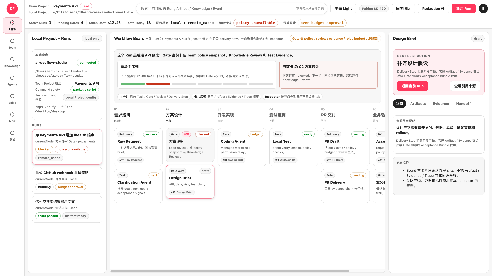
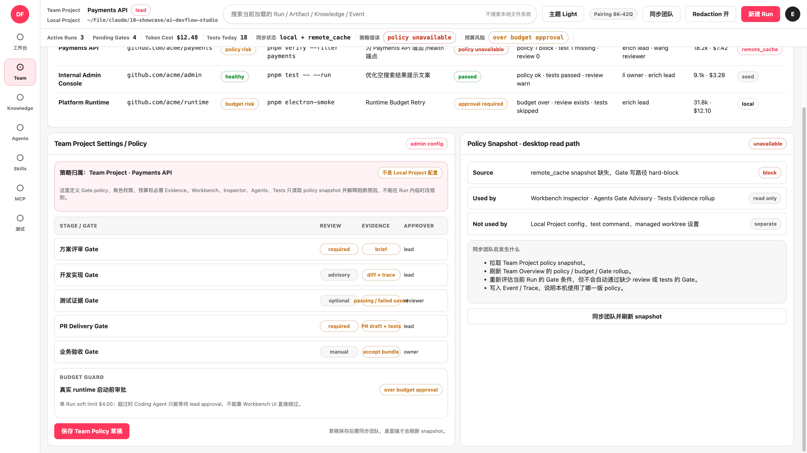
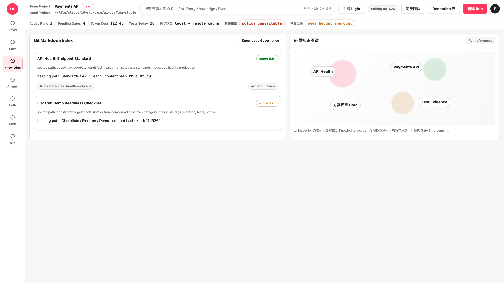
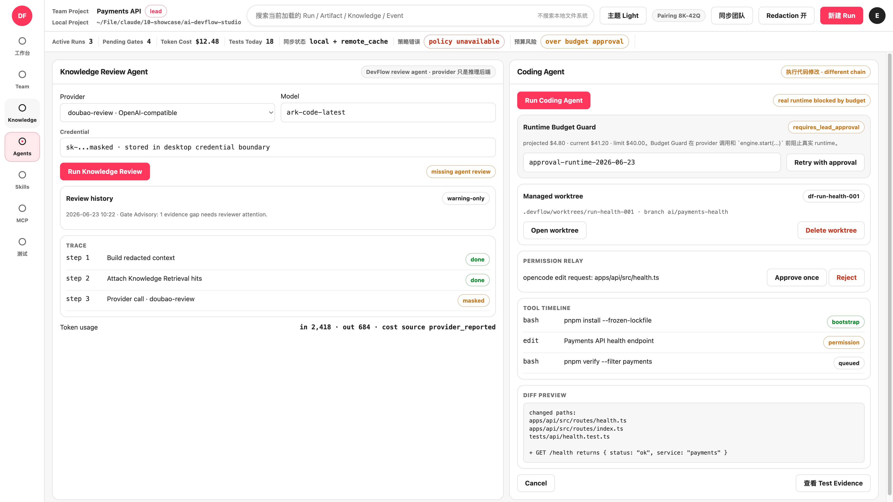
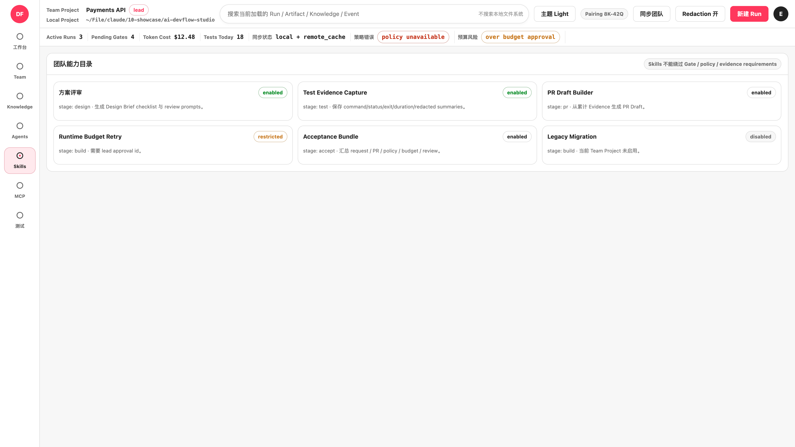
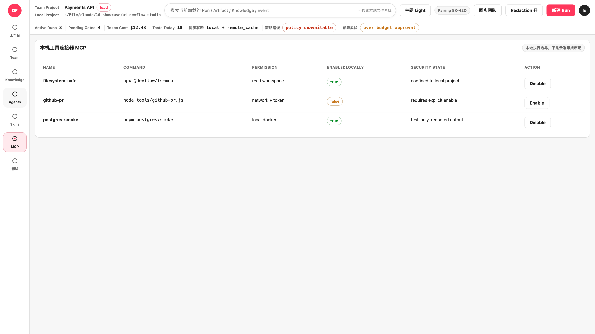
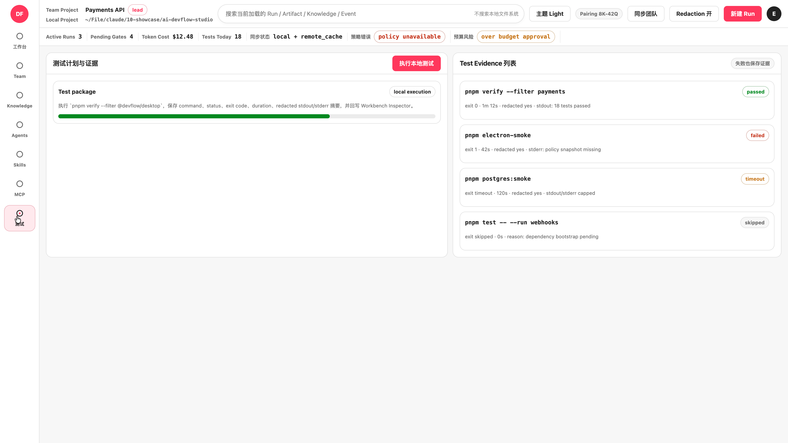

# Design References

This folder stores visual references that should inform DevFlow Studio UI work without becoming runtime source code.

## Style References

- [Apple-inspired Keynote visual style](./apple-inspired-keynote-style.md): Content-first, restrained, high-precision visual direction and reusable prompt templates for premium technical presentation/design exploration.
- [AI DevFlow Studio keynote decisions](./ai-devflow-studio-keynote-decisions.md): Confirmed narrative, terminology, deck structure, visual boundaries, and screenshot usage for DevFlow Studio keynote work.

## Airbnb-III Prototype References

These screenshots capture the OpenDesign `Airbnb-III` prototype states that should guide the React/Electron UI port.

Source:

- OpenDesign project: `Airbnb-III`
- OpenDesign project id: `a2407ed0-1392-42b1-81ac-eda3bf593560`
- Source artifact: `index.html`
- Original implementation archive: [Airbnb-III.zip](./opendesign/Airbnb-III.zip)
- Captured: 2026-06-23

Reference set:

- [Workbench](./airbnb-iii-workbench-reference.png): main delivery flow with Local Project + Runs, Workflow Board, and Inspector.
- [Team Policy](./airbnb-iii-team-policy-reference.png): Team Overview policy settings, budget guard, and desktop snapshot read path.
- [Knowledge](./airbnb-iii-knowledge-reference.png): Git Markdown index and lightweight knowledge graph.
- [Agents](./airbnb-iii-agents-reference.png): Knowledge Review Agent and Coding Agent execution console.
- [Skills](./airbnb-iii-skills-reference.png): team capability catalog.
- [MCP](./airbnb-iii-mcp-reference.png): local connector table and permission boundary.
- [Tests](./airbnb-iii-tests-reference.png): local test execution and Test Evidence list.

### Workbench

### Team Policy

### Knowledge

### Agents

### Skills

### MCP

### Tests

Preserve these product decisions when porting the prototype into React:

- Keep Team Project and Local Project visually separate in the top context area.
- Keep the left rail narrow and stable across Workbench, Team, Knowledge, Agents, Skills, MCP, and Tests.
- Keep the Workbench as a three-zone layout: Local Project + Runs, Workflow Board, and right-side Inspector.
- Keep Workflow Board cards compact; detailed diagnostics belong in the Inspector.
- Keep the right Inspector action-oriented with Next Best Action, tabs, Artifacts, Evidence, and Handoff.
- Keep status chips visible for policy, review, evidence, role, budget, sync, and test states.
- Treat this as a visual and interaction reference, not as a static HTML source to embed directly.
