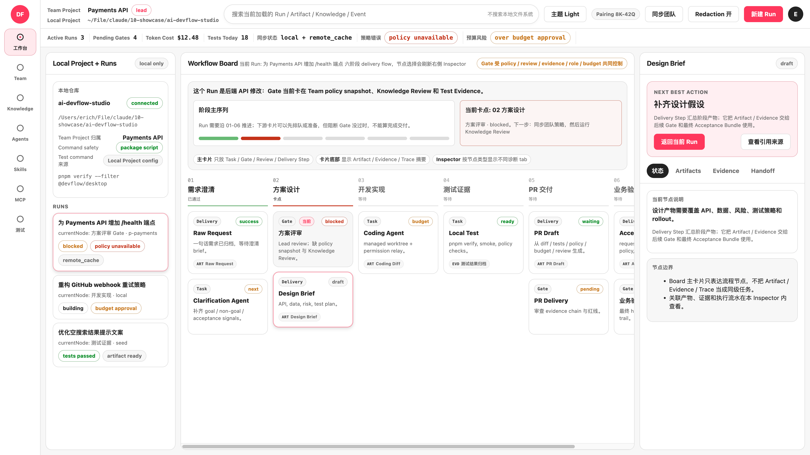
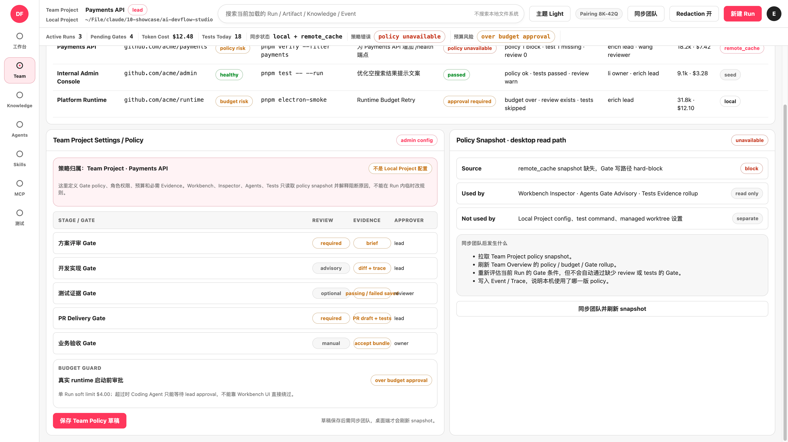
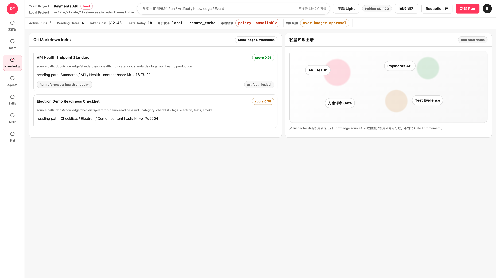
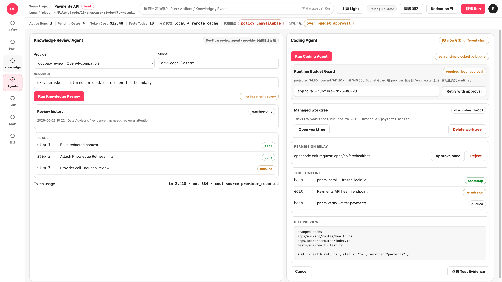
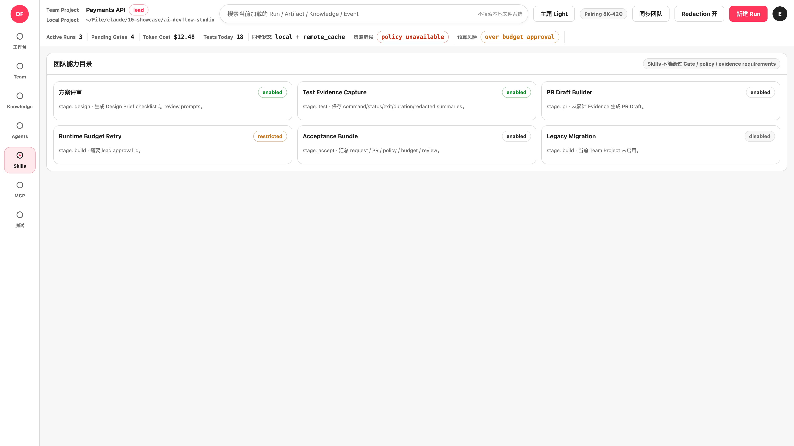
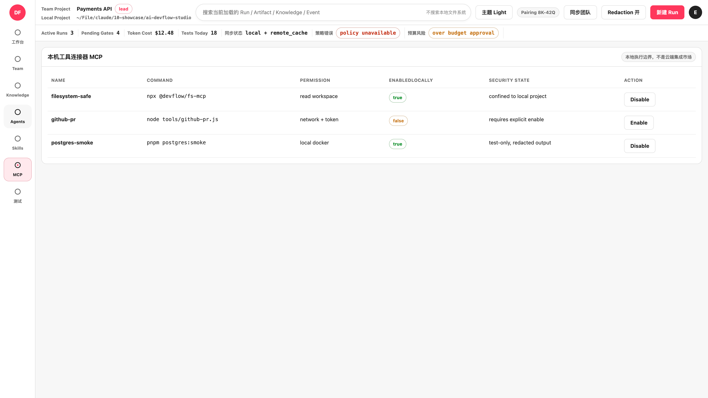
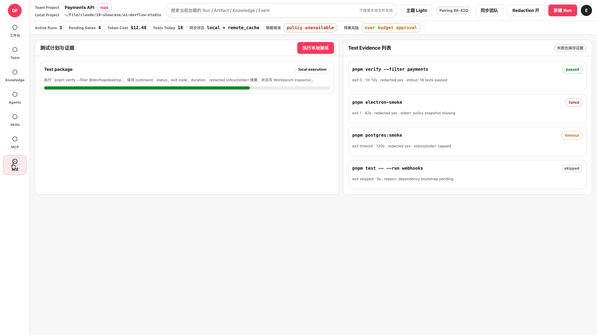

# 设计参考

本目录保存 DevFlow Studio 界面设计的视觉参考，不作为运行时源码直接嵌入。

## 风格参考

- [受 Apple 启发的 Keynote 视觉风格](./apple-inspired-keynote-style.md)：以内容为主、克制且精确的视觉方向，以及技术演示和设计探索可复用的提示词模板。
- [AI DevFlow Studio 演讲设计决策](./ai-devflow-studio-keynote-decisions.md)：已确认的叙事、术语、页面结构、视觉边界和截图使用规则。
- [AI DevFlow Studio 文字主导的漫画风演示文稿](./ai-devflow-studio-textfirst-comic-keynote.pdf)：导出的 9 页参考文稿，用于学习简明叙事结构与演示节奏。

## Airbnb-III 原型参考

这些截图记录 OpenDesign `Airbnb-III` 原型，用于追溯 React/Electron 界面移植的视觉来源。

来源：

- OpenDesign 项目：`Airbnb-III`
- OpenDesign 项目 ID：`a2407ed0-1392-42b1-81ac-eda3bf593560`
- 源产物：`index.html`
- 原始实现归档：[Airbnb-III.zip](./opendesign/Airbnb-III.zip)
- 截图日期：2026-06-23

参考范围：

- [工作台](./airbnb-iii-workbench-reference.png)：本地项目与 Run、流程看板及节点检查区组成的主交付流程。
- [团队策略](./airbnb-iii-team-policy-reference.png)：团队概览中的策略设置、预算保护和桌面快照读取路径。
- [知识](./airbnb-iii-knowledge-reference.png)：Git Markdown 索引与轻量知识关系图。
- [智能体](./airbnb-iii-agents-reference.png)：知识审查智能体与编码智能体执行控制台。
- [技能](./airbnb-iii-skills-reference.png)：团队能力目录。
- [MCP](./airbnb-iii-mcp-reference.png)：本地连接器列表与权限边界。
- [测试](./airbnb-iii-tests-reference.png)：本地测试执行与测试证据列表。

### 工作台

### 团队策略

### 知识

### 智能体

### 技能

### MCP

### 测试

原型移植时采用的产品决策如下，保留其历史语境：

- 顶部上下文区域在视觉上区分团队项目与本地项目。
- 工作台、团队、知识、智能体、技能、MCP 与测试页面共用窄而稳定的左侧导航。
- 当时的工作台采用“本地项目与 Run / 流程看板 / 右侧节点检查区”三分区。
- 流程卡片保持紧凑，详细诊断放入节点检查区。
- 节点检查区围绕操作组织，提供下一步动作、页签、产物、证据与交接材料。
- 策略、审查、证据、角色、预算、同步和测试状态保持可发现。
- 原型用于视觉与交互参考，不直接嵌入静态 HTML 源码。

**后续布局依据**：2026-09-25/26 确认的 [#171](https://github.com/erich04/ai-devflow-studio/issues/171)、[#174](https://github.com/erich04/ai-devflow-studio/issues/174) 和 [#177](https://github.com/erich04/ai-devflow-studio/issues/177) 将工作台调整为左侧流程与节点工作区、右侧独立对话，并以“概览 / 内容与审查 / 产物与证据 / 执行记录”组织节点内容。新改动按实际验证和发布记录判断交付状态；本目录的历史截图不代表新布局已验收，也不要求恢复旧三分区。
