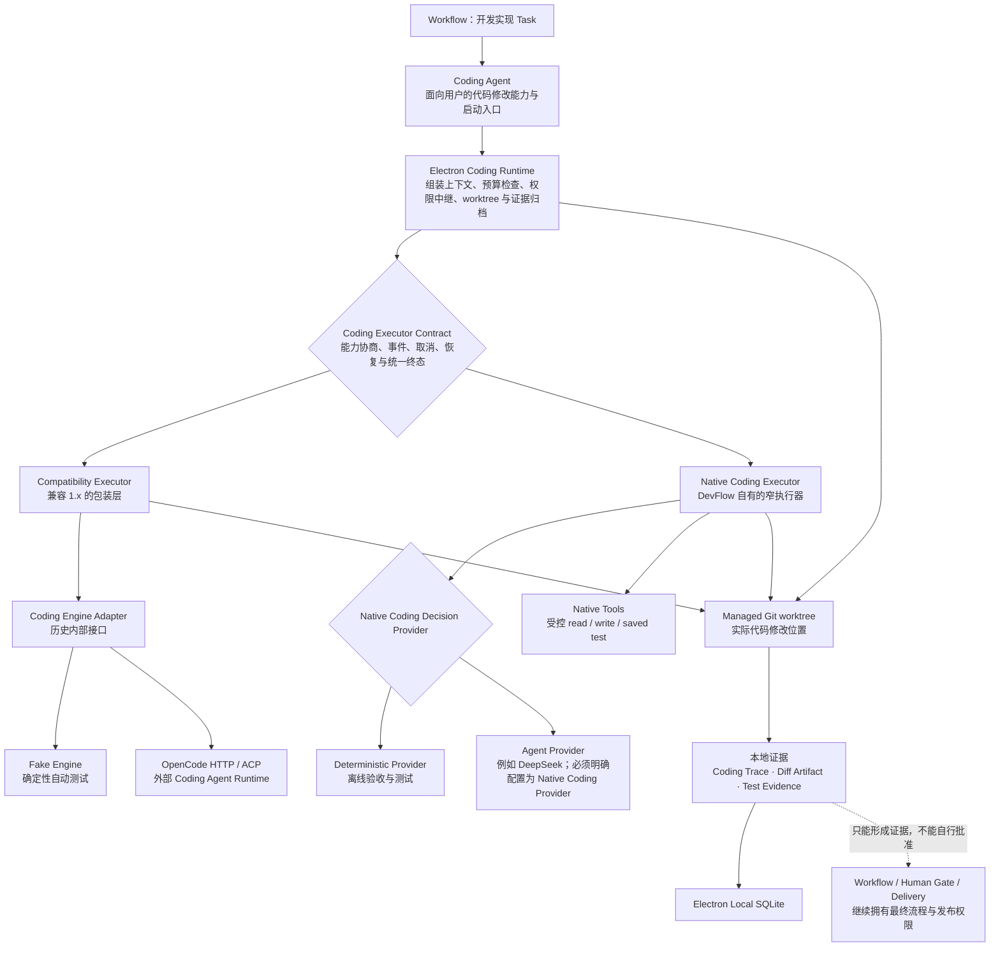

# Coding Agent、Engine、Executor 与 Native Coding 的关系

本文解释 AI DevFlow Studio 中几个容易混淆的名称。它们不处在同一层，也不是同义词。

## 一张图看懂当前结构



## 各个名称分别是什么

| 名称 | 所在层次 | 准确定义 | 不是什么 |
| --- | --- | --- | --- |
| Agent Provider | 模型调用层 | 将 Prompt 或结构化请求交给模型 API，例如 DeepSeek | 不是代码执行器，也不直接修改仓库 |
| Coding Agent | 产品能力层 | Workflow 中“执行代码修改”的入口和整体能力名称 | 不是某一个固定类，也不等于 DeepSeek |
| Electron Coding Runtime | 编排与治理层 | 负责 Context、预算、权限、worktree、事件、Diff 和测试证据 | 不负责人工批准 Gate 或发布代码 |
| Coding Executor | 当前统一合同层 | V2.0 引入的执行器接口；统一能力描述、事件、取消、恢复和终态结果 | 不是某个具体模型或进程 |
| Compatibility Executor | 兼容层 | 将旧的 `CodingEngineAdapter` 包装成当前 `Coding Executor` | 不是新的第二套产品合同 |
| Coding Engine Adapter | 历史内部实现层 | 1.x 用来连接 Fake Engine 或 OpenCode HTTP/ACP 的旧接口 | 不应再被当成当前最高层抽象 |
| OpenCode | 外部执行实现 | 在兼容执行路径中真正完成代码工作的外部 Agent Runtime | 其内部完整轨迹并不归 DevFlow 控制 |
| Native Coding Executor | DevFlow 自有执行实现 | 使用受控 Native Tools 的窄执行器，执行固定且有界的 plan/read/edit/test/repair 流程 | 目前不是 Claude Code 式通用多轮 Agent Loop |
| Native Coding Decision Provider | Native 决策层 | 为 Native Executor 返回结构化的 plan/edit/repair 决定 | 不直接写文件；实际副作用由 Native Tools 执行 |
| Native Tools | 本地能力层 | Electron main 控制的读、写和测试能力，带权限、范围和审计约束 | 不是 Agent，也不是 Provider |

## DeepSeek 在哪里

当前保存的 DeepSeek Provider 首先用于需求澄清、方案生成，以及基于知识的门禁审查（Knowledge-Grounded Gate Review）等模型调用。门禁审查以检索到的 Knowledge 为依据，对当前 Gate、门禁条件和阶段产物进行审查。

它**不会因为被选为 Workflow Provider，就自动成为 Coding Agent 的代码执行后端**：

- 走 OpenCode 路径时，真正执行代码的是 OpenCode，模型配置属于该外部执行路径；
- 走 Native Coding 路径时，只有明确选择 `native-provider` 并指定相应 Provider，DeepSeek 才会作为 `Native Coding Decision Provider`；
- 即使 DeepSeek参与 Native Coding，它也只产生受限的结构化决定，文件读写与测试仍由 Electron main 授权的 Native Tools 完成。

## 从点击按钮到保存证据

```text
点击“Coding Agent”
  → Electron Coding Runtime 校验当前 Build Task
  → 组装 Coding Brief
  → 做预算与能力检查
  → 创建 managed worktree
  → 选择一个满足能力要求的 Coding Executor
  → Compatibility/OpenCode 或 Native Executor 执行
  → 权限申请按需等待人工处理
  → 运行保存的测试命令
  → 归档 Coding Trace、Coding Diff Artifact 和 Test Evidence
  → Workflow 再根据证据进入后续测试、PR 和人工 Gate
```

## 最重要的三条边界

1. **Provider 负责模型决定，Executor 负责执行合同，Tool 负责具体副作用。**
2. **Coding Agent 是面向用户的整体能力名称，不是与 Executor 并列的另一个底层引擎。**
3. **任何 Executor 都只能产生代码和证据，不能批准 Gate、发布、合并或扩大自身权限。**

## 代码与决策依据

- [`ADR 0015: Governed Coding Executor Contract`](../../adr/0015-governed-coding-executor.md)
- [`CONTEXT.md` 中的 Coding Executor / Coding Agent 术语](../../../CONTEXT.md)
- [`apps/desktop/electron/main.ts`](../../../apps/desktop/electron/main.ts)：Compatibility 与 Native Executor 的选择
- [`apps/desktop/electron/coding-runtime.ts`](../../../apps/desktop/electron/coding-runtime.ts)：Coding Runtime 编排
- [`apps/desktop/electron/native-coding-executor.ts`](../../../apps/desktop/electron/native-coding-executor.ts)：Native Coding Executor
- [`packages/shared/src/coding-executor.ts`](../../../packages/shared/src/coding-executor.ts)：统一合同
