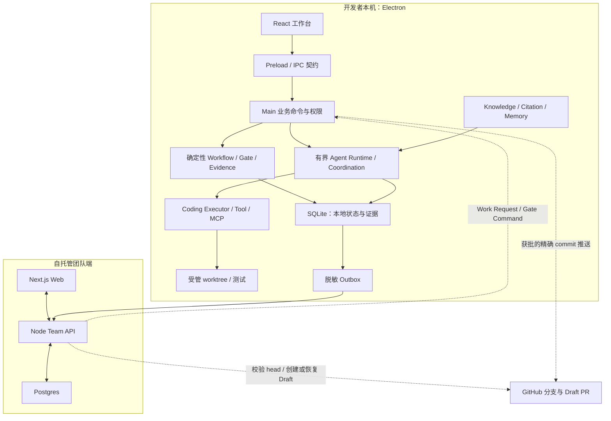

# AI DevFlow Studio：代码地图与面试讲解初稿

日期：2026-09-09。分析基线：`ae0484331b5e18ef72e437f518958a5fc4de17a9`，分支 `codex/architecture-micro-refactor-20260906`。起始工作区仅见既有未跟踪的 `output/`，未将它作为实现依据。

本稿来自 workspace manifests、关键实现/测试、CONTEXT、ADR 和 Roadmap 的初步阅读。层次划分是本次人工归纳的讲解视图，不是第三方工具已经生成或验证的全量符号图谱；本轮没有运行应用测试。关联[工具选型与社区证据](code-analysis-tools-2026-09-09.zh-CN.md)。

**项目是什么**

AI DevFlow Studio 面向小型研发团队，将 AI 辅助开发纳入可审核的交付流程。确定性 Workflow 组织需求澄清、方案设计、编码、测试、PR 交付和验收；Agent 在边界内完成任务，人工 Gate 决定是否继续。桌面端保有本地执行与完整证据，团队端负责身份、策略、预算、协作意图及脱敏状态。

依据：[README](../../README.md)、[领域语言](../../CONTEXT.md)、[Roadmap](../roadmap.md)、[Workflow 命令实现](../../packages/shared/src/workflow-transition.ts)。

**物理模块**

| 模块 | 当前实现定位 | 技术与入口 |
| --- | --- | --- |
| Desktop | 本地工作台、可信执行、工作流操作、证据与状态 | Electron + React + React Flow + sql.js；[main](../../apps/desktop/electron/main.ts)、[preload](../../apps/desktop/electron/preload.ts)、[App](../../apps/desktop/src/App.tsx) |
| Web | 团队工作台及经授权的协作/审批入口；展示脱敏团队投影 | Next.js + React；[package](../../apps/web/package.json) |
| API | 团队身份、项目、策略/预算、配对、同步投影、协作与交付请求 | Node HTTP + pg；[server](../../apps/api/src/server.ts)、[team routes](../../apps/api/src/routes/team-routes.ts) |
| Shared | 多端共用的领域类型、状态迁移、解析、策略、脱敏与执行契约 | TypeScript；[导出入口](../../packages/shared/src/index.ts) |
| Worker | 当前为项目/成员成本汇总函数与 CLI 入口，规模很小 | [实际源码](../../apps/worker/src/index.ts) |

包依赖来自[workspace 配置](../../pnpm-workspace.yaml)及各包 manifest。Worker 当前实现不能支撑“完整分布式任务调度平台”的介绍。

**六个讲解层次**

这些层次是职责视图，多个职责共处一个部署单元；不能将它们说成六个独立微服务。

| 层次 | 主要问题 | 关键源码/决策 |
| --- | --- | --- |
| 1. 产品交互 | 开发者与团队如何查看任务、发起操作和审核？ | Desktop React、Web Next.js；[IPC 契约](../../apps/desktop/electron/ipc-contract.ts) |
| 2. 交付治理 | 当前阶段能否继续，谁能批准，需要什么证据？ | [Workflow transition](../../packages/shared/src/workflow-transition.ts)、[Workflow runtime](../../apps/desktop/electron/workflow-runtime.ts)、[Gate 策略](../../packages/shared/src/enforcement.ts) |
| 3. Agent 与工具执行 | Agent 如何有界运行，如何调用工具、编码和协作？ | [Agent runtime](../../apps/desktop/electron/agent-runtime-runtime.ts)、[Coding Executor](../../apps/desktop/electron/coding-executor.ts)、[Native v2](../../apps/desktop/electron/native-coding-executor-v2.ts)、[Coordination](../../apps/desktop/electron/specialist-runtime-coordinator.ts)、[Local MCP](../../apps/desktop/electron/local-mcp-runtime.ts) |
| 4. 知识、Context 与 Memory | 依据从哪里来，引用是否有效，哪些记忆可以复用？ | [Knowledge](../../packages/shared/src/knowledge.ts)、[Retrieval/Memory 契约](../../packages/shared/src/retrieval-memory.ts)、[仓库知识读取](../../apps/desktop/electron/repository-knowledge.ts)、[Memory 人工操作](../../apps/desktop/electron/agent-memory-human-actions.ts) |
| 5. 本地持久化与恢复 | 中断后如何恢复，如何保持证据、状态与待同步项一致？ | [LocalStore](../../apps/desktop/electron/local-store.ts)、[持久化](../../apps/desktop/electron/local-store-persistence.ts)、[Outbox](../../apps/desktop/electron/remote-sync-outbox-processor.ts) |
| 6. 团队协作与外部交付 | 本地工作怎样进入团队视图和 GitHub？ | [Team API](../../apps/api/src/routes/team-routes.ts)、[Postgres repository](../../apps/api/src/repositories/postgres-team-repository.ts)、[GitHub Delivery](../../apps/desktop/electron/github-delivery-processor.ts)、[交付 API](../../apps/api/src/routes/github-delivery-routes.ts) |

此图省略部分存储依赖与错误分支；边表示主要业务交互，不是逐个 import 的抽取结果。Web 能产生经授权的团队意图/审批，但本地 Run 和源码执行仍由 Desktop main 决定。参见 [ADR 0012](../adr/0012-web-desktop-work-authority.md)、[ADR 0013](../adr/0013-github-app-delivery-authority.md)。

**三条值得完整讲清的链路**

1. **从需求到可审阅的代码**：Work Request → 本地 canonical Run → Clarify/Design 产物与 Gate → 按项目选择 Coding Executor → 受管 worktree 中生成或执行变更 → Diff/Test Evidence → Workflow 检查。关键入口为 [main 的运行时装配](../../apps/desktop/electron/main.ts)、[编码运行时](../../apps/desktop/electron/coding-runtime.ts)、[Workflow transition](../../packages/shared/src/workflow-transition.ts)。
2. **从知识到受控执行**：Git/Markdown Knowledge → 索引/检索 → 带版本与摘要的 Citation/Context → Agent 动作前校验 → 可观察结果 → 惰性 Memory Candidate → 人工/策略控制的持久化、修订与删除。检索或 Memory 不会自动成为可放行的 Evidence。依据 [ADR 0007](../adr/0007-knowledge-retrieval-is-not-governance-evidence.md)、[ADR 0017](../adr/0017-evaluated-hybrid-retrieval-and-citation.md)、[ADR 0018](../adr/0018-scoped-agent-memory-lifecycle.md)。
3. **从本地成果到团队交付**：本地状态/证据 → 持久 Outbox → 脱敏团队投影 → 独立 Web 批准 → 精确 commit 发布 → API 校验并创建/协调 Draft PR → Acceptance。应能解释重试与重启如何避免重复副作用，以及批准为什么绑定版本。依据 [Delivery processor](../../apps/desktop/electron/github-delivery-processor.ts)、[Outbox processor](../../apps/desktop/electron/remote-sync-outbox-processor.ts)、[ADR 0013](../adr/0013-github-app-delivery-authority.md)。

**面试材料需要纠正的版本差异**

- [旧项目简介](../product/project-introduction.zh-CN.md)还写着“项目不会重新实现一套 Coding Agent”。[ADR 0015](../adr/0015-governed-coding-executor.md)已经明确替代 external-only 假设；当前 `main.ts` 装配 `createNativeCodingExecutorV2`，实际实现位于 [Native v2](../../apps/desktop/electron/native-coding-executor-v2.ts)。更准确的表述是“统一执行契约下支持 OpenCode 和有界原生编码执行器”。
- 旧简介强调单组阶段 Agent；当前 [ADR 0019](../adr/0019-bounded-multi-agent-coordination.md)与 [协调器](../../apps/desktop/electron/specialist-runtime-coordinator.ts)定义了有限 Supervisor/Specialist 协调。应讲清固定任务图、预算/权限收窄、终态和恢复，不能包装为无限自治协作。
- 包版本为 `2.2.0`，但 [Roadmap](../roadmap.md)的发布基线仍是 `v1.5.0`，2.x 功能里程碑完成、正式 `v2.2.0` 发布签核尚未关闭。功能已实现与发布完成必须分别表达。
- 仓库已有 [架构复盘](../engineering/architecture-review-2026-09-06.zh-CN.md)和[真实 Provider 流程记录](../engineering/live-provider-validation-2026-09-06.zh-CN.md)。本轮只确认它们存在并阅读其内容，未重跑或扩大其中测试结论的适用范围。

**简历与面试的表达初稿**

下面是项目视角的事实草稿，不自动代表个人独立完成了所有部分。岗位和本人职责确认后再取舍。

> AI DevFlow Studio 是面向小型研发团队的 AI 交付工作台，通过确定性工作流串起需求、设计、编码、测试和 PR 交付，将有界 Agent、知识检索、预算和人工审批接入同一条证据链。Electron 负责本地代码执行与完整证据，团队端接收脱敏状态；编码能力支持 OpenCode 与原生执行器。

三个适合继续发展成简历条目的技术故事：

| 技术故事 | 可展开的设计与取舍 | 面试时应能回答 |
| --- | --- | --- |
| 确定性治理 + 有界 Agent 执行 | Workflow 与 Runtime 权责分离；统一 Coding Executor；预算、取消、检查点和能力限制 | 为什么不让 LLM 直接推进流程？更换编码引擎要改哪些接口？ |
| 可校验的知识与记忆 | 知识来源、引用版本、候选/持久记忆、过期与 tombstone、检索评测 | 如何防止过时引用和已删除记忆再次进入 Context？ |
| 本地优先的交付与恢复 | SQLite/Outbox 与团队 Postgres 的边界；版本化批准、幂等交付、脱敏投影 | 断网/重启后怎么办？如何防止重复发布或跨项目越权？ |

指标只能使用有明确口径、场景和版本依据的实际记录。当前材料不能直接推出生产用户数、生产并发规模、业务效率提升百分比或通用 RAG 正确率；固定评测语料上的成绩需要说明其范围。

**后续开发与学习的进入顺序**

1. 从 [CONTEXT](../../CONTEXT.md)、[Roadmap](../roadmap.md)和 Shared 的 Workflow 契约建立词汇与状态模型。
2. 追一条完整业务链到 main、LocalStore 和测试；查看 [Workflow 行为测试](../../packages/shared/src/workflow-transition.test.ts)如何约束错误状态和 Evidence。
3. 阅读 [ADR 0014](../adr/0014-bounded-agent-runtime.md)、[ADR 0015](../adr/0015-governed-coding-executor.md)及原生/外部执行路径，解释停止、权限与恢复。
4. 阅读 [Retrieval/Memory 契约测试](../../packages/shared/src/retrieval-memory.test.ts)和对应 ADR，区分候选、持久版本和删除语义。
5. 沿 Outbox/API/GitHub Delivery 追踪跨端流程；结合[架构复盘](../engineering/architecture-review-2026-09-06.zh-CN.md)理解当前耦合点，再决定开发改动范围。
6. 为每条链路补“正常路径、失败路径、重启恢复、取舍、源码/测试依据”。先用自己的话复述，再做受控的小改动练习。

下一步建议产物是源码索引、可查询图谱、三张时序图和技术故事证据表。它们属于理解与研究材料；开发优先级和正式发布状态仍由 Roadmap 维护。

