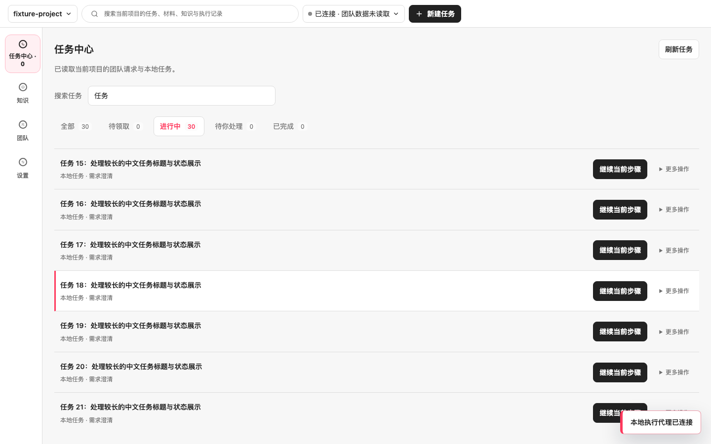
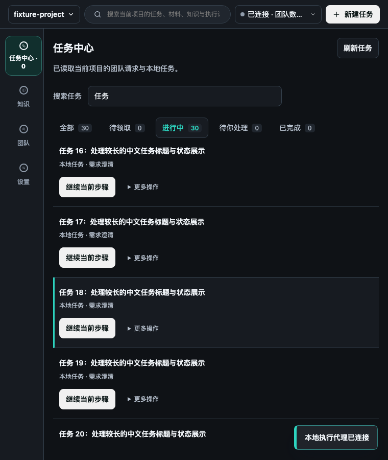

# Open issues 批量实现与验证（2026-10-10）

## 范围与环境

本次处理开始时的 14 个 Open issue。按用户要求暂缓 #135（正常 Developer ID 签名安装下的 macOS Keychain 验收）和 #227（指定 Opus 5.5 执行）。其余 12 个 issue 的实现、验证或条件缺口见下表；不能把“提交实现”当成所有历史事故均已归因。

- 基线：`b24cc4830743a550146a7e5a8eed40d1b8032512`，独立分支 `codex/resolve-open-issues-20261010`。
- Node.js `24.18.0`，Corepack pnpm `9.15.0`，macOS arm64，Electron `42.11.6`。
- 实现位于独立 worktree。现有现场 worktree 的方案修订改动已核对后纳入，原 checkout 和未提交文件保留。
- API/Postgres 验证使用单独的 PostgreSQL 16 容器、数据库/随机 schema、临时 Electron profile 和测试仓库。未使用用户现有的项目、账单、凭据或运行状态。
- 本次没有调用真实 DeepSeek/其他收费端点；模型响应来自本地夹具或明确启用的 fake runtime。真实 Electron、Main、IPC、SQLite、Git、OpenCode 进程与 Postgres 的验证分别标明，不能据此声称真实账单或所有模型协议已经验证。

设计与部署开关见 [ADR 0027](../adr/0027-request-recovery-and-budget-continuation.md)。

## Issue 交付矩阵

| Issue | 本次实现 / 验证 | 关闭边界 |
| --- | --- | --- |
| #182 独立任务中心 | 常驻入口、请求/Run 按业务身份聚合、状态/来源/筛选、预览、明确领取、恢复、返回定位；身份变更丢弃迟到请求。真实 Web→Postgres→Electron 刷新/预览/领取通过，预览前后不创建 Run，领取仅创建一个关联 Run | 仍缺 issue 指定的现有任务清单小需求从 Web 到真实六阶段交付/验收的人工贯通证据；保留该验收项 |
| #201 偶发门禁 JSON 失败 | 首次加两次有界恢复、逐次用量保留、长度恢复与准确元数据；无效材料不保存，不批准 Gate | 原始失败正文不存在，不能声称已证明 2026-09-30 的具体根因；历史复现保持 Open |
| #202 结算失败伴随窗口关闭 | 有效模型结果不会因用量上传失败被丢弃；最终账本保留待同步，重放账目不重新生成 | 未复现历史窗口关闭，也没有证据证明它与财务上传失败的因果关系；保持 Open |
| #224 持续工具授权 | 当前会话精确命令/路径集合授权、每次策略复核、显式拒绝优先、审计、撤销、2 小时过期、重启失效；不替代最终改动/Gate 批准 | 不包含永久项目规则（原 issue 为可选评估） |
| #225 思考设置入口 | 可见箭头、展开提示、44px 点击区、悬停/焦点；Electron 深浅主题下鼠标和 Enter/Space 操作，折叠不修改 Provider | 无模型调用要求 |
| #226 内置仓库审查 | 与编码执行器独立配置；无需 OpenCode 的只读循环、真实读取与主机核验引用；IPC、用量上传和重启设置均贯通。真实 Electron 的本地响应端点通过 | 真实模型端点补验保留，不能把本地响应当作 DeepSeek 兼容性证明 |
| #228 启动预算状态 | 已配置未评估、未检查、读取失败、真实未配置分别表达；非开发节点仍读取策略；进入开发节点仍执行预算准入 | Electron 验证包括预算保存、非开发节点检查与开发节点允许 |
| #229 失败诊断 | 调用/步骤/周期/恢复组、Provider 标识、finish reason、字节限制、usage 状态与失败历史；重试/重启保留，敏感正文不进入诊断 | 不用新增诊断反推历史供应商责任 |
| #230 步骤恢复 | 每步首次加两次、成功普通查询重置、关键提案组统一额度、检查点继续、批次暂停、取消、版本变化重新核实 | 不自动切模型，不无限重试 |
| #231 原生只读工具 | 默认关闭试点、能力表、完整批次先验、工具调用配对、Thinking 历史、引用与旧会话读取；本地响应端点通过 | 真实 `deepseek-flash` 端点与 Thinking 组合未验证；保持默认关闭和 Open |
| #233 长内容全链路 | 请求额度/接收/持久化分离、独立内容引用、完整方案修订、送审分块、部分用量保留；3 个可独立关闭的新执行能力 | 真实模型成功率、实际账单和签名发布不在确定性测试结论内 |
| #234 费用待核对继续 | 可信上界保留占用；单张显式确认卡、不填假账；范围/版本/次数/金额/过期校验，幂等、并发及跨月结算 | 不能将历史未知费用改成零；冲突账单仍需核对 |

## 验证结果

基线 `corepack pnpm verify`：4,792 项通过、15 项跳过。以下为修复后工作树的结果；不使用中间失败日志宣称完成。

| 命令 / 场景 | 实际结果与范围 |
| --- | --- |
| `corepack pnpm verify` | 371 个测试文件、4,878 项通过，2 个文件/16 项 Postgres 条件测试跳过；全仓 typecheck 和跨平台静态检查通过 |
| `corepack pnpm build` 与 `test:build-output-smoke` | 通过；API/Web/桌面构建完成，API/Web/Worker 独立构建产物不依赖仓库源码 |
| `corepack pnpm test:e2e` | 46 通过、1 跳过；包含任务中心 760/1440px、深浅主题、长需求、键盘焦点与滚动恢复 |
| `corepack pnpm test:electron-smoke` | 通过；任务中心、流程、审查、权限、测试、重启及 Provider 删除；思考设置深浅主题、44px 点击区、箭头、Enter/Space/鼠标操作和 Provider 配置不变 |
| `corepack pnpm test:native-coding-electron-smoke` | 通过；Main/IPC/API/本地模型端点、无 OpenCode 内置仓库审查、人工权限、managed worktree 修改、真实测试及证据；已保存预算在非开发节点为已读取/未评估，进入开发后真实准入 |
| `corepack pnpm test:workbench-conversation-electron-smoke` | 通过；28 次本地端点请求，包含原生工具、503/格式恢复、取消、重启历史和预算确认卡；`externalProviderCalled: false` |
| `corepack pnpm test:stage-agent-design-electron` | 通过；实际 OpenCode 进程连接本地端点，修订取消/重试、旧版保留、新版待审、重启设置保持 |
| `corepack pnpm test:stage-agent-design-contract` | 通过；真实 OpenCode 进程与受控 HTTP 端点，未调用外部 Provider |
| `corepack pnpm test:workbench-opencode-contract` | 通过；真实 OpenCode 工具协议与本地响应 |
| `corepack pnpm test:budget-postgres` | 1 项真实 Postgres 集成通过；并发 40 次准入只接受授权中的 36 次、确认幂等、版本失效、重启与迟到结算 |
| `corepack pnpm test:organization-postgres` | 15 项真实 Postgres 测试通过，组织/身份/并发隔离 |
| `corepack pnpm test:postgres-smoke` | 迁移 0032 与真实数据库读写通过 |
| `corepack pnpm test:local-auth-postgres-smoke` | 登录、空项目、预算、配对及 bearer 读取通过 |
| `corepack pnpm test:studio-onboarding-postgres-smoke` | Web 创建项目/请求→Postgres→Electron 任务中心刷新、预览、领取；策略版本 1→3、并发编辑 409 与 Gate 同步通过；0 次模型调用 |
| `corepack pnpm audit:production` | 无已知漏洞；升级 Next 至 15.5.27，并更新 sharp/source-map-js 覆盖原 2 high、2 moderate 报告 |
| `corepack pnpm build:desktop-pilot` | unsigned darwin-arm64 包已生成；不声称 Developer ID 签名、notarization 或 Keychain 正式安装验收 |

全量默认跳过的 16 项 Postgres 测试用上述专用数据库命令单独运行并通过。E2E 的 1 项跳过是 opt-in 文档截图任务。浏览器测试和 native smoke 的 Provider 响应是人工构造；token 数值用于验证产品记账，不代表发生过真实消费。Windows runner、Linux Docker 与候选提交 evaluator 的结果以 PR CI 为准，不冒充本机已运行。

关键针对性证据：

- 超过旧 32 KiB 正文、64 KiB 推理、4 MiB 累计 SSE；UTF-8 单字节分片、缺终止帧、usage 后坏帧/断线/取消，以及靠近 8 MiB 的文档。
- 超过 18k 的提案、超过 64 KiB 的正式方案、转义密集大文本与持久化重开；送审分块明确标记，未用被截短文本替代完整正文。
- 自动恢复耗尽、后续步骤重新获得两次机会、手动新周期、查询结果保留和仓库修改后失效。180 秒批次边界的回归先复现了“第二次调用失败后提前暂停”，修复后完成该步骤两次恢复再暂停新步骤；整组会话测试 81 项通过。
- 三个发布开关关闭时：新生成输出变为 8,192，已有长文本完整返回；新继续授权被拒绝而旧费用可结算；自动恢复停止而手动续作保留依据。该组 93 项通过。
- 会话授权命令/文件匹配、拒绝优先、越界、其他身份/Run、撤销/过期和重启不恢复授权。
- 首轮 Windows CI 暴露长文本并发保存的 `rename / EPERM`：相同哈希的写入互相替换文件。改为完整临时文件原子发布且不覆盖已有目标，竞争成功者的内容须通过哈希校验；4 个 store 同时保存重复字段、并行读取、重复保存和损坏内容不覆盖均有回归，内容存储与会话合计 84 项通过。

## Cursor 审查与处理

使用 Cursor Agent CLI / Grok 4.7 Extra High（非 Fast）进行只读咨询，会话 `fc155738-9816-4057-9e6a-8d9630a2220e`。原 verdict 为 **fail**；Cursor 没有运行测试，且其 `git diff --stat` 被工具权限拒绝。下面是 Codex 独立核实、修复与验证，不能描述成 Cursor 已二次通过。

| 发现 | 处理 | 证据 |
| --- | --- | --- |
| 本地请求校验发生在预算预留后，可能把未发送请求记为未知费用 | 结构/容量校验移到预留前；内部剩余校验抛出 `not_sent / not_incurred` | 断言网络调用为 0、无未知费用，及明确未发送结算 |
| 原生非法工具批次在校验前进入检查点，重试重放未配对历史 | 名称/参数/项目/路径/符号链接全批校验后才保存；本地越界不自动重试 | 断言仅 1 次请求、0 工具执行、检查点无非法 `tool_calls`，手动重试不携带该历史 |
| UTF-8 字节估算与 token 上界混用 | 已识别 DeepSeek 使用整个上下文的 token 上界；兼容服务仍明确为估算 | 报价和实际输出参数同源，未核验服务不冒充可信上界 |
| 步骤 purpose 改变可能切断继续授权 | turn/cycle 的显式操作键跨辅助校验复用；新操作仍使用新版本 | 操作作用域与准入回归 |
| 未知上游 HTTP/读体失败仍记未知 | 保留；没有提供方证明不能改写成零 | 通过占用/明确继续授权恢复，而非编造账单 |
| 旧全量日志不代表最终工作树 | 修复后重新执行全量 verify/build 和对应集成 | 以本页最终结果与 PR CI 为准 |

两项主要阻塞修复后，7 个文件的 120 项定向测试通过。中间 Electron 联调还暴露并修复了 `native-agent` IPC 枚举、共享用量校验白名单和重启设置还原的问题；没有以组件测试替代这些边界验证。

## UI 证据

以下是合成 30 项任务的浏览器 UI 验证，证明布局和往返状态，不表示用户真实任务数据：

以下是实际 Electron 临时 profile 的设置界面，Provider 为不访问网络的测试配置：

- [思考设置浅色与键盘焦点](assets/open-issues-20261010/thinking-disclosure-light.png)
- [思考设置深色与键盘焦点](assets/open-issues-20261010/thinking-disclosure-dark.png)

## 升级与保留事项

1. API 先执行迁移 0032，再部署支持新记录的 API 和桌面。保持预算策略本身不变。
2. 备份 SQLite 与相邻 `.contents` 目录；新旧内容可读，当前没有自动内容 GC，不能仅备份数据库文件。
3. 如需暂停新行为，使用 ADR 的独立开关；仍部署能读取新记录和完成旧结算的代码，不删除内容或财务历史来回退。
4. 原生工具试点默认关闭。只有完成具体端点/模型/Thinking 的真实兼容性验收后，才显式启用。
5. #135、#227 保持用户指定暂缓。#182、#201、#202、#226、#231 的上述真实/历史条件继续跟踪，不以本页模拟响应结果代替验收。

本机完整日志在独立 worktree 的 `out/issue-resolution-20261010/`；目录不纳入 Git，避免夹具输出和机器路径进入产品文档。版本化记录保留结论、复现命令和必要截图，后续 CI 提供远程可复核结果。
